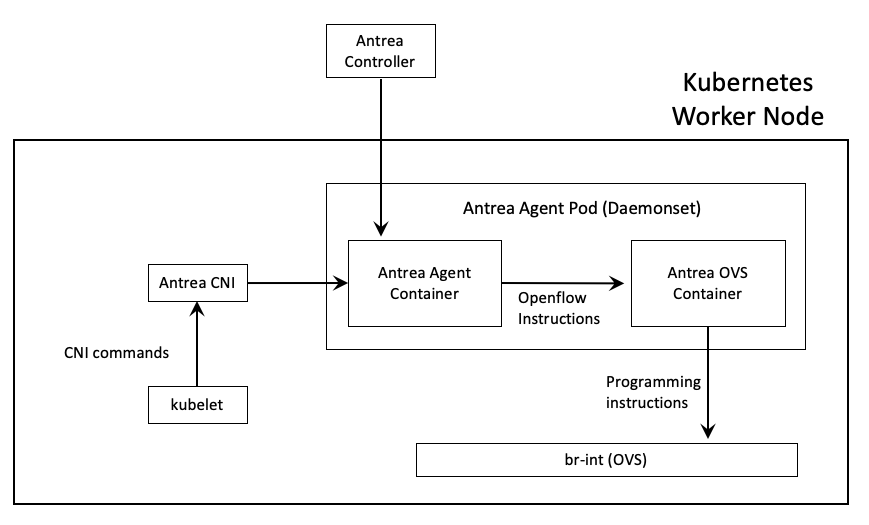
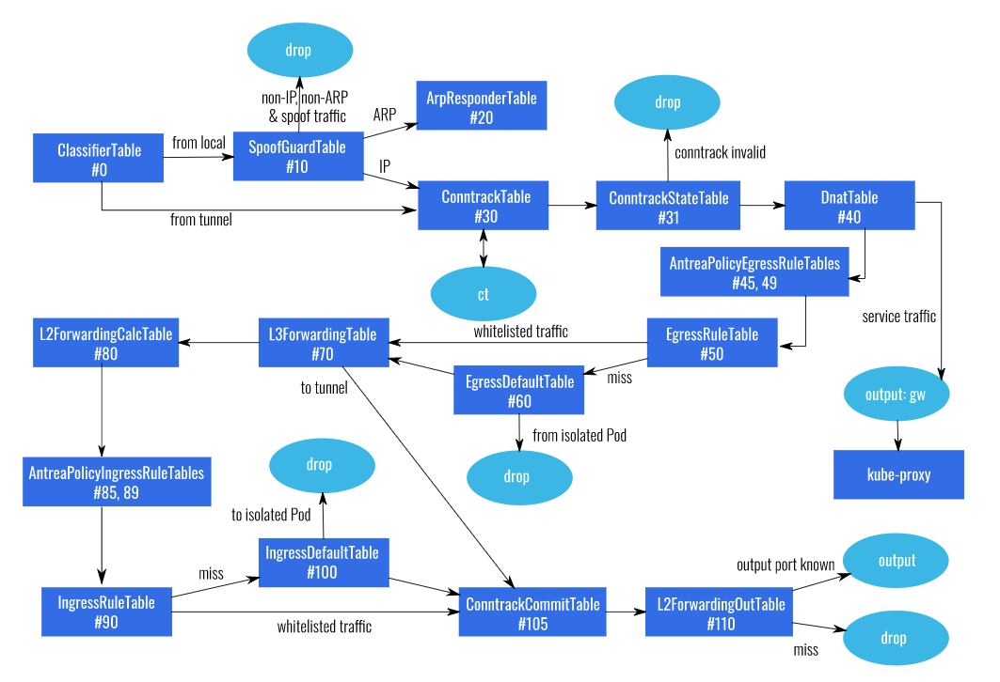

# Part A

This section provides a high level overview of Antrea implementation and the details on the test environment.

# 1. Antrea Implementation in a Worker Node

The high level architecture diagram is shown below. 

Antrea OVS container within Antrea Agent Pod runs the OVS daemons ovsdb-server and ovs-vswitchd.

"br-int" is the default name of OVS virtual bridge/switch that Antrea provisions on the Kubernetes nodes.

**Note :** More detailed diagram is [here](https://github.com/vmware-tanzu/antrea/blob/master/docs/architecture.md), at Project Antrea page on Github.

# 2. OVS Pipeline

Above diagram is copied from [here](https://github.com/vmware-tanzu/antrea/blob/master/docs/ovs-pipeline.md)(OVS Pipeline at Project Antrea page on Github) showing the actual steps in the pipeline. Antrea team has already done an awesome job in explaining each table in this diagram with extreme details. OVS terminology is also explained on the same page. 

**As mentioned in the intro section, the aim of this article is explaining each OVS table from the application flow' s point of view with some other details and more explanations.**

# 3. Test Environment

In the test environment there is a single master (control plane) and two worker (compute) nodes in the Kubernetes cluster. Ubuntu, Docker, Kubernetes versions used can be seen below.

Container image used in this tool, which is dumlutimuralp/networktest is a copy of the original image [Praqma/Network-Multitool](https://github.com/Praqma/Network-MultiTool) on Dockerhub. All usage is subject to the original image' s licensing scheme. 

<pre><code>
vmware@master:~$ kubectl get nodes -o wide
NAME      STATUS   ROLES    AGE   VERSION   INTERNAL-IP   EXTERNAL-IP   OS-IMAGE             KERNEL-VERSION       CONTAINER-RUNTIME
master    Ready    master   20d   v1.18.8   10.79.1.200   <none>        Ubuntu 18.04.4 LTS   4.15.0-112-generic   docker://19.3.11
worker1   Ready    <none>   20d   v1.18.8   10.79.1.201   <none>        Ubuntu 18.04.4 LTS   4.15.0-112-generic   docker://19.3.11
worker2   Ready    <none>   20d   v1.18.8   10.79.1.202   <none>        Ubuntu 18.04.4 LTS   4.15.0-112-generic   docker://19.3.11
</code></pre>

This Kubernetes cluster is bootstrapped using [`kubeadm`](https://kubernetes.io/docs/setup/production-environment/tools/kubeadm/create-cluster-kubeadm/). Antrea relies on 'nodeipam controller' for Pod IP address assignment, hence the `--pod-network-cidr` (as 10.222.0.0/16) kubeadm parameter is used. More info on this requirement is [here](https://github.com/vmware-tanzu/antrea/blob/master/docs/getting-started.md#ensuring-requirements-are-satisfied).

Antrea installation is just one line of command as mentioned [here](https://github.com/vmware-tanzu/antrea/blob/master/docs/getting-started.md#installation)

The Antrea version used in this lab is shown below. `Antctl` is a CLI tool to get various information on Antrea. More info on antctl tool is [here](https://github.com/vmware-tanzu/antrea/blob/master/docs/antctl.md).

<pre><code>
vmware@master:~$ k exec -it antrea-controller-655fcbc656-hrkwg -n kube-system -- antctl version
antctlVersion: v0.10.0-dev-4ed2c67
controllerVersion: v0.10.0-dev-4ed2c67
vmware@master:~$ 
</code></pre>

**IMPORTANT NOTE :** Antrea is installed with its **default features** in this environment. By default (in this version) it uses GENEVE encapsulation for inter node networking and relies on kube-proxy on the nodes for ClusterIP services and NodePort services. The alpha or beta features such as Antrea Network Policy, Antrea Cluster Network Policy or Antrea Proxy are **NOT** used in this environment. 

The Kubernetes worker node and pod connectivity diagram for the test environment used is shown below. 

Next few sections demonstrate how to verify different constructs shown in this diagram by using various Linux shell and kubectl commands.

## 3.1 Worker Node IP Interface, ARP and IP Route Tables

### 3.1.1 Worker 1

<pre><code>
vmware@<b>worker1</b>:~$ <b>ip address</b>
<b>OUTPUT OMITTED</b>
2: <b>ens160</b>: <BROADCAST,MULTICAST,UP,LOWER_UP> mtu 1500 qdisc mq state UP group default qlen 1000
    link/ether 00:50:56:8f:4e:82 brd ff:ff:ff:ff:ff:ff
    inet <b>10.79.1.201/24</b> brd 10.79.1.255 scope global ens160
       valid_lft forever preferred_lft forever
    inet6 fe80::250:56ff:fe8f:4e82/64 scope link 
       valid_lft forever preferred_lft forever
3: docker0: <NO-CARRIER,BROADCAST,MULTICAST,UP> mtu 1500 qdisc noqueue state DOWN group default 
    link/ether 02:42:26:b8:2f:e5 brd ff:ff:ff:ff:ff:ff
    inet 172.17.0.1/16 brd 172.17.255.255 scope global docker0
       valid_lft forever preferred_lft forever
4: ovs-system: <BROADCAST,MULTICAST> mtu 1500 qdisc noop state DOWN group default qlen 1000
    link/ether 06:79:c1:9a:b2:1b brd ff:ff:ff:ff:ff:ff
5: <b>genev_sys_6081</b>: <BROADCAST,MULTICAST,UP,LOWER_UP> mtu 65000 qdisc noqueue master ovs-system state UNKNOWN group default qlen 1000
    link/ether 2e:d2:32:e9:81:80 brd ff:ff:ff:ff:ff:ff
    inet6 fe80::2cd2:32ff:fee9:8180/64 scope link 
       valid_lft forever preferred_lft forever
6: <b>antrea-gw0</b>: <BROADCAST,MULTICAST,UP,LOWER_UP> mtu 1450 qdisc noqueue state UNKNOWN group default qlen 1000
    link/ether 4e:99:08:c1:53:be brd ff:ff:ff:ff:ff:ff
    inet <b>10.222.1.1/24</b> brd 10.222.1.255 scope global antrea-gw0
       valid_lft forever preferred_lft forever
    inet6 fe80::4c99:8ff:fec1:53be/64 scope link 
       valid_lft forever preferred_lft forever
<b>OUTPUT OMITTED</b>
52: backend1-bab86f@if3: <BROADCAST,MULTICAST,UP,LOWER_UP> mtu 1450 qdisc noqueue master ovs-system state UP group default 
    link/ether 9e:bf:dd:84:e6:90 brd ff:ff:ff:ff:ff:ff link-netnsid 2
    inet6 fe80::9cbf:ddff:fe84:e690/64 scope link 
       valid_lft forever preferred_lft forever
53: frontend-a3ba2f@if3: <BROADCAST,MULTICAST,UP,LOWER_UP> mtu 1450 qdisc noqueue master ovs-system state UP group default 
    link/ether e6:88:e2:ed:64:82 brd ff:ff:ff:ff:ff:ff link-netnsid 3
    inet6 fe80::e488:e2ff:feed:6482/64 scope link 
       valid_lft forever preferred_lft forever
</code></pre>

- "genev_sys" is the actual tunnel interface (antrea-tun0) used on the OVS in the worker nodes for overlay encapsulation functionality of Antrea. It acts as a slave interface of "ovs-system" interface. 
- "ovs-system" interface is the OVS internal port which is not used for any IP / OSI Layer 3 function here. For more info please check [this introduction video](https://www.youtube.com/watch?v=rYW7kQRyUvA).
- "antrea-gw0" interface is basically the default gateway interface for all the pods on Worker 1.

**Note :** For simplicity, environment diagram above is does not show the OVS internal port.

<pre><code>
vmware@<b>worker1</b>:~$ <b>arp -a</b>
<b>OUTPUT OMITTED</b>
? (10.222.1.48) at be:2c:bf:e4:ec:c5 [ether] on antrea-gw0 <b>=> Frontend Pod IP and MAC</b>
_gateway (10.79.1.1) at 00:0c:29:fa:d8:a8 [ether] on ens160 <b>=> Default Gateway IP and MAC</b>
? (10.222.1.47) at f2:32:d8:07:e2:a6 [ether] on antrea-gw0 <b>=> Backend1 Pod IP and MAC</b>
? (10.222.2.1) at aa:bb:cc:dd:ee:ff [ether] on antrea-gw0 <b>= > antrea-gw0 interface IP and MAC of Worker 2 node. Why is this even here ? It is explained in Section 12.</b>
? (10.79.1.5) at 00:0c:29:de:2c:c9 [ether] on ens160 <b>=> DNS server IP and MAC</b>
master (10.79.1.200) at 00:50:56:8f:f7:65 [ether] on ens160 <b>=> Master node IP and MAC</b>
worker2 (10.79.1.202) at 00:50:56:8f:1c:f6 [ether] on ens160 <b>=> Worker 2 node IP and MAC</b>
<b>OUTPUT OMITTED</b>
</code></pre>

<pre><code>
vmware@<b>worker1</b>:~$ <b>ip route</b>
default via 10.79.1.1 dev ens160 proto static <b>=> Default route</b>
10.79.1.0/24 dev ens160 proto kernel scope link src 10.79.1.201 <b>=> Directly connected subnet on ens160 interface</b>
10.222.0.0/24 via 10.222.0.1 dev antrea-gw0 onlink <b>=> Pod subnet of the Master node and the next hop IP is the antrea-gw0 interface of the Master Node ? How come ? It is explained in Section 12.</b>
10.222.1.0/24 dev antrea-gw0 proto kernel scope link src 10.222.1.1  <b>=> Pod subnet of the Worker 1 node which is the directly connected subnet on antrea-gw0 interface of Worker 1 node</b>
10.222.2.0/24 via 10.222.2.1 dev antrea-gw0 onlink <b>=> Pod Subnet of the Worker 2 node and the next hop IP is the antrea-gw0 interface of Worker 2 node ? How come ? It is explained in Section 12.</b> 
172.17.0.0/16 dev docker0 proto kernel scope link src 172.17.0.1 linkdown <b>=> Default Docker subnet on docker0 interface on Worker 1, not being used --linkdown--</b>
</code></pre>

### 3.1.2 Worker 2

<pre><code>
vmware@<b>worker2</b>:~$ <b>ip address</b>
<b>OUTPUT OMITTED</b>
2: <b>ens160</b>: <BROADCAST,MULTICAST,UP,LOWER_UP> mtu 1500 qdisc mq state UP group default qlen 1000
    link/ether 00:50:56:8f:1c:f6 brd ff:ff:ff:ff:ff:ff
    inet <b>10.79.1.202/24</b> brd 10.79.1.255 scope global ens160
       valid_lft forever preferred_lft forever
    inet6 fe80::250:56ff:fe8f:1cf6/64 scope link 
       valid_lft forever preferred_lft forever
3: docker0: <NO-CARRIER,BROADCAST,MULTICAST,UP> mtu 1500 qdisc noqueue state DOWN group default 
    link/ether 02:42:52:5c:9a:a0 brd ff:ff:ff:ff:ff:ff
    inet 172.17.0.1/16 brd 172.17.255.255 scope global docker0
       valid_lft forever preferred_lft forever
4: ovs-system: <BROADCAST,MULTICAST> mtu 1500 qdisc noop state DOWN group default qlen 1000
    link/ether 9a:4a:5d:12:4f:4b brd ff:ff:ff:ff:ff:ff
5: <b>genev_sys_6081</b>: <BROADCAST,MULTICAST,UP,LOWER_UP> mtu 65000 qdisc noqueue master ovs-system state UNKNOWN group default qlen 1000
    link/ether 92:6c:b7:e1:77:2d brd ff:ff:ff:ff:ff:ff
    inet6 fe80::906c:b7ff:fee1:772d/64 scope link 
       valid_lft forever preferred_lft forever
6: <b>antrea-gw0</b>: <BROADCAST,MULTICAST,UP,LOWER_UP> mtu 1450 qdisc noqueue state UNKNOWN group default qlen 1000
    link/ether 02:d8:4e:3f:92:1d brd ff:ff:ff:ff:ff:ff
    inet <b>10.222.2.1/24</b> brd 10.222.2.255 scope global antrea-gw0
       valid_lft forever preferred_lft forever
    inet6 fe80::d8:4eff:fe3f:921d/64 scope link 
       valid_lft forever preferred_lft forever
<b>OUTPUT OMITTED</b>
39: backend2-202ff6@if3: <BROADCAST,MULTICAST,UP,LOWER_UP> mtu 1450 qdisc noqueue master ovs-system state UP group default 
    link/ether e6:19:5f:2b:73:65 brd ff:ff:ff:ff:ff:ff link-netnsid 1
    inet6 fe80::e419:5fff:fe2b:7365/64 scope link 
       valid_lft forever preferred_lft forever
</code></pre>

- "genev_sys" is the actual tunnel interface (antrea-tun0) used on the OVS in the worker nodes for overlay encapsulation functionality of Antrea. It acts as a slave interface of "ovs-system" interface. 
- "ovs-system" interface is the OVS internal port which is not used for any IP / OSI Layer 3 function here. For more info please check [this introduction video](https://www.youtube.com/watch?v=rYW7kQRyUvA).
- "antrea-gw0" interface is basically the default gateway interface for all the pods on Worker 1.

**Note :** For simplicty, environment diagram above does not show the OVS internal port.

<pre><code>
vmware@<b>worker2</b>:~$ <b>arp -a</b>
<b>OUTPUT OMITTED</b>
? (10.222.2.34) at c6:f4:b5:76:10:38 [ether] on antrea-gw0 <b>=> Backend2 Pod IP and MAC</b>
worker1 (10.79.1.201) at 00:50:56:8f:4e:82 [ether] on ens160 <b>=> Worker 1 node IP and MAC</b>
master (10.79.1.200) at 00:50:56:8f:f7:65 [ether] on ens160 <b>=> Master node IP and MAC</b>
? (10.79.1.5) at 00:0c:29:de:2c:c9 [ether] on ens160 <b>=> DNS server IP and MAC</b>
_gateway (10.79.1.1) at 00:0c:29:fa:d8:a8 [ether] on ens160 <b>Default Gateway IP and MAC </b>
? (10.222.1.1) at aa:bb:cc:dd:ee:ff [ether] on antrea-gw0 <b>=> antrea-gw0 interface IP and MAC of Worker 1 node. Why is this even here ? Will be explained later </b>
<b>OUTPUT OMITTED</b>
vmware@worker2:~$ 
</code></pre>

<pre><code>
vmware@<b>worker2</b>:~$ <b>ip route</b>
default via 10.79.1.1 dev ens160 proto static <b>=> Default Route</b>
10.79.1.0/24 dev ens160 proto kernel scope link src 10.79.1.202 <b>=> Directly connected subnet on ens160 interface</b>
10.222.0.0/24 via 10.222.0.1 dev antrea-gw0 onlink <b>=> Pod subnet of the Master node and the next hop IP is the antrea-gw0 interface of Master node ? How come ? Will be explained later</b>
10.222.1.0/24 via 10.222.1.1 dev antrea-gw0 onlink <b>Pod subnet of the Worker 1 node and the next hop IP is the antrea-gw0 interface of Worker 1 node ? How come ? Will be explained later</b>
10.222.2.0/24 dev antrea-gw0 proto kernel scope link src 10.222.2.1 <b>=> Pod subnet of the Worker 2 node which is the directly connected subnet on antrea-gw0 interface of the Worker 2 node</b>
172.17.0.0/16 dev docker0 proto kernel scope link src 172.17.0.1 linkdown <b>=>=> Default Docker subnet on docker0 interface on Worker 1, not being used --linkdown--</b>
vmware@worker2:~$ 
</code></pre>

## 3.2 Test Application

The below manifest deploys just three Pods (frontend, backend1, backend2), a service (ClusterIP) and two network policies (one for frontend pod and one for backend pods).

<pre><code>
apiVersion: v1
kind: Pod
metadata:
  labels:
    role: frontend
  name: frontend
spec:
  containers:
  - image: dumlutimuralp/networktest
    name: frontend
  nodeName: worker1
---
apiVersion: v1
kind: Pod
metadata:
  labels:
    role: backend
  name: backend1
spec:
  containers:
  - image: dumlutimuralp/networktest
    name: backend1
  nodeName: worker1
---
apiVersion: v1
kind: Pod
metadata:
  labels:
    role: backend
  name: backend2
spec:
  containers:
  - image: dumlutimuralp/networktest
    name: backend2
  nodeName: worker2
---
apiVersion: v1
kind: Service
metadata:
  labels:
    app: backendsvc
  name: backendsvc
spec:
  ports:
  - port: 80
    protocol: TCP
    targetPort: 80
  selector:
    role: backend
  type: ClusterIP
---
apiVersion: networking.k8s.io/v1
kind: NetworkPolicy
metadata:
  name: frontendpolicy
  namespace: default
spec:
  podSelector:
    matchLabels:
      role: frontend
  policyTypes:
  - Egress
  - Ingress
  egress:
  - to:
    - podSelector:
        matchLabels: 
          role: backend
    ports:
    - protocol: TCP
      port: 80
  - ports:
    - protocol: UDP
      port: 53
  ingress:
  - ports:
    - protocol: TCP
      port : 80
---
apiVersion: networking.k8s.io/v1
kind: NetworkPolicy
metadata:
  name: backendpolicy
  namespace: default
spec:
  podSelector:
    matchLabels:
      role: backend
  policyTypes:
  - Ingress
  - Egress
  ingress:
  - from:
    - podSelector:
        matchLabels:
          role: frontend
    ports:
    - protocol: TCP
      port: 80
</code></pre>

After applying above YAML, the default namespace resources should look similar to below.

<pre><code>
vmware@master:~$ kubectl get pods -o wide
NAME       READY   STATUS    RESTARTS   AGE     IP            NODE      NOMINATED NODE   READINESS GATES
<b>backend1</b>   1/1     Running   0          7d17h   <b>10.222.1.47</b>   <b>worker1</b>   <none>           <none>
<b>backend2</b>   1/1     Running   0          7d17h   <b>10.222.2.34</b>   <b>worker2</b>   <none>           <none>
<b>frontend</b>   1/1     Running   0          7d17h   <b>10.222.1.48</b>   <b>worker1</b>   <none>           <none>
vmware@master:~$ 
vmware@master:~$ kubectl get svc
NAME         TYPE        CLUSTER-IP      EXTERNAL-IP   PORT(S)   AGE
<b>backendsvc</b>   ClusterIP   <b>10.104.65.133</b>   <none>        <b>80/TCP</b>    7d17h
kubernetes   ClusterIP   10.96.0.1       <none>        443/TCP   12d
vmware@master:~$ 
vmware@master:~$ kubectl get ep
NAME         ENDPOINTS                       AGE
backendsvc   <b>10.222.1.47:80,10.222.2.34:80</b>   7d17h
kubernetes   10.79.1.200:6443                12d
vmware@master:~$ 
vmware@master:~$ kubectl get netpol
NAME             POD-SELECTOR    AGE
<b>backendpolicy</b>    role=backend    7d18h
<b>frontendpolicy</b>   role=frontend   7d18h
vmware@master:~$ 
</code></pre>

**In the next few sections the OVS Pipeline for the following flow will be investigated.** The flow will be from frontend pod to backendsvc service on TCP port 80 (which is a Kubernetes service type of "ClusterIP"). 

Below is a sample output of the test of this simple application.

<pre><code>
vmware@master:~$ kubectl exec -it frontend -- sh
/ # curl backendsvc
Praqma Network MultiTool (with NGINX) - backend1 - 10.222.1.47/24
/ # curl backendsvc
Praqma Network MultiTool (with NGINX) - backend2 - 10.222.2.34/24
/ # 
</code></pre>

What is shown above is, frontend pod initiates a request on TCP port 80 to backendsvc and this request gets processed by iptables rules on Worker 1 node which is managed by kube-proxy on Worker 1 node. Iptables applies DNAT on the flow and picks one of the backend pods to service this request of frontend pod. 

**Note :** In order for frontend pod to send a request to backendsvc service on its IP, it actually sends a DNS request to Kubernetes DNS service. This DNS flow, which happens to take place before the actual requst on TCP port 80, is not the focus of this article. Assumption will be frontend pod already resolved the backendsvc IP through Kubernetes DNS.

** Note 2:** In the yaml file shown above, everything kept extremely simple down to the level of pinning a specific pode to a specific worker node. For that reason "Nodename" is used in the yaml. Hence in order to use the same yaml file nodename values need to be edited accordingly to match the actual environment' s Kubernetes node names.

## 3.3 Identifying Antrea Agent Pods

To be able to investigate the flow entries on the Open vSwitch (OVS) on the Worker nodes, first the Antrea agent pods need to be identified in the environment. Antrea OVS container running within Antrea agent pod runs OVS daemons and the OVS commands will be executed in that container in the next few sections.

<pre><code>
vmware@master:~$ <b>kubectl get pods -A -o wide</b>
NAMESPACE     NAME                                 READY   STATUS    RESTARTS   AGE   IP            NODE      NOMINATED NODE   READINESS GATES
default       backend1                             1/1     Running   0          41m   10.222.1.47   worker1   <none>           <none>
default       backend2                             1/1     Running   0          41m   10.222.2.34   worker2   <none>           <none>
default       frontend                             1/1     Running   0          41m   10.222.1.48   worker1   <none>           <none>
kube-system   antrea-agent-bpmx8                   2/2     Running   0          18d   10.79.1.200   master    <none>           <none>
kube-system   <b>antrea-agent-f76q2</b>                   2/2     Running   0          18d   10.79.1.201   <b>worker1</b>   <none>           <none>
kube-system   <b>antrea-agent-fv5x9</b>                   2/2     Running   0          18d   10.79.1.202   <b>worker2</b>   <none>           <none>
kube-system   antrea-controller-655fcbc656-hrkwg   1/1     Running   0          18d   10.79.1.202   worker2   <none>           <none>
kube-system   antrea-octant-f59b76dd9-dcvvl        1/1     Running   0          18d   10.222.1.3    worker1   <none>           <none>
kube-system   coredns-66bff467f8-bclzd             1/1     Running   0          18d   10.222.1.2    worker1   <none>           <none>
kube-system   coredns-66bff467f8-f4nc4             1/1     Running   0          18d   10.222.2.2    worker2   <none>           <none>
kube-system   etcd-master                          1/1     Running   1          18d   10.79.1.200   master    <none>           <none>
kube-system   kube-apiserver-master                1/1     Running   1          18d   10.79.1.200   master    <none>           <none>
kube-system   kube-controller-manager-master       1/1     Running   4          18d   10.79.1.200   master    <none>           <none>
kube-system   kube-proxy-dngwf                     1/1     Running   1          18d   10.79.1.202   worker2   <none>           <none>
kube-system   kube-proxy-kg8rr                     1/1     Running   1          18d   10.79.1.200   master    <none>           <none>
kube-system   kube-proxy-qj5bp                     1/1     Running   1          18d   10.79.1.201   worker1   <none>           <none>
kube-system   kube-scheduler-master                1/1     Running   5          18d   10.79.1.200   master    <none>           <none>
</code></pre>

## 3.4 Identifying OVS Port IDs (OF Port IDs)

### Worker 1

<b>"ovs-vsctl show"</b> command will be used within antrea-ovs container in antrea-agent pod on Worker 1 to verify the actual ports on the OVS on Worker 1 node.

<pre><code>
vmware@master:~$ kubectl exec -n kube-system -it <b>antrea-agent-f76q2</b> -c antrea-ovs -- ovs-vsctl show
6ee0af40-0b54-4667-ba35-0b9f3e80e32f
    Bridge br-int
        datapath_type: system
        Port backend1-bab86f
            Interface backend1-bab86f
        Port antrea-tun0
            Interface antrea-tun0
                type: geneve
                options: {csum="true", key=flow, remote_ip=flow}
        Port antrea-o-830766
            Interface antrea-o-830766
        Port coredns--3e3abf
            Interface coredns--3e3abf
        Port frontend-a3ba2f
            Interface frontend-a3ba2f
        Port antrea-gw0
            Interface antrea-gw0
                type: internal
    ovs_version: "2.14.0"
</code></pre>

<b>"ovs-ofctl show br-int"</b> command will be used within antrea-ovs container in antrea-agent pod on Worker 1 node to verify the OF port IDs of the ports on the OVS on Worker 1 node.

<pre><code>
vmware@master:~$ kubectl exec -n kube-system -it antrea-agent-f76q2 -c antrea-ovs -- ovs-ofctl show br-int
OFPT_FEATURES_REPLY (xid=0x2): dpid:0000c6d974e83943
n_tables:254, n_buffers:0
capabilities: FLOW_STATS TABLE_STATS PORT_STATS QUEUE_STATS ARP_MATCH_IP
actions: output enqueue set_vlan_vid set_vlan_pcp strip_vlan mod_dl_src mod_dl_dst mod_nw_src mod_nw_dst mod_nw_tos mod_tp_src mod_tp_dst
 <b>1(antrea-tun0): addr:f6:02:a1:20:ca:f3</b>
     config:     0
     state:      0
     speed: 0 Mbps now, 0 Mbps max
 <b>2(antrea-gw0): addr:4e:99:08:c1:53:be</b>
     config:     0
     state:      0
     speed: 0 Mbps now, 0 Mbps max
 3(coredns--3e3abf): addr:6a:88:6d:f3:d8:a4
     config:     0
     state:      0
     current:    10GB-FD COPPER
     speed: 10000 Mbps now, 0 Mbps max
 4(antrea-o-830766): addr:56:69:25:bb:46:ae
     config:     0
     state:      0
     current:    10GB-FD COPPER
     speed: 10000 Mbps now, 0 Mbps max
 <b>48(backend1-bab86f): addr:9e:bf:dd:84:e6:90</b>
     config:     0
     state:      0
     current:    10GB-FD COPPER
     speed: 10000 Mbps now, 0 Mbps max
 <b>49(frontend-a3ba2f): addr:e6:88:e2:ed:64:82</b>
     config:     0
     state:      0
     current:    10GB-FD COPPER
     speed: 10000 Mbps now, 0 Mbps max
OFPT_GET_CONFIG_REPLY (xid=0x4): frags=normal miss_send_len=0
</code></pre>

**Note1** : The MAC addresses shown next to each OF Port is the MAC of the port , not the MAC of the Pod connected to that OF port. 

**Note2**: To identify the MAC of the Pod, either :
- "kubectl exec -it <PODNAME> -- sh" and then "ip link" command can be used 
- or later on Spoofguard table (Table #10) will be used to identify the Pod MAC. At this stage, for completeness of the diagram shown earlier, "kubectl exec ..." command is used. 

### Worker 2

<b>"ovs-vsctl show"</b> command will be used on the Antrea Agent pod on Worker 2 to verify the actual ports on the OVS on Worker 2.

<pre><code>
vmware@master:~$ kubectl exec -n kube-system -it antrea-agent-fv5x9 -c antrea-ovs -- ovs-vsctl show
7d8a4c40-defb-4620-9a8e-b2670a9ab89e
    Bridge br-int
        datapath_type: system
        Port antrea-gw0
            Interface antrea-gw0
                type: internal
        Port backend2-202ff6
            Interface backend2-202ff6
        Port coredns--d8f62c
            Interface coredns--d8f62c
        Port antrea-tun0
            Interface antrea-tun0
                type: geneve
                options: {csum="true", key=flow, remote_ip=flow}
    ovs_version: "2.14.0"
vmware@master:~$ 
</code></pre>

<b>"ovs-ofctl show br-int"</b> command will be used on Antrea Agent pod on Worker 2 to verify the OF port IDs of the ports on the OVS on Worker 2.

<pre><code>
vmware@master:~/article_antrea$ kubectl exec -it antrea-agent-fv5x9 -n kube-system -c antrea-ovs -- ovs-ofctl show br-int
OFPT_FEATURES_REPLY (xid=0x2): dpid:0000729fba949641
n_tables:254, n_buffers:0
capabilities: FLOW_STATS TABLE_STATS PORT_STATS QUEUE_STATS ARP_MATCH_IP
actions: output enqueue set_vlan_vid set_vlan_pcp strip_vlan mod_dl_src mod_dl_dst mod_nw_src mod_nw_dst mod_nw_tos mod_tp_src mod_tp_dst
 <b>1(antrea-tun0): addr:d2:6e:97:16:97:5d</b>
     config:     0
     state:      0
     speed: 0 Mbps now, 0 Mbps max
 <b>2(antrea-gw0): addr:02:d8:4e:3f:92:1d</b>
     config:     0
     state:      0
     speed: 0 Mbps now, 0 Mbps max
 3(coredns--d8f62c): addr:e2:20:19:7b:32:ef
     config:     0
     state:      0
     current:    10GB-FD COPPER
     speed: 10000 Mbps now, 0 Mbps max
 <b>35(backend2-202ff6): addr:e6:19:5f:2b:73:65</b>
     config:     0
     state:      0
     current:    10GB-FD COPPER
     speed: 10000 Mbps now, 0 Mbps max
OFPT_GET_CONFIG_REPLY (xid=0x4): frags=normal miss_send_len=0
vmware@master:~/article_antrea$ 
</code></pre> 

**Note1** : The MAC addresses shown next to each OF Port is the MAC of the port , not the MAC of the Pod connected to that OF port. 

**Note2**: To identify the MAC of the Pod, either :
- "kubectl exec -it <PODNAME> -- sh" and then "ip link" command can be used 
- or later on Spoofguard table (Table #10) will be used to identify the Pod MAC. At this stage, for completeness of the diagram shown earlier, "kubectl exec ..." command is used. 
