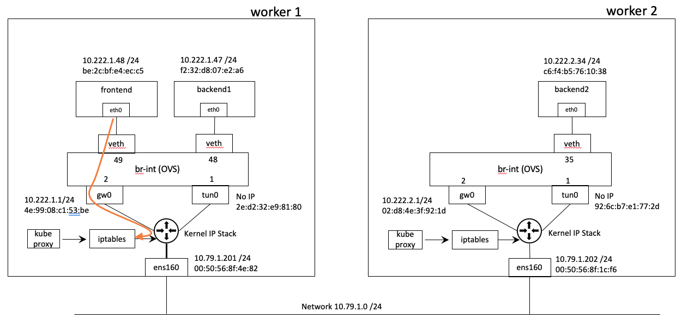
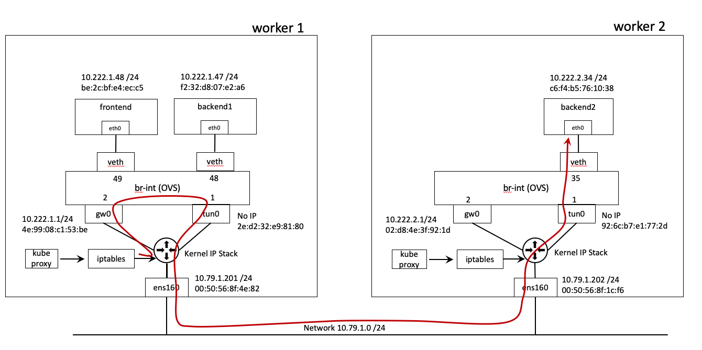
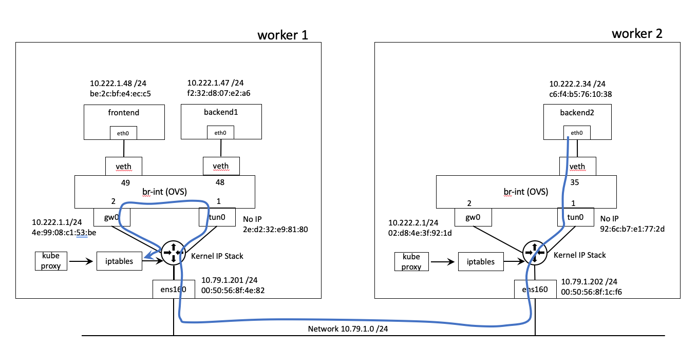
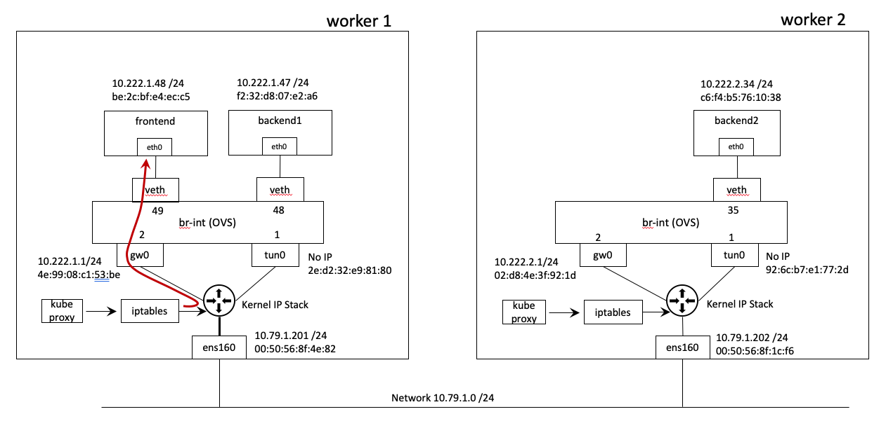

# PART C 

This section explains the packet flow between frontend and backend pods, which are on different Kubernetes nodes, in four phases.

- [8. Frontend to Service](https://github.com/dumlutimuralp/antrea-packet-walks/blob/master/part_c/README.md#8-Frontend-pod-to-service)
- [9. Service to Backend Pod](https://github.com/dumlutimuralp/antrea-packet-walks/blob/master/part_c/README.md#9-Service-to-backend-pod)
- [10. Backend Pod to Service](https://github.com/dumlutimuralp/antrea-packet-walks/blob/master/part_c/README.md#10-Backend-pod-to-service)
- [11. Service to Frontend](https://github.com/dumlutimuralp/antrea-packet-walks/blob/master/part_c/README.md#11-Service-to-frontend-pod)

# 8. Frontend Pod to Service
[Back to table of contents](https://github.com/dumlutimuralp/antrea-packet-walks/blob/master/part_c/README.md#part-c)

The flow that will be explained in this section is shown below.

As shown in [Part A Section 3.2](https://github.com/dumlutimuralp/antrea-packet-walks/blob/master/part_a/README.md#32-test-application), a simple "curl backendsvc" on frontend pod would initiate this request. Shown below.

<pre><code>
vmware@master:~$ k exec -it frontend -- sh
/ # curl backendsvc
<b>OUTPUT OMITTED</b>
</code></pre>

This flow comes to OVS on the frontend pod port. Basically this flow is frontend pod accessing the backendsvc service on TCP port 80. Backendsvc service is backed by backend1 and backend2 pods, as shown in kubectl outputs in [Part A Section 3.2](https://github.com/dumlutimuralp/antrea-packet-walks/tree/master/part_a#32-test-application).

At this stage, the current flow has the following values in the Ethernet and IP headers.

- Source IP = 10.222.1.48 (Frontend pod IP)
- Destination IP = 10.104.65.133 (Backendsvc service IP)
- Source MAC = be:2c:bf:e4:ec:c5 (Frontend pod MAC)
- Destination MAC = 4e:99:08:c1:53:be (antrea-gw0 interface MAC on Worker 1)

This flow will be matched against a flow entry in each OVS Table, processed top to bottom in each individual table, based on the priority value of the flow entry in the table.

## 8.1 Classifier Table #0

Table #0 on Worker 1 node is shown below.

<pre><code>
vmware@master:~$ kubectl exec -n kube-system -it antrea-agent-f76q2 -c antrea-ovs -- ovs-ofctl dump-flows br-int table=0 --no-stats
 cookie=0x1000000000000, priority=200,in_port="antrea-gw0" actions=load:0x1->NXM_NX_REG0[0..15],resubmit(,10)
 cookie=0x1000000000000, priority=200,in_port="antrea-tun0" actions=move:NXM_NX_TUN_METADATA0[28..31]->NXM_NX_REG9[28..31],load:0->NXM_NX_REG0[0..15],load:0x1->NXM_NX_REG0[19],resubmit(,30)
 cookie=0x1030000000000, priority=190,in_port="coredns--3e3abf" actions=load:0x2->NXM_NX_REG0[0..15],resubmit(,10)
 cookie=0x1030000000000, priority=190,in_port="antrea-o-830766" actions=load:0x2->NXM_NX_REG0[0..15],resubmit(,10)
 cookie=0x1030000000000, priority=190,in_port="backend1-bab86f" actions=load:0x2->NXM_NX_REG0[0..15],resubmit(,10)
 <b>cookie=0x1030000000000, priority=190,in_port="frontend-a3ba2f" actions=load:0x2->NXM_NX_REG0[0..15],resubmit(,10)</b>
 cookie=0x1000000000000, priority=0 actions=drop
vmware@master:~$
</code></pre>

This table is to classify the traffic by matching it on the ingress port and then setting the register NXM_NX_REG0[0..15] bits as following; "0" for tunnel, "1" for local gateway and "2" for local pod.  The current flow in this scenario, which is initiated from frontend pod and comes to OVS on the frontend pod interface, matches the <b>sixth</b> flow entry in the above output (which is highlighted). First action in this flow entry is to set the value of the register reg0[0..15] to "0x2", which means flow comes from a local pod. Second action in the same flow entry is to hand over the flow to next table which is Table 10. (resubmit(,10))  
So next stop is Table 10.

**Note :** "0x" means that it is hexadecimal. For example, 

- "0x2" is 2 × (16 to the power of 0) = 2 x 1 = 2
- or "0x20" is 2 x (16 to the power of 1) + 0 x (16 to the power of 0)  =  32 + 0 = 32

## 8.2 Spoofguard Table #10

Table #10 on Worker 1 node is shown below. "nw_src" refers to the IP address and "dl_src" refers to the MAC address of the pod connected to the respective OF port.

<pre><code>
vmware@master:~$ kubectl exec -n kube-system -it antrea-agent-f76q2 -c antrea-ovs -- ovs-ofctl dump-flows br-int table=10 --no-stats
 cookie=0x1000000000000, table=10, priority=200,ip,in_port="antrea-gw0" actions=resubmit(,30)
 cookie=0x1000000000000, table=10, priority=200,arp,in_port="antrea-gw0",arp_spa=10.222.1.1,arp_sha=4e:99:08:c1:53:be actions=resubmit(,20)
 cookie=0x1030000000000, table=10, priority=200,arp,in_port="coredns--3e3abf",arp_spa=10.222.1.2,arp_sha=f2:82:cc:96:da:bd actions=resubmit(,20)
 cookie=0x1030000000000, table=10, priority=200,arp,in_port="antrea-o-830766",arp_spa=10.222.1.3,arp_sha=6e:9e:5a:3e:3f:e8 actions=resubmit(,20)
 cookie=0x1030000000000, table=10, priority=200,arp,in_port="backend1-bab86f",arp_spa=10.222.1.47,arp_sha=f2:32:d8:07:e2:a6 actions=resubmit(,20)
 <b>cookie=0x1030000000000, table=10, priority=200,arp,in_port="frontend-a3ba2f",arp_spa=10.222.1.48,arp_sha=be:2c:bf:e4:ec:c5 actions=resubmit(,20)</b>
 cookie=0x1030000000000, table=10, priority=200,ip,in_port="coredns--3e3abf",dl_src=f2:82:cc:96:da:bd,nw_src=10.222.1.2 actions=resubmit(,30)
 cookie=0x1030000000000, table=10, priority=200,ip,in_port="antrea-o-830766",dl_src=6e:9e:5a:3e:3f:e8,nw_src=10.222.1.3 actions=resubmit(,30)
 cookie=0x1030000000000, table=10, priority=200,ip,in_port="backend1-bab86f",dl_src=f2:32:d8:07:e2:a6,nw_src=10.222.1.47 actions=resubmit(,30)
 <b>cookie=0x1030000000000, table=10, priority=200,ip,in_port="frontend-a3ba2f",dl_src=be:2c:bf:e4:ec:c5,nw_src=10.222.1.48 actions=resubmit(,30)</b>
 cookie=0x1000000000000, table=10, priority=0 actions=drop
vmware@master:~$ 
</code></pre>

What this table does is verifying if the source IP and MAC of the the traffic matches the IP and MAC assigned to the Pod by Antrea CNI plugin during initial Pod wiring. It implements this check both for IP and ARP traffic.

Highlighted lines in the above output are the respective ARP and IP check entries for the OF port which the frontend pod is connected to. In this instance this is an IP flow from frontend pod to backend service hence the current flow will match the second line from the bottom. Notice, in the same flow entry, once the spoofguard check is successful then the flow is handed over to Table 30 (actions=resubmit(,30)). Table 30 is the next stop.

## 8.3 Conntrack Table #30

Table #30 on Worker 1 node is shown below.

Conntrack table' s job is to start tracking all the traffic. ("ct" action means connection tracking) Any flow that goes through this table will be in "tracked" (trk) state. In generic networking security terms this functionality makes the OVS a stateful connection aware component. Flow then gets handed over to the next table which is Table 31; as seen in the "actions" section of the flow entry (actions=ct(table=31,)). Next stop is Table 31.

<pre><code>
vmware@master:~$ kubectl exec -n kube-system -it antrea-agent-f76q2 -c antrea-ovs -- ovs-ofctl dump-flows br-int table=30 --no-stats
 cookie=0x1000000000000, table=30, priority=200,ip <b>actions=ct(table=31,zone=65520)</b>
vmware@master:~$ 
</code></pre>

**Note :** "Zone" is explained [here](https://github.com/vmware-tanzu/antrea/blob/master/docs/ovs-pipeline.md#conntracktable-30) as following : "A ct_zone is simply used to isolate connection tracking rules. It is similar in spirit to the more generic Linux network namespaces, but ct_zone is specific to conntrack and has less overhead." 

## 8.4 ConntrackState Table #31

Table #31 on Worker 1 node is shown below.

<pre><code>
vmware@master:~$ kubectl exec -n kube-system -it antrea-agent-f76q2 -c antrea-ovs -- ovs-ofctl dump-flows br-int table=31 --no-stats
 cookie=0x1000000000000, table=31, priority=210,<b>ct_state=-new+trk</b>,ct_mark=0x20,ip,reg0=0x1/0xffff actions=resubmit(,40)
 cookie=0x1000000000000, table=31, priority=200,<b>ct_state=-new+trk</b>,ct_mark=0x20,ip actions=load:0x4e9908c153be->NXM_OF_ETH_DST[],resubmit(,40)
 cookie=0x1000000000000, table=31, priority=190,<b>ct_state=+inv+trk</b>,ip actions=drop
 <b>cookie=0x1000000000000, table=31, priority=0 actions=resubmit(,40)</b>
vmware@master:~$ 
</code></pre>

ConntrackState table processes all the flows that are in tracked state (basically which were handed over by the Conntrack table 30). The first and second flow entries shown above process the flows where the flow is NOT new AND tracked. (ct_state=-new means not new, +trk means being tracked) The third flow entry processes the flows where the respective flow is INVALID and TRACKED, basically it drops all those flows. 

The current flow is a completely NEW flow from frontend pod to backendsvc service. Hence the current flow will match the <b>last entry</b> in the flow table highlighted above. Notice the action in that flow entry is handing the flow over to the next table which is table 40. (resubmit(,40)) Next stop is Table 40.

## 8.5 DNAT Table #40

Table #40 on Worker 1 node is shown below.

<pre><code>
vmware@master:~$ kubectl exec -n kube-system -it antrea-agent-f76q2 -c antrea-ovs -- ovs-ofctl dump-flows br-int table=40 --no-stats
 cookie=0x1040000000000, table=40, priority=200,ip,<b>nw_dst=10.96.0.0/12</b> actions=mod_dl_dst:4e:99:08:c1:53:be,load:0x2->NXM_NX_REG1[],load:0x1->NXM_NX_REG0[16],resubmit(,105)
 cookie=0x1000000000000, table=40, priority=0 actions=resubmit(,50)
vmware@master:~$ 
</code></pre>

The table has only two flow entries. The first flow entry checks whether if the destination IP of the flow is part of the service CIDR range configured in the cluster (which is 10.96.0.0/12); if it does, then certain actions are taken on the flow to steer the flow to the antrea-gw0 interface on the Worker 1 node.  

The IP of the backendsvc service can be checked as below.

<pre><code>
vmware@master:~$ kubectl get svc
NAME                 TYPE        CLUSTER-IP      EXTERNAL-IP   PORT(S)   AGE
<b>service/backendsvc</b>   ClusterIP   <b>10.104.65.133</b>   <none>        80/TCP    2d1h
service/kubernetes   ClusterIP   10.96.0.1       <none>        443/TCP   7d1h
vmware@master:~$ 
</code></pre>

As shown above, 10.104.65.133 falls into the service CIDR range <b>hence the current flow will match the first flow entry</b> in the table and multiple actions will be taken on the flow.

The first action specified in the flow entry is rewriting the destination mac of the flow with "4e:99:08:c1:53:be" (mod_dl_dst:4e:99:08:c1:53:be); which is the MAC address of the gw0 (antrea-gw0) interface of the Worker 1 node. 

The second action specified in the flow entry is to set the "NXM_NX_REG1" bit to "0x2" (by load:0x2 in hex, which is 2 in decimal). This register represents the egress OF Port ID of the flow. (ie through which OF port this flow will be sent) And "2" is the OF Port ID for the antrea-gw0. The outputs and diagrams shown in [Part A Section 3.4](https://github.com/dumlutimuralp/antrea-packet-walks/tree/master/part_a#34-identifying-ovs-port-ids-of-port-ids) can be reviewed again to see OF Port ID.

The third action specified in the flow entry is setting the "NXM_NX_REG0[16]" to "1" (by load:0x1). This value in Reg0[16] means that OVS knows the destination MAC address. In other words this MAC address exists in OVS MAC address table (Table 80), which is explained in a seperate section. 

The fourth action in the flow entry is handing the flow over to the next table which is table 105 (resubmit(,105)). Next stop for this flow is Table 105.

**Note 1:** The flow is handed over to Table #105 and Egress tables (related to network policies), which are Table 45-49 and 50, are just bypassed, why ? Will be explained in an upcoming section.

**Note 2:** About the first action mentioned in the flow entry above, since the destination MAC in this flow is already the MAC address of the antrea-gw0 interface (cause frontend pod' s default gateway is gw0 interface IP) this rewrite action actually does not make any sense in this environment. Apparently this functionality was developed for a different use case and still exists but it actually does not affect anything. There is a PR for this which can be read [here](https://github.com/vmware-tanzu/antrea/issues/1264).

**Note 3:** The Service CIDR range (10.96.0.0/12) is aligned to the kubeadm default service cidr range. If a specific range is used in "--service-cluster-ip-range" for kube-apiserver then the "serviceCIDR" variable in antrea configmap should also be configured with the same range so that the respective flow entry in Table 40 gets configured with the correct range.

## 8.6 ConnTrackCommit Table #105

Table 105 on Worker 1 node is shown below.

<pre><code>
vmware@master:~$ kubectl exec -n kube-system -it antrea-agent-f76q2 -c antrea-ovs -- ovs-ofctl dump-flows br-int table=105 --no-stats
 cookie=0x1000000000000, table=105, priority=200,ct_state=+new+trk,ip,reg0=0x1/0xffff actions=ct(commit,table=110,zone=65520,exec(load:0x20->NXM_NX_CT_MARK[]))
 cookie=0x1000000000000, table=105, priority=190,ct_state=+new+trk,ip actions=ct(commit,table=110,zone=65520)
 cookie=0x1000000000000, table=105, priority=0 actions=resubmit(,110)
vmware@master:~$ 
</code></pre>

This table is for committing all the new flows for tracking them. This action, ct(commit,), is specifically explained as "Commit the connection to the connection tracking module which will be stored beyond the lifetime of packet in the pipeline." [in OVS docs](https://docs.openvswitch.org/en/latest/tutorials/ovs-conntrack/).

The first flow entry checks whether if the flow is a new flow (+new) and if it is a tracked flow (+trk). The same flow entry also checks if the flow is coming from the gateway interface. This is represented by reg0=0x1/0xffff. Explanation of this is as following. The second part "0xffff" instructs OVS to verify the first 16 bits in reg0, meaning reg0[0..15] and then the first part "0x1" means the result of that check should be "1". So it basically checks reg0[0..15]. The Reg0[0..15] is set by Classifier Table 10 and it is set to "1" if the flow comes from antrea-gw0 interface. 

The second flow entry checks whether if the flow is a new flow (+new) and if it is a tracked flow (+trk). 

In this case the current flow matches this <b>second</b> flow entry. It is not coming from the gateway interface; it is coming from a local pod interface (frontend pod interface on OVS). It is a new flow from frontend pod to backendsvc service and it is being tracked (previously from Conntrack Table 30 and 31). Hence the current flow is committed to conntrack table (actions=ct(commit,..)) and then it is handed over to the next table (,table=110). So next stop is Table 110.  

## 8.7 L2ForwardingOut Table #110

Table 110 on Worker 1 node is shown below.

This table' s job is simple. First flow entry in this table first reads the value in register reg0[16]. If the value of this register is "1" in decimal, that means the destination MAC address is known to OVS and the flow should be able to get forwarded (otherwise it would get dropped). The same flow entry has an action defined as "actions=output:NXM_NX_REG1[]". What this action does is it reads the value in "NXM_NX_REG1" to determine the OF port this flow will be sent through and then sends the flow onwards to that port.

<pre><code>
vmware@master:~$ kubectl exec -n kube-system -it antrea-agent-f76q2 -c antrea-ovs -- ovs-ofctl dump-flows br-int table=110 --no-stats
 cookie=0x1000000000000, table=110, priority=200,ip,reg0=0x10000/0x10000 actions=output:NXM_NX_REG1[]
 cookie=0x1000000000000, table=110, priority=0 actions=drop
vmware@master:~$
</code></pre>

The current flow' s reg0[16] bit was set to "0x1" (1 in decimal)  back in DNAT Table 40 and also the value of REG1 was set to "0x2" (2 in decimal) back in DNAT Table 40. "2" is the OF Port ID of antrea-gw0 interface. Hence the current flow is sent onwards to the antrea-gw0 by OVS.

**Note :** The second flow entry in this table obviously drops the flows which do not have their "reg0[16]" register set.

The logic of "reg0=-0x10000/0x10000" in the flow entry is that the first 0x10000 is the desired value of this register. The second 0x10000 is the exact instructions on which specific bit(s) should be verified to match the desired value. Since "0x" is hexadecimal, below is a detailed explanation of the position of the bit that is verified. 

<pre><code>
23              16  15               8   7               0
0 0 0 0 | 0 0 0 1   0 0 0 0 |  0 0 0 0   0 0 0 0 | 0 0 0 0
</code></pre>

So bit 16 must be "1", and that is being verified in "reg0". The first four bits on the left hand side is not worth to mention hence the desired value and actual value are both shown as "0x10000". 

## 8.8 IPTables

At this stage, the Kernel IP stack of Worker 1 node receives the flow from antrea-gw0 interface and the flow will  is processed by iptables NAT rules. Iptables NAT rules on Worker 1 node are shown below.

Basically Kube Services chain "KUBE-SVC-EKL7ZEFK3VFJKKGJ" applies destination NAT on flows destined to backendsvc service IP and picks either backend1 or backend2 as the destination. This is typical Kube-proxy managed, iptables driven "ClusterIP" type of Kubernetes service functionality which is providing distributed load balancing for flows within a Kubernetes cluster.

<pre><code>
vmware@worker1:~$ sudo iptables -t nat -L -n
Chain PREROUTING (policy ACCEPT)
target     prot opt source               destination         
KUBE-SERVICES  all  --  0.0.0.0/0            0.0.0.0/0            /* kubernetes service portals */
DOCKER     all  --  0.0.0.0/0            0.0.0.0/0            ADDRTYPE match dst-type LOCAL

Chain INPUT (policy ACCEPT)
target     prot opt source               destination         

Chain OUTPUT (policy ACCEPT)
target     prot opt source               destination         
KUBE-SERVICES  all  --  0.0.0.0/0            0.0.0.0/0            /* kubernetes service portals */
DOCKER     all  --  0.0.0.0/0           !127.0.0.0/8          ADDRTYPE match dst-type LOCAL

Chain POSTROUTING (policy ACCEPT)
target     prot opt source               destination         
KUBE-POSTROUTING  all  --  0.0.0.0/0            0.0.0.0/0            /* kubernetes postrouting rules */
MASQUERADE  all  --  172.17.0.0/16        0.0.0.0/0           
ANTREA-POSTROUTING  all  --  0.0.0.0/0            0.0.0.0/0            /* Antrea: jump to Antrea postrouting rules */

Chain ANTREA-POSTROUTING (1 references)
target     prot opt source               destination         
MASQUERADE  all  --  10.222.1.0/24        0.0.0.0/0            /* Antrea: masquerade pod to external packets */ ! match-set ANTREA-POD-IP dst

Chain DOCKER (2 references)
target     prot opt source               destination         
RETURN     all  --  0.0.0.0/0            0.0.0.0/0           

Chain KUBE-KUBELET-CANARY (0 references)
target     prot opt source               destination         

Chain KUBE-MARK-DROP (0 references)
target     prot opt source               destination         
MARK       all  --  0.0.0.0/0            0.0.0.0/0            MARK or 0x8000

Chain KUBE-MARK-MASQ (19 references)
target     prot opt source               destination         
MARK       all  --  0.0.0.0/0            0.0.0.0/0            MARK or 0x4000

Chain KUBE-NODEPORTS (1 references)
target     prot opt source               destination         
KUBE-MARK-MASQ  tcp  --  0.0.0.0/0            0.0.0.0/0            /* kube-system/antrea-octant: */ tcp dpt:31067
KUBE-SVC-A2RN3UXPG7GRS3AU  tcp  --  0.0.0.0/0            0.0.0.0/0            /* kube-system/antrea-octant: */ tcp dpt:31067

Chain KUBE-POSTROUTING (1 references)
target     prot opt source               destination         
RETURN     all  --  0.0.0.0/0            0.0.0.0/0            mark match ! 0x4000/0x4000
MARK       all  --  0.0.0.0/0            0.0.0.0/0            MARK xor 0x4000
MASQUERADE  all  --  0.0.0.0/0            0.0.0.0/0            /* kubernetes service traffic requiring SNAT */

Chain KUBE-PROXY-CANARY (0 references)
target     prot opt source               destination         

Chain KUBE-SEP-2MIG7YSQRKRPLGGX (1 references)
target     prot opt source               destination         
KUBE-MARK-MASQ  all  --  10.222.1.2           0.0.0.0/0            /* kube-system/kube-dns:dns */
DNAT       udp  --  0.0.0.0/0            0.0.0.0/0            /* kube-system/kube-dns:dns */ udp to:10.222.1.2:53

<b>Chain KUBE-SEP-6PRWOLZVS5LKSHLK (1 references)
target     prot opt source               destination         
KUBE-MARK-MASQ  all  --  10.222.1.47          0.0.0.0/0            /* default/backendsvc: */
DNAT       tcp  --  0.0.0.0/0            0.0.0.0/0            /* default/backendsvc: */ tcp to:10.222.1.47:80</b>

Chain KUBE-SEP-BCZG4RHMLPD3XZC5 (1 references)
target     prot opt source               destination         
KUBE-MARK-MASQ  all  --  10.222.2.2           0.0.0.0/0            /* kube-system/kube-dns:dns-tcp */
DNAT       tcp  --  0.0.0.0/0            0.0.0.0/0            /* kube-system/kube-dns:dns-tcp */ tcp to:10.222.2.2:53

Chain KUBE-SEP-EVFFBIHEP2PDYG44 (1 references)
target     prot opt source               destination         
KUBE-MARK-MASQ  all  --  10.79.1.200          0.0.0.0/0            /* default/kubernetes:https */
DNAT       tcp  --  0.0.0.0/0            0.0.0.0/0            /* default/kubernetes:https */ tcp to:10.79.1.200:6443

Chain KUBE-SEP-NRWLC3D3JGTRYOSQ (1 references)
target     prot opt source               destination         
KUBE-MARK-MASQ  all  --  10.79.1.202          0.0.0.0/0            /* kube-system/antrea: */
DNAT       tcp  --  0.0.0.0/0            0.0.0.0/0            /* kube-system/antrea: */ tcp to:10.79.1.202:10349

Chain KUBE-SEP-NS6VF4EO5FNJEZ3Z (1 references)
target     prot opt source               destination         
KUBE-MARK-MASQ  all  --  10.222.1.3           0.0.0.0/0            /* kube-system/antrea-octant: */
DNAT       tcp  --  0.0.0.0/0            0.0.0.0/0            /* kube-system/antrea-octant: */ tcp to:10.222.1.3:80

Chain KUBE-SEP-QQKVVTQCCVWQJVWT (1 references)
target     prot opt source               destination         
KUBE-MARK-MASQ  all  --  10.222.2.2           0.0.0.0/0            /* kube-system/kube-dns:dns */
DNAT       udp  --  0.0.0.0/0            0.0.0.0/0            /* kube-system/kube-dns:dns */ udp to:10.222.2.2:53

<b>Chain KUBE-SEP-R5BOSGFC7D2XSIZA (1 references)
target     prot opt source               destination         
KUBE-MARK-MASQ  all  --  10.222.2.34          0.0.0.0/0            /* default/backendsvc: */
DNAT       tcp  --  0.0.0.0/0            0.0.0.0/0            /* default/backendsvc: */ tcp to:10.222.2.34:80</b>

Chain KUBE-SEP-U2DUVZDMAC5YMHOK (1 references)
target     prot opt source               destination         
KUBE-MARK-MASQ  all  --  10.222.1.2           0.0.0.0/0            /* kube-system/kube-dns:dns-tcp */
DNAT       tcp  --  0.0.0.0/0            0.0.0.0/0            /* kube-system/kube-dns:dns-tcp */ tcp to:10.222.1.2:53

Chain KUBE-SEP-Z2WIYZ27U5AUKQEZ (1 references)
target     prot opt source               destination         
KUBE-MARK-MASQ  all  --  10.222.1.2           0.0.0.0/0            /* kube-system/kube-dns:metrics */
DNAT       tcp  --  0.0.0.0/0            0.0.0.0/0            /* kube-system/kube-dns:metrics */ tcp to:10.222.1.2:9153

Chain KUBE-SEP-ZP6MZIYCX7J4FSPR (1 references)
target     prot opt source               destination         
KUBE-MARK-MASQ  all  --  10.222.2.2           0.0.0.0/0            /* kube-system/kube-dns:metrics */
DNAT       tcp  --  0.0.0.0/0            0.0.0.0/0            /* kube-system/kube-dns:metrics */ tcp to:10.222.2.2:9153

Chain KUBE-SERVICES (2 references)
target     prot opt source               destination         
KUBE-MARK-MASQ  tcp  -- !10.222.0.0/16        10.96.0.10           /* kube-system/kube-dns:dns-tcp cluster IP */ tcp dpt:53
KUBE-SVC-ERIFXISQEP7F7OF4  tcp  --  0.0.0.0/0            10.96.0.10           /* kube-system/kube-dns:dns-tcp cluster IP */ tcp dpt:53
KUBE-MARK-MASQ  tcp  -- !10.222.0.0/16        10.109.110.219       /* kube-system/antrea-octant: cluster IP */ tcp dpt:80
KUBE-SVC-A2RN3UXPG7GRS3AU  tcp  --  0.0.0.0/0            10.109.110.219       /* kube-system/antrea-octant: cluster IP */ tcp dpt:80
KUBE-MARK-MASQ  udp  -- !10.222.0.0/16        10.96.0.10           /* kube-system/kube-dns:dns cluster IP */ udp dpt:53
KUBE-SVC-TCOU7JCQXEZGVUNU  udp  --  0.0.0.0/0            10.96.0.10           /* kube-system/kube-dns:dns cluster IP */ udp dpt:53
KUBE-MARK-MASQ  tcp  -- !10.222.0.0/16        10.110.254.249       /* kube-system/antrea: cluster IP */ tcp dpt:443
KUBE-SVC-ACVYUMUVQZGITN4Q  tcp  --  0.0.0.0/0            10.110.254.249       /* kube-system/antrea: cluster IP */ tcp dpt:443
<b>KUBE-MARK-MASQ  tcp  -- !10.222.0.0/16        10.104.65.133        /* default/backendsvc: cluster IP */ tcp dpt:80
KUBE-SVC-EKL7ZEFK3VFJKKGJ  tcp  --  0.0.0.0/0            10.104.65.133        /* default/backendsvc: cluster IP */ tcp dpt:80</b>
KUBE-MARK-MASQ  tcp  -- !10.222.0.0/16        10.96.0.1            /* default/kubernetes:https cluster IP */ tcp dpt:443
KUBE-SVC-NPX46M4PTMTKRN6Y  tcp  --  0.0.0.0/0            10.96.0.1            /* default/kubernetes:https cluster IP */ tcp dpt:443
KUBE-MARK-MASQ  tcp  -- !10.222.0.0/16        10.96.0.10           /* kube-system/kube-dns:metrics cluster IP */ tcp dpt:9153
KUBE-SVC-JD5MR3NA4I4DYORP  tcp  --  0.0.0.0/0            10.96.0.10           /* kube-system/kube-dns:metrics cluster IP */ tcp dpt:9153
KUBE-NODEPORTS  all  --  0.0.0.0/0            0.0.0.0/0            /* kubernetes service nodeports; NOTE: this must be the last rule in this chain */ ADDRTYPE match dst-type LOCAL

Chain KUBE-SVC-A2RN3UXPG7GRS3AU (2 references)
target     prot opt source               destination         
KUBE-SEP-NS6VF4EO5FNJEZ3Z  all  --  0.0.0.0/0            0.0.0.0/0            /* kube-system/antrea-octant: */

Chain KUBE-SVC-ACVYUMUVQZGITN4Q (1 references)
target     prot opt source               destination         
KUBE-SEP-NRWLC3D3JGTRYOSQ  all  --  0.0.0.0/0            0.0.0.0/0            /* kube-system/antrea: */

<b>Chain KUBE-SVC-EKL7ZEFK3VFJKKGJ (1 references)
target     prot opt source               destination         
KUBE-SEP-6PRWOLZVS5LKSHLK  all  --  0.0.0.0/0            0.0.0.0/0            /* default/backendsvc: */ statistic mode random probability 0.50000000000
KUBE-SEP-R5BOSGFC7D2XSIZA  all  --  0.0.0.0/0            0.0.0.0/0            /* default/backendsvc: */</b>

Chain KUBE-SVC-ERIFXISQEP7F7OF4 (1 references)
target     prot opt source               destination         
KUBE-SEP-U2DUVZDMAC5YMHOK  all  --  0.0.0.0/0            0.0.0.0/0            /* kube-system/kube-dns:dns-tcp */ statistic mode random probability 0.50000000000
KUBE-SEP-BCZG4RHMLPD3XZC5  all  --  0.0.0.0/0            0.0.0.0/0            /* kube-system/kube-dns:dns-tcp */

Chain KUBE-SVC-JD5MR3NA4I4DYORP (1 references)
target     prot opt source               destination         
KUBE-SEP-Z2WIYZ27U5AUKQEZ  all  --  0.0.0.0/0            0.0.0.0/0            /* kube-system/kube-dns:metrics */ statistic mode random probability 0.50000000000
KUBE-SEP-ZP6MZIYCX7J4FSPR  all  --  0.0.0.0/0            0.0.0.0/0            /* kube-system/kube-dns:metrics */

Chain KUBE-SVC-NPX46M4PTMTKRN6Y (1 references)
target     prot opt source               destination         
KUBE-SEP-EVFFBIHEP2PDYG44  all  --  0.0.0.0/0            0.0.0.0/0            /* default/kubernetes:https */

Chain KUBE-SVC-TCOU7JCQXEZGVUNU (1 references)
target     prot opt source               destination         
KUBE-SEP-2MIG7YSQRKRPLGGX  all  --  0.0.0.0/0            0.0.0.0/0            /* kube-system/kube-dns:dns */ statistic mode random probability 0.50000000000
KUBE-SEP-QQKVVTQCCVWQJVWT  all  --  0.0.0.0/0            0.0.0.0/0            /* kube-system/kube-dns:dns */
vmware@worker1:~$ 
</code></pre>

Next phase is the flow being sent from backendsvc service to one of the backend pods backing that service and the processing of that flow is explained in the next section. 

# 9. Service to Backend Pod
[Back to table of contents](https://github.com/dumlutimuralp/antrea-packet-walks/blob/master/part_c/README.md#part-c)

The **assumption is that, in the previous phase, kube-proxy driven NAT rules in iptables translated the backendsvc service IP to the backend2 pod' s IP (which is on Worker 2 node)** to service the request that came from the frontend pod in the previous section. 

As mentioned in the assumption above, the kube-proxy managed iptables NAT rule DNATed backendsvc IP (10.104.65.133) to backend2 pod IP (10.222.2.34). Hence, the flow that will be explained in this section is shown below. 

Basically this flow is the service to backend2 pod communication and it has the following values in the Ethernet and IP headers.

- Source IP = 10.222.1.48 (frontend pod IP)
- Destination IP = 10.222.2.34 (backend2 pod IP)
- Source MAC = 4e:99:08:c1:53:be (antrea-gw0 interface MAC on Worker 1)
- Destination MAC = aa:bb:cc:dd:ee:ff (When the destination pod is on a different node this global virtual MAC is used. It will be explained in [Part D Section 12](https://github.com/dumlutimuralp/antrea-packet-walks/tree/master/part_d)) 

To verify how the service to backend pod (backend2 pod in this case) flow comes to OVS (from antrea-gw0 interface), a quick tcpdump on the antrea-gw0 interface on Worker 1 node would reveal the source and destination IP/MAC of this communication. It is shown below.

<pre><code>
vmware@worker1:~$ sudo tcpdump -i antrea-gw0 -en
[sudo] password for vmware: 
tcpdump: verbose output suppressed, use -v or -vv for full protocol decode
listening on antrea-gw0, link-type EN10MB (Ethernet), capture size 262144 bytes
09:41:49.008628 be:2c:bf:e4:ec:c5 > 4e:99:08:c1:53:be, ethertype IPv4 (0x0800), length 74: 10.222.1.48.56670 > 10.104.65.133.80: Flags [S], seq 569506855, win 64860, options [mss 1410,sackOK,TS val 3688671724 ecr 0,nop,wscale 7], length 0
09:41:49.008680 <b>4e:99:08:c1:53:be > aa:bb:cc:dd:ee:ff, ethertype IPv4 (0x0800), length 74: 10.222.1.48.56670 > 10.222.2.34.80</b>: Flags [S], seq 569506855, win 64860, options [mss 1410,sackOK,TS val 3688671724 ecr 0,nop,wscale 7], length 0
<b>OUTPUT OMITTED</b>
</code></pre>

Note 1: For simplicity, the ARP requests/replies between antrea-gw0, frontend pod and backend2 pod are not shown in the above output.

The highlighted flow above will be matched against a flow entry in each OVS Table (first on Worker 1 node, then on Worker 2 node), processed top to bottom in each individual table, based on the priority value of the flow entry in the table.

## 9.1 Classifier Table #0

Table #0 on Worker 1 node is shown below.

<pre><code>
vmware@master:~$ kubectl exec -n kube-system -it antrea-agent-f76q2 -c antrea-ovs -- ovs-ofctl dump-flows br-int table=0 --no-stats
 <b>cookie=0x1000000000000, priority=200,in_port="antrea-gw0" actions=load:0x1->NXM_NX_REG0[0..15],resubmit(,10)</b>
 cookie=0x1000000000000, priority=200,in_port="antrea-tun0" actions=move:NXM_NX_TUN_METADATA0[28..31]->NXM_NX_REG9[28..31],load:0->NXM_NX_REG0[0..15],load:0x1->NXM_NX_REG0[19],resubmit(,30)
 cookie=0x1030000000000, priority=190,in_port="coredns--3e3abf" actions=load:0x2->NXM_NX_REG0[0..15],resubmit(,10)
 cookie=0x1030000000000, priority=190,in_port="antrea-o-830766" actions=load:0x2->NXM_NX_REG0[0..15],resubmit(,10)
 cookie=0x1030000000000, priority=190,in_port="backend1-bab86f" actions=load:0x2->NXM_NX_REG0[0..15],resubmit(,10)
 cookie=0x1030000000000, priority=190,in_port="frontend-a3ba2f" actions=load:0x2->NXM_NX_REG0[0..15],resubmit(,10)
 cookie=0x1000000000000, priority=0 actions=drop
vmware@master:~$
</code></pre>

This table is to classify the traffic by matching it on the ingress port and then setting the register NXM_NX_REG0[0..15] bits as following; "0" for tunnel, "1" for local gateway and "2" for local pod. 

The current flow came from antrea-gw0 interface hence it matches the <b>first</b> flow entry in the above output (which is highlighted). The first action in this flow entry is to set the register reg0[0..15] to "0x1" since the flow comes from the local gateway. The second action in this flow entry is to hand over the flow to Table 10. (resubmit(,10)) Hence next stop is Table 10.

## 9.2 Spoofguard Table #10

Table #10 on Worker 1 node is shown below. "nw_src" refers to the IP address and "dl_src" refers to the MAC address of the pod connected to the respective OF port.

<pre><code>
vmware@master:~$ kubectl exec -n kube-system -it antrea-agent-f76q2 -c antrea-ovs -- ovs-ofctl dump-flows br-int table=10 --no-stats
 <b>cookie=0x1000000000000, table=10, priority=200,ip,in_port="antrea-gw0" actions=resubmit(,30)</b>
 cookie=0x1000000000000, table=10, priority=200,arp,in_port="antrea-gw0",arp_spa=10.222.1.1,arp_sha=4e:99:08:c1:53:be actions=resubmit(,20)
 cookie=0x1030000000000, table=10, priority=200,arp,in_port="coredns--3e3abf",arp_spa=10.222.1.2,arp_sha=f2:82:cc:96:da:bd actions=resubmit(,20)
 cookie=0x1030000000000, table=10, priority=200,arp,in_port="antrea-o-830766",arp_spa=10.222.1.3,arp_sha=6e:9e:5a:3e:3f:e8 actions=resubmit(,20)
 cookie=0x1030000000000, table=10, priority=200,arp,in_port="backend1-bab86f",arp_spa=10.222.1.47,arp_sha=f2:32:d8:07:e2:a6 actions=resubmit(,20)
 cookie=0x1030000000000, table=10, priority=200,arp,in_port="frontend-a3ba2f",arp_spa=10.222.1.48,arp_sha=be:2c:bf:e4:ec:c5 actions=resubmit(,20)
 cookie=0x1030000000000, table=10, priority=200,ip,in_port="coredns--3e3abf",dl_src=f2:82:cc:96:da:bd,nw_src=10.222.1.2 actions=resubmit(,30)
 cookie=0x1030000000000, table=10, priority=200,ip,in_port="antrea-o-830766",dl_src=6e:9e:5a:3e:3f:e8,nw_src=10.222.1.3 actions=resubmit(,30)
 cookie=0x1030000000000, table=10, priority=200,ip,in_port="backend1-bab86f",dl_src=f2:32:d8:07:e2:a6,nw_src=10.222.1.47 actions=resubmit(,30)
 cookie=0x1030000000000, table=10, priority=200,ip,in_port="frontend-a3ba2f",dl_src=be:2c:bf:e4:ec:c5,nw_src=10.222.1.48 actions=resubmit(,30)
 cookie=0x1000000000000, table=10, priority=0 actions=drop
vmware@master:~$ 
</code></pre>

What this table does is verifying if the source IP and MAC of the the traffic matches the IP and MAC assigned to the Pod by Antrea CNI plugin during initial Pod wiring. It implements this check both for IP and ARP traffic.

Since the flow comes from the antrea-gw0 interface, the flow will match the <b>first</b> flow entry in this table. The source IP of the current flow, which is coming from antrea-gw0 interface, is still the frontend pod IP (requestor of the original flow), hence spoofguard does not do any checks in this instance. The only action specified in the first flow entry is handing the flow over to Table 30 (actions=goto_table:30). So next stop is Table 30.

**Note :** Spoofguard does not do any checks for IP packets on the antrea-gw0 port. However it still checks the ARP flows on that port. Second entry in the table is used for that purpose. It basically checks the ARP flows/replies sent by the antrea-gw0 interface to the local pods running on Worker1 node.

## 9.3 ConntrackTable Table #30

Table #30 on Worker 1 node is shown below.

<pre><code>
vmware@master:~$ kubectl exec -n kube-system -it antrea-agent-f76q2 -c antrea-ovs -- ovs-ofctl dump-flows br-int table=30 --no-stats
 cookie=0x1000000000000, table=30, priority=200,ip <b>actions=ct(table=31</b>,zone=65520)
vmware@master:~$ 
</code></pre>

Conntrack table' s job is to start tracking all the traffic. ("ct" action means connection tracking). Any flow that goes through this table will be in "tracked" (trk) state. In generic networking security terms this functionality makes the OVS a stateful connection aware component. Flow then gets handed over to the next table which is Table 31; as seen in the "actions" section of the flow entry. (actions=ct(table=31,)) So next stop is Table 31.

**Note :** Zone ID is explained [here](https://github.com/vmware-tanzu/antrea/blob/master/docs/ovs-pipeline.md#conntracktable-30) as "A ct_zone is simply used to isolate connection tracking rules. It is similar in spirit to the more generic Linux network namespaces, but ct_zone is specific to conntrack and has less overhead." 

## 9.4 ConnTrackState Table #31

Table #31 on Worker 1 node is shown below.

<pre><code>
vmware@master:~$ kubectl exec -n kube-system -it antrea-agent-f76q2 -c antrea-ovs -- ovs-ofctl dump-flows br-int table=31 --no-stats
 cookie=0x1000000000000, table=31, priority=210,<b>ct_state=-new+trk</b>,ct_mark=0x20,ip,reg0=0x1/0xffff actions=resubmit(,40)
 cookie=0x1000000000000, table=31, priority=200,<b>ct_state=-new+trk</b>,ct_mark=0x20,ip actions=load:0x4e9908c153be->NXM_OF_ETH_DST[],resubmit(,40)
 cookie=0x1000000000000, table=31, priority=190,<b>ct_state=+inv+trk</b>,ip actions=drop
 <b>cookie=0x1000000000000, table=31, priority=0 actions=resubmit(,40)</b>
vmware@master:~$ 
</code></pre>

ConntrackState table processes all the flows that are in tracked state (basically which were handed over by the Conntrack table 30). The first and second flow entries shown above process the flows where the flow is NOT new AND tracked. (ct_state=-new means not new, +trk means being tracked) The third flow entry processes the flows where the respective flow is INVALID and TRACKED, basically it drops all those flows.

The current flow is a completely NEW flow - from frontend pod to backend2 pod. Hence the flow matches the <b>last entry</b> in the flow table highlighted above. Notice the action in the same flow entry is handing the flow over to the next table which is table 40 (resubmit(,40)). So next stop is Table 40.

**Note :** The current flow is actually the continuity of the previous flow, which was from frontend pod to backendsvc service. However that previous flow has been subject to DNAT process by iptables in Section 8.8. The destination IP of that previous flow has been changed (to backend2 pod IP) so the current flow, whose source IP is frontend pod IP and destination IP is now the backend1 pod IP, is a new flow. Hence it matches the last flow entry in Table 31. 

## 9.5 DNAT Table #40

Table #40 on Worker 1 node is shown below.

<pre><code>
vmware@master:~$ kubectl exec -n kube-system -it antrea-agent-f76q2 -c antrea-ovs -- ovs-ofctl dump-flows br-int table=40 --no-stats
 cookie=0x1040000000000, table=40, priority=200,ip,w_dst=10.96.0.0/12 actions=mod_dl_dst:4e:99:08:c1:53:be,load:0x2->NXM_NX_REG1[],load:0x1->NXM_NX_REG0[16],resubmit(,105)
 cookie=0x1000000000000, table=40, priority=0 actions=resubmit(,50)
vmware@master:~$ 
</code></pre>

This table in essence checks whether if the flow is destined to a Kubernetes service so that it can redirect the flow to the antrea-gw0. 

The table has only two flow entries. The first flow entry checks whether if the destination IP of the flow is part of the service CIDR range configured in the cluster (which is 10.96.0.0/12); if it does, then certain actions are taken on the flow to steer the flow to the antrea-gw0 interface on the Worker 1 node.  

The destination IP of the current flow is backend2 pod IP (10.222.2.34) and it does not fall into the service CIDR range in the first flow entry in Table 40. Hence the current flow will match the second/last entry. The action specified in the last flow entry is to basically hand over the flow to Table 50 (actions=resubmit(,50)). So next stop is Table 50.

**Note :** In the OVS Pipeline diagram at Antrea Project' s Github repo, there are tables 45-49 before Table50. However those tables are in use only when ClusterNetworkPolicy (CNP) feature of Antrea is used. In this Antrea environment, CNP is not used. 

## 9.6 EgressRule Table #50

At this stage, the flow is in Table 50. 

Table 50 has flow entries which correspond to the egress rules configured in Kubernetes Network Policies applied to the pods on Worker 1 node. There is a frontend pod and a backend1 pod on the Worker 1 node. "frontendpolicy" is applied to frontend pod and "backendpolicy" is applied to backend1 pod and backend2 pod (on Worker2) . 

In this section the current flow will be matched against the egress rules of the Kubernetes Network Policy "frontendpolicy"; since it is the policy which is applied to the frontend pod and frontend pod is the initiator of the flow. 

In the previous section (Section 8) the flow could not be matched against The Kubernetes Network Policy "frontendpolicy", instead bypassed all the EgressRule tables. Because that flow' s destination IP was still the backendsvc service IP and Kubernetes Network Policy would not make an accurate check in that case and legitimate flows would have been blocked. This is the reason as to why the flow in Section 8 bypassed all the Egress Rule tables and got redirected to antrea-gw0 interface onwards to Kernel IP stack for iptables rule processing. Only after kube-proxy managed iptables rules applied DNAT on that flow (in Phase 1), which essentially translated the destination backendsvc service IP to one of the backend pods IP, then the new flow in this current phase, which is Phase 2, can be processed by Kubernetes Network Policy "frontendpolicy" as will be explained in this step. 

The content of the "frontendpolicy" is shown below.

<pre><code>
vmware@master:~$ kubectl get netpol frontendpolicy
NAME             POD-SELECTOR    AGE
frontendpolicy   role=frontend   6d5h
vmware@master:~$ kubectl get netpol frontendpolicy -o yaml
apiVersion: networking.Kubernetes.io/v1
kind: NetworkPolicy
metadata:
  name: <b>frontendpolicy</b>
  namespace: default
spec:
  <b>egress:
  - ports:
    - port: 80
      protocol: TCP
    to:
    - podSelector:
        matchLabels:
          role: backend
  - ports:
    - port: 53
      protocol: UDP</b>
  ingress:
  - ports:
    - port: 80
      protocol: TCP
  podSelector:
    matchLabels:
      role: frontend
  policyTypes:
  - Egress
  - Ingress
vmware@master:~$ 
vmware@master:~$ k describe netpol frontendpolicy
Name:         frontendpolicy
Namespace:    default
Created on:   2020-09-14 15:27:33 +0000 UTC
Labels:       <none>
Annotations:  Spec:
  PodSelector:     role=frontend
  Allowing ingress traffic:
    To Port: 80/TCP
    From: <any> (traffic not restricted by source)
  <b>Allowing egress traffic:
    To Port: 80/TCP
    To:
      PodSelector: role=backend
    ----------
    To Port: 53/UDP
    To: <any> (traffic not restricted by source)</b>
  Policy Types: Egress, Ingress
vmware@master:~$ 
vmware@master:~$ 
</code></pre>

The egress section of this network policy is highlighted in the above output. In this network policy that, frontend pod can initiate HTTP to backend pods and it can initiate DNS to anywhere. All other type of traffic from frontend pod will be denied. Notice the current flow is from frontend pod to backend2 pod; hence the current flow is now subject to Kubernetes Network Policy "frontendpolicy" ' s egress rules that are applied to the frontend pod.

**Note :** The reason DNS is also allowed is, when the frontend pod sends a request to the backendsvc service by its name, a DNS query is sent by frontend pod to Kubernetes DNS so that frontend pod can call out one of the backend pods by their IPs, hence DNS has to be allowed to make this work. **As mentioned before, this article focuses on the actual application flow which occurs after the DNS query. In this section the flow from frontend pod to backend2 pod on TCP port 80 is explained.**

The Table 50 on Worker 1 node is shown below. 

<pre><code>
vmware@master:~$ kubectl exec -n kube-system -it antrea-agent-f76q2 -c antrea-ovs -- ovs-ofctl dump-flows br-int table=50 --no-stats
 cookie=0x1000000000000, table=50, priority=210,ct_state=-new+est,ip actions=resubmit(,70)
 cookie=0x1050000000000, table=50, priority=200,ip actions=conjunction(2,2/3)
 cookie=0x1050000000000, table=50, priority=200,udp,tp_dst=53 actions=conjunction(2,3/3)
 cookie=0x1050000000000, table=50, priority=200,tcp,tp_dst=80 actions=conjunction(1,3/3)
 cookie=0x1050000000000, table=50, priority=200,ip,nw_src=10.222.1.48 actions=conjunction(1,1/3),conjunction(2,1/3)
 cookie=0x1050000000000, table=50, priority=200,ip,nw_src=10.222.1.47 actions=conjunction(5,1/2)
 cookie=0x1050000000000, table=50, priority=200,ip,nw_dst=10.222.2.34 actions=conjunction(1,2/3)
 cookie=0x1050000000000, table=50, priority=200,ip,nw_dst=10.222.1.47 actions=conjunction(1,2/3)
 cookie=0x1050000000000, table=50, priority=190,conj_id=2,ip actions=load:0x2->NXM_NX_REG5[],resubmit(,70)
 cookie=0x1050000000000, table=50, priority=190,conj_id=1,ip actions=load:0x1->NXM_NX_REG5[],resubmit(,70)
 cookie=0x1050000000000, table=50, priority=190,conj_id=5,ip actions=load:0x5->NXM_NX_REG5[],resubmit(,70)
 cookie=0x1000000000000, table=50, priority=0 actions=resubmit(,60)
vmware@master:~$ 
</code></pre>

One thing to emphasize here again is that this table includes the egress rules of all the Kubernetes Network Policies applied to all of the pods on Worker 1 node (not only the egress rules configured on "frontendpolicy" and applied to frontend pod). Cause there is a frontend pod and a backend1 pod running on Worker 1 node. However the focus in this section is on the flow entries which correspond to the egress rules of the Kubernetes Network Policy "frontendpolicy" which is applied to the frontend pod.

First thing to understand from above table is OVS uses "conjunctive" match across multiple fields alongside "conjunction" action. This enables OVS to optimize policy implementation without consuming too many flow entries.

The first flow entry in Table 50 above checks whether if the flow is an already established flow (-new,+trk); if it is then there is no need to process the flow against the remaining flow entries in this table since Kubernetes Network Policy is STATEFUL by nature. However the current flow is a NEW flow hence it does NOT match this first flow entry.

The second flow entry matches against a given source or destination IP set. But there is no specific IP that this flow entry checks upon apparently. Same flow entry has a conjunction action with a conjunction id of "2".

The third flow entry matches against destination protocol, which is UDP 53 (DNS) in this case. Same flow entry has a conjunction action with a conjunction id of "2". 

The fourth flow entry matches against destination protocol, which is TCP 80 (HTTP) in this case. Same flow entry has a conjunction action with a conjunction id of "1".

The fifth flow entry matches against a specific source IP, which is frontend pod IP - 10.222.1.48. The same flow entry has a conjunction action with both an id of "1" and "2".

**Note :** The x/y notation in the conjunctions are to represent whether if the conjunction has multiple conditions to match and which condition the current flow represents.

<b>So conjunction 2 is fully implemented by second, third and fifth flow entries.</b> Conjunction 2 checks if the source IP address is 10.222.1.48 and if the destination protocol is UDP 53. This corresponds to the DNS specific rule in the egress section of the Kubernetes network policy named as "frontendpolicy" shown earlier. DNS is allowed egress to any destination IP hence the second flow entry above does not have any specific IP to match against. 

The sixth flow entry matches against source IP, which is 10.222.1.47, which is the backend1 pod IP in this case. The same flow entry has a conjunction action with a conjunction id of "5".

The seventh and eight flow entries match against the destination IP to see if it is either of the IPs; 10.222.1.47 or 10.222.2.34. These flow entries has a conjunction action with a conjunction id of "1".

<b> So conjunction 1 is fully implemented by fourth, fifth, seventh and eighth flow entries.</b> Conjunction 1 checks if the source IP is 10.222.1.48 and then if the destination is TCP 80 and then if the destination IP is either 10.222.1.47 or 10.222.2.34. This corresponds to TCP 80 specific rule in the egress section of the Kubernetes network policy named as "frontendpolicy".

**Note :** The sixth flow entry mentioned above has got nothing to do with Kubernetes Network Policy "frontendpolicy", it actually corresponds to the egress rule used in the Kubernetes Network Policy "backendpolicy" which is not relevant here.

The ninth flow entry defines two actions for conjunction 2 as soon as all fields of conjunction 2 (which is explained above with second, third and fifth flow entries) is matched. First action is to set the register NXM_NX_REG5 with the conjunction id of "2" (0x2). The second action in the same flow entry is to hand the flow over to Table 70. (resubmit(,70))

The tenth flow entry defines two actions for conjunction 1 as soon as all fields of conjunction 1 (which is explained above with fourth, fifth,seventh and eigth flow entries) is matched. First action is to set the register NXM_NX_REG5 with the conjunction id of "1" (0x1). The second action in the same flow entry is to hand the flow over to Table 70. (resubmit(,70))

**Note :** NXM_NX_REG5 register is used to cache the conjunction id which is mapped to the egress Network Policy Rule in Antrea agent and also then written back to the Antrea custom resource definition in Kubernetes API for another feature of Antrea called "traceflow". More info on it can be found [here](https://github.com/vmware-tanzu/antrea/blob/master/docs/traceflow-guide.md).

**The current flow, which is from frontend pod IP to backend2 pod IP on protocol TCP 80, matches conjunction 1 (defined in tenth flow entry) and it will be handed over to Table 70. So next stop is Table 70. (explained in Section 9.7 below)**

For reference, remaining flow entries are explained below : 

The eleventh flow entry also defines two actions for conjunction 5 as soon as all fields of conjunction 5 is matched. As mentioned before, this conjunction id has got nothing to do with "frontendpolicy" and it is not relevant here. It actually coresponds to the egress rules configured in "backendpolicy".

Last flow entry in this table defines that if the flow does not match any of the above entries then the flow is handed over to Table 60 which is EgressDefaultTable (resubmit(,60)). Table 60 is for isolation rules. Basically when a Kubernetes Network Policy is applied to a pod, the flows which do not match any of the allowed egress flows in Table 50 will be dropped by Table 60.

For reference, EgressDefault Table #60 on Worker 1 node is shown  below. As the current flow matches conjunction 1, Table 60 will be bypassed and the flow is allowed by Kubernetes Network Policy "frontendpolicy" applied to frontend pod. 

<pre><code>
vmware@master:~$ kubectl exec -n kube-system -it antrea-agent-f76q2 -c antrea-ovs -- ovs-ofctl dump-flows br-int table=60 --no-stats
 cookie=0x1000000000000, table=60, priority=200,ip,nw_src=10.222.1.48 actions=drop
 cookie=0x1000000000000, table=60, priority=200,ip,nw_src=10.222.1.47 actions=drop
 cookie=0x1000000000000, table=60, priority=0 actions=resubmit(,70)
vmware@master:~$
</code></pre>

Reason there are two source IPs in two different flow entries here is, there is an egress rule used in two different Kubernetes Network Policies; one is "frontendpolicy" applied to frontend pod, the other is "backendpolicy" applied to backend pods. Each of the first two flow entries in this table applies to the respective pod running on Worker 1 node. 

The last flow entry in Table 60 basically hands over all the flows (which did not match any of the conjunctions in Table 50 nor the drop flow entries in Table 60) to the next table , Table 70.

## 9.7 L3Forwarding Table #70

The Table 70 on Worker 1 node is shown below.

<pre><code>
vmware@master:~$ kubectl exec -n kube-system -it antrea-agent-f76q2 -c antrea-ovs -- ovs-ofctl dump-flows br-int table=70 --no-stats
 cookie=0x1000000000000, table=70, priority=200,ip,dl_dst=aa:bb:cc:dd:ee:ff,nw_dst=10.222.1.1 actions=mod_dl_dst:4e:99:08:c1:53:be,resubmit(,80)
 cookie=0x1030000000000, table=70, priority=200,ip,dl_dst=aa:bb:cc:dd:ee:ff,nw_dst=10.222.1.2 actions=mod_dl_src:4e:99:08:c1:53:be,mod_dl_dst:f2:82:cc:96:da:bd,dec_ttl,resubmit(,80)
 cookie=0x1030000000000, table=70, priority=200,ip,dl_dst=aa:bb:cc:dd:ee:ff,nw_dst=10.222.1.3 actions=mod_dl_src:4e:99:08:c1:53:be,mod_dl_dst:6e:9e:5a:3e:3f:e8,dec_ttl,resubmit(,80)
 cookie=0x1030000000000, table=70, priority=200,ip,dl_dst=aa:bb:cc:dd:ee:ff,nw_dst=10.222.1.47 actions=mod_dl_src:4e:99:08:c1:53:be,mod_dl_dst:f2:32:d8:07:e2:a6,dec_ttl,resubmit(,80)
 cookie=0x1030000000000, table=70, priority=200,ip,dl_dst=aa:bb:cc:dd:ee:ff,nw_dst=10.222.1.48 actions=mod_dl_src:4e:99:08:c1:53:be,mod_dl_dst:be:2c:bf:e4:ec:c5,dec_ttl,resubmit(,80)
 cookie=0x1020000000000, table=70, priority=200,ip,nw_dst=10.222.0.0/24 actions=dec_ttl,mod_dl_src:4e:99:08:c1:53:be,mod_dl_dst:aa:bb:cc:dd:ee:ff,load:0x1->NXM_NX_REG1[],load:0x1->NXM_NX_REG0[16],load:0xa4f01c8->NXM_NX_TUN_IPV4_DST[],resubmit(,105)
 <b>cookie=0x1020000000000, table=70, priority=200,ip,nw_dst=10.222.2.0/24 actions=dec_ttl,mod_dl_src:4e:99:08:c1:53:be,mod_dl_dst:aa:bb:cc:dd:ee:ff,load:0x1->NXM_NX_REG1[],load:0x1->NXM_NX_REG0[16],load:0xa4f01ca->NXM_NX_TUN_IPV4_DST[],resubmit(,105)</b>
 cookie=0x1000000000000, table=70, priority=0 actions=resubmit(,80)
vmware@master:~$ 
</code></pre>

Basically each flow entry in this flow table checks either the destination IP address or destination MAC address (in some entries both) to make a forwarding decision. 

The current flow' s source and destination MAC and IP address values are still as they are shown back in Section 9. Shown below again. 

- Source IP = 10.222.1.48 (frontend pod IP)
- Destination IP = 10.222.2.34 (backend2 pod IP)
- Source MAC = 4e:99:08:c1:53:be (antrea-gw0 interface MAC on Worker 1)
- Destination MAC = aa:bb:cc:dd:ee:ff (When the destination pod is on a different node this global virtual MAC is used. It is explained in Section 12) 

Based on the current flow' s source and destination MAC/IP values the flow matches the seventh flow entry in Table 70, since the destination IP matches the "nw_dst" field. There are several actions in this seventh flow entry which are explained below : 

- First action is to decrement the TTL ("dec_ttl") since the destination IP of the flow is on another subnet than the one frontend pod is, so this flow is actually a routed flo.  

- Second action is to modify the source MAC address of the flow "mod_dl_src: 4e:99:08:c1:53:be" to the antrea-gw0 interface of Worker 1 node

- Third action is to modify the destination MAC address of the flow "mod_dl_dst: aa:bb:cc:dd:ee:ff" 

- Fourth action is to set the "NXM_NX_REG1" bit to "0x1" (by load:0x1 in hex, which is 1 in decimal). This register represents the OF Port ID which this flow will be sent through.  "1" is the OF Port ID for the tunnel0 interface (genev_sys_6081 interface on Linux) used for overlay networking between Kubernetes worker nodes. The outputs and diagrams shown in [Part A Section 3.4](https://github.com/dumlutimuralp/antrea-packet-walks/tree/master/part_a#34-identifying-ovs-port-ids-of-port-ids) can be reviewed again to see OF Port ID.

- Fifth action is to set the "NXM_NX_REG0[16]" to "1" (by load:0x1). This value in Reg0[16] means that the destination MAC address in the flow is known to OVS. In other words this MAC address exists in OVS MAC address table (Table 80), which is explained in a seperate section. 

- Sixth action is to set the "NXM_NX_TUN_IPV4_DST" to "0x4f0aca" which corresponds to 10.79.1.202 in IP. Meaning that the destination node for this flow should be Worker 2 node since 10.79.1.202 is the ens160 interface IP of the Worker 2 node.

- Seventh action is "resubmit(,105)" which basically hands the flow over to Table 105. Hence next stop is Table 105. 

**Note 1:** Notice that the original source and destination MAC address in the flow are already the values which are written by the second and third actions in seventh flow entry. Why are those still rewritten ? The reason is this same flow entry (seventh flow entry) is used also for the flows between Pods on different nodes, in which the source MAC ofthe flow would be source Pod' s MAC and destination MAC would be the antrea-gw0 interface of the node where source Pod is running. So with one flow entry two different types of flows are addressed. One is service to pod (on another node) flows, the other is pod to pod (on another node) flows.

**Note 2:** The flow here skips Table 80 (L2 Forwarding) and 90 (Ingress Rules). The OF Port ID of the port which this flow will be be sent through is already written to register Reg1 and the ingress rules will be processed at the other end (Worker 2 node) cause the receiving pod is on a different node. 

## 9.8 ConntrackCommit Table #105

Table 105 on Worker 1 is shown below.

<pre><code>
vmware@master:~$ kubectl exec -n kube-system -it antrea-agent-f76q2 -c antrea-ovs -- ovs-ofctl dump-flows br-int table=105 --no-stats
 <b>cookie=0x1000000000000, table=105, priority=200,ct_state=+new+trk,ip,reg0=0x1/0xffff actions=ct(commit,table=110,zone=65520,exec(load:0x20->NXM_NX_CT_MARK[]))</b>
 cookie=0x1000000000000, table=105, priority=190,ct_state=+new+trk,ip actions=ct(commit,table=110,zone=65520)
 cookie=0x1000000000000, table=105, priority=0 actions=resubmit(,110)
vmware@master:~$ 
</code></pre>

This table is for committing all the new flows for tracking them. This action is specifically explained as "Commit the connection to the connection tracking module which will be stored beyond the lifetime of packet in the pipeline." [in OVS docs](https://docs.openvswitch.org/en/latest/tutorials/ovs-conntrack/).

The first flow entry checks whether if the flow is a new flow (+new) and if it is a tracked flow (+trk). The same flow entry also checks if the flow is coming from the gateway interface. This is represented by reg0=0x1/0xffff. Explanation of this is as following. The second part "0xffff" instructs OVS to verify the first 16 bits in reg0, meaning reg0[0..15] and then the first part "0x1" means the result of that check should be "1". So it basically checks reg0[0..15]. The Reg0[0..15] is set in Classifier Table 10 and it is set to "1" if the flow comes from antrea-gw0 interface. 

The second flow entry checks whether if the flow is a new flow (+new) and if it is a tracked flow (+trk). 

The current flow is a NEW and TRACKED flow and additionally it is coming from the gateway interface hence its reg0[0..15] was already set to "1" earlier in Table 10 (Section 5.1). **So the current flow matches the first flow entry in Table 105.** The actions in the first flow entry is to commit this tracked flow to conntrack table and hand it over to Table 110 (actions=ct(commit,table=110..)) and also set the NXM_NX_CT_MARK[] register to 0x20 (load:0x20) . The next stop is Table 110.

**Note :** NSM_NX_CT_MARK register is used at a later stage for identifying the response from the backend2 pod and take the appropriate action on that return traffic. The reason is backend2 pod' s response to the current flow will have to be steered back to antrea-gw0 interface on Worker 1 node for ip tables NAT rule processing. It will be explained in Section 10.

## 9.9 L2ForwardingOut Table #110

Table 110 on Worker 1 node is shown below.

This table' s job is simple. First flow entry in this table first reads the value in register reg0[16]. If the value of this register is "1" in decimal, that means the destination MAC address is known to OVS and the flow should be able to get forwarded (otherwise it would get dropped). The same flow entry has an action defined as "actions=output:NXM_NX_REG1[]". What this action does is it reads the value in "NXM_NX_REG1" to determine the OF port this flow will be sent through and then sends the flow onwards to that port.

<pre><code>
vmware@master:~$ kubectl exec -n kube-system -it antrea-agent-f76q2 -c antrea-ovs -- ovs-ofctl dump-flows br-int table=110 --no-stats
 cookie=0x1000000000000, table=110, priority=200,ip,reg0=0x10000/0x10000 actions=output:NXM_NX_REG1[]
 cookie=0x1000000000000, table=110, priority=0 actions=drop
vmware@master:~$
</code></pre>

The value of reg0[16] was set to "1" back in L3Forwarding Table #70 (Section 9.7). The value of REG1 was set to "0x1" (which is "1" in decimal) also back in L3Forwarding Table #70. "1" is the OF Port ID of tunnel0 interface (genev_sys_6081 interface on Linux). **Hence the OVS sends this flow onwards to the tunnel0 interface.** 

**Note :** The second flow entry in this table obviously drops the flows which do not have their "reg0[16]" register set.

The logic of "reg0=-0x10000/0x10000" in the flow entry is that the first 0x10000 is the desired value of this register. The second 0x10000 is the exact instructions on which specific bit(s) should be verified to match the desired value. Since "0x" is hexadecimal, below is a detailed explanation of the position of the bit that is verified. 

<pre><code>
23              16  15               8   7               0
0 0 0 0 | 0 0 0 1   0 0 0 0 |  0 0 0 0   0 0 0 0 | 0 0 0 0
</code></pre>

So bit 16 must be "1", and that is being verified in "reg0". The first four bits on the left hand side is not worth to mention hence the desired value and actual value are both shown as "0x10000". 

## 9.10 Encapsulation from Worker 1 to Worker 2

When the current flow gets to tunnel0 (genev_sys_6081) interface on Worker 1 node, Linux IP Stack adds the GENEVE headers to the flow with the destination IP address of 10.79.1.202 (which was determined in Table 70 back in Section 9.7 earlier) and source IP of 10.79.1.201 which is Worker 1 node IP. **Next, the flow is sent through the ens160 interface of the Worker 1 node onwards to the physical network, destined to the Worker 2 node.**

To verify how Worker 1 node encapsulates the flows, a quick tcpdump on the Worker 1 node ens160 interface on UDP 6081, which is GENEVE port, would reveal the source and destination IP/MAC of this flow. 

<pre><code>
vmware@master:~$ k exec -it frontend -- sh
/ # curl backendsvc
Praqma Network MultiTool (with NGINX) - backend2 - 10.222.2.34/24
</code></pre>

while performing curl on frontend pod (as shown above), in another ssh session to the Kubernetes Worker 1 node :

<pre><code>
vmware@worker1:~$ sudo tcpdump -i ens160 -en udp port 6081
tcpdump: verbose output suppressed, use -v or -vv for full protocol decode
listening on ens160, link-type EN10MB (Ethernet), capture size 262144 bytes
21:02:21.273147 <b>00:50:56:8f:4e:82 > 00:50:56:8f:1c:f6</b>, ethertype IPv4 (0x0800), length 124: <b>10.79.1.201.12445 > 10.79.1.202.6081</b>: Geneve, Flags [none], vni 0x0, proto TEB (0x6558): <b>4e:99:08:c1:53:be > aa:bb:cc:dd:ee:ff</b>, ethertype IPv4 (0x0800), length 74: <b>10.222.1.48.46490 > 10.222.2.34.80</b>: Flags [S], seq 2799349838, win 64860, options [mss 1410,sackOK,TS val 3988709021 ecr 0,nop,wscale 7], length 0
<b>OUTPUT OMITTED</b>
</code></pre>

The source and destination IP/MAC are the ens160 interfaces of the Worker 1 and Worker 2 nodes. Highlighted above. The inner IP/MAC can also be seen in the same output.

**Note:** Notice "vni 0x0" that is the actual network ID used in the GENEVE header for this traffic. Apparently no specific ID needs to be used cause OVS keeps track of each flow individually.

## 9.11 Worker 2 Node OVS Flow Process
[Back to table of contents](https://github.com/dumlutimuralp/antrea-packet-walks/blob/master/part_c/README.md#part-c)

When the Worker 2 node receives the flow, the Linux Kernel IP stack reads the GENEVE header, strips it out and then sends the flow over to the tunnel0 (genev_sys_6081) interface.

At this stage the inner headers have the following IP/MAC. (they have not changed since Section 9.10)

- Source IP = 10.222.1.48 (frontend pod IP)
- Destination IP = 10.222.2.34 (backend2 pod IP)
- Source MAC = 4e:99:08:c1:53:be (antrea-gw0 interface MAC on Worker 1)
- Destination MAC = aa:bb:cc:dd:ee:ff (When the destination pod is on a different node this global virtual MAC is used. It is explained in [Part D Section 12](https://github.com/dumlutimuralp/antrea-packet-walks/tree/master/part_d#12-arp-process) 

### 9.11.1 Classifier Table #0

Table #0 on Worker 2 node is shown below.

<pre><code>
vmware@master:~$ kubectl exec -n kube-system -it antrea-agent-fv5x9 -c antrea-ovs -- ovs-ofctl dump-flows br-int table=0 --no-stats
 cookie=0x1000000000000, priority=200,in_port="antrea-gw0" actions=load:0x1->NXM_NX_REG0[0..15],resubmit(,10)
 <b>cookie=0x1000000000000, priority=200,in_port="antrea-tun0" actions=move:NXM_NX_TUN_METADATA0[28..31]->NXM_NX_REG9[28..31],load:0->NXM_NX_REG0[0..15],load:0x1->NXM_NX_REG0[19],resubmit(,30)</b>
 cookie=0x1030000000000, priority=190,in_port="coredns--d8f62c" actions=load:0x2->NXM_NX_REG0[0..15],resubmit(,10)
 cookie=0x1030000000000, priority=190,in_port="backend2-202ff6" actions=load:0x2->NXM_NX_REG0[0..15],resubmit(,10)
 cookie=0x1000000000000, priority=0 actions=drop
vmware@master:~$ 
</code></pre>

This table is to classify the traffic by matching it on the ingress port and then setting the register NXM_NX_REG0[0..15] bits as following; "0" for tunnel, "1" for local gateway and "2" for local pod. 

The current flow came from tunnel0 interface hence it matches the <b>second</b> flow entry in the above output (which is highlighted). There are multiple actions in the second flow entry.

- First action is "move:NXM_NX_TUN_METADATA0[28..31]->NXM_NX_REG9[28..31]" which actually writes a tag for Antrea traceflow feature usage

- Second action is to set the reg0[0..15] to "0", meaning that this traffic has come to OVS from the tunnel interface

- Third action is to set the NXM_NX_REG0[19] to "1" (0x1), meaning that the MAC addresses in this flow needs to be rewritten (since this is a routed flow that came from another node)

- Fourth action is to hand the flow over to the next table, which is Table 30 (resubmit(,30)).

Notice that the current flow bypasses Spoofguard Table 10.

### 9.11.2 ConntrackTable Table #30

Table #30 on Worker 2 node is shown below.

<pre><code>
vmware@master:~$ kubectl exec -n kube-system -it antrea-agent-fv5x9 -c antrea-ovs -- ovs-ofctl dump-flows br-int table=30 --no-stats
 cookie=0x1000000000000, table=30, priority=200,ip <b>actions=ct(table=31</b>,zone=65520)
vmware@master:~$ 
</code></pre>

Conntrack table' s job is to start tracking all the traffic. ("ct" action means connection tracking). Any flow that goes through this table will be in "tracked" (trk) state. In generic networking security terms this functionality makes the OVS a stateful connection aware component. Flow then gets handed over to the next table which is Table 31; as seen in the "actions" section of the flow entry. (actions=ct(table=31,)) So next stop is Table 31.

**Note :** Zone ID is explained [here](https://github.com/vmware-tanzu/antrea/blob/master/docs/ovs-pipeline.md#conntracktable-30) as "A ct_zone is simply used to isolate connection tracking rules. It is similar in spirit to the more generic Linux network namespaces, but ct_zone is specific to conntrack and has less overhead." 

### 9.11.3 ConnTrackState Table #31

Table #31 on Worker 2 node is shown below.

<pre><code>
vmware@master:~$ kubectl exec -n kube-system -it antrea-agent-fv5x9 -c antrea-ovs -- ovs-ofctl dump-flows br-int table=31 --no-stats
 cookie=0x1000000000000, table=31, priority=210,<b>ct_state=-new+trk</b>,ct_mark=0x20,ip,reg0=0x1/0xffff actions=resubmit(,40)
 cookie=0x1000000000000, table=31, priority=200,<b>ct_state=-new+trk</b>,ct_mark=0x20,ip actions=load:0x2d84e3f921d->NXM_OF_ETH_DST[],resubmit(,40)
 cookie=0x1000000000000, table=31, priority=190,<b>ct_state=+inv+trk</b>,ip actions=drop
 <b>cookie=0x1000000000000, table=31, priority=0 actions=resubmit(,40)</b>
vmware@master:~$ 
</code></pre>

ConntrackState table processes all the flows that are in tracked state (basically which were handed over by the Conntrack table 30). The first and second flow entries shown above process the flows where the flow is NOT new AND tracked. (ct_state=-new means not new, +trk means being tracked) The third flow entry processes the flows where the respective flow is INVALID and TRACKED, basically it drops all those flows.

The current flow is a completely NEW flow destined to backend2 pod. Hence the flow matches the <b>last entry</b> in the flow table highlighted above. Notice the action in the same flow entry is handing the flow over to the next table which is table 40 (resubmit(,40)). So next stop is Table 40.

### 9.11.4 ConnTrackState Table #40

Table #40 on Worker 2 node is shown below.

<pre><code>
vmware@master:~$ kubectl exec -n kube-system -it antrea-agent-fv5x9 -c antrea-ovs -- ovs-ofctl dump-flows br-int table=40 --no-stats
 cookie=0x1040000000000, table=40, priority=200,ip,nw_dst=10.96.0.0/12 actions=mod_dl_dst:02:d8:4e:3f:92:1d,load:0x2->NXM_NX_REG1[],load:0x1->NXM_NX_REG0[16],resubmit(,105)
 <b>cookie=0x1000000000000, table=40, priority=0 actions=resubmit(,50)</b>
vmware@master:~$ 
</code></pre>

This table in essence checks whether if the flow is destined to a Kubernetes service so that it can redirect the flow to the antrea-gw0. 

The table has only two flow entries. The first flow entry checks whether if the destination IP of the flow is part of the service CIDR range configured in the cluster (which is 10.96.0.0/12); if it does, then certain actions are taken on the flow to steer the flow to the antrea-gw0 interface on the node.  

The destination IP of the current flow is backend2 pod IP (10.222.2.34) and it does not fall into the service CIDR range in the first flow entry in Table 40. Hence the current flow will match <b>the second/last entry</b>. The action specified in the last flow entry is to basically hand over the flow to Table 50 (actions=resubmit(,50)). So next stop is Table 50.

**Note :** In the OVS Pipeline diagram at Antrea Project' s Github repo, there are tables 45-49 before Table50. However those tables are in use only when ClusterNetworkPolicy (CNP) feature of Antrea is used. In this Antrea environment, CNP is not used. 

### 9.11.5 EgressRule Table #50

At this stage, the flow is in Table 50. 

On Worker 2 node Table 50 has flow entries which correspond to the egress rules that are configured in Kubernetes Network Policy "backendpolicy" only; it does not have any flow entries related to egress rules that are configured in Kubernetes Network Policy "frontendpolicy" since there are <b>no frontend pods running on Worker 2 node</b>. 

Table 50 on Worker 2 node is shown below. 

<pre><code>
vmware@master:~$ kubectl exec -n kube-system -it antrea-agent-fv5x9 -c antrea-ovs -- ovs-ofctl dump-flows br-int table=50 --no-stats
 cookie=0x1000000000000, table=50, priority=210,ct_state=-new+est,ip actions=resubmit(,70)
 cookie=0x1050000000000, table=50, priority=200,ip,nw_src=10.222.2.34 actions=conjunction(2,1/2)
 cookie=0x1050000000000, table=50, priority=190,conj_id=2,ip actions=load:0x2->NXM_NX_REG5[],resubmit(,70)
 <b>cookie=0x1000000000000, table=50, priority=0 actions=resubmit(,60)</b>
vmware@master:~$ 
</code></pre>

The current flow is from frontend pod to backend2 pod and it is a NEW flow. Hence it will match the last entry in this table. The last entry has a single action which is handing the flow over to Table 60 (resubmit(,60)). Hence next stop is Table 60.

### 9.11.5 EgressDefaultRule Table #60

Table 60 on Worker 2 node is shown below. As mentioned in the previous section, there will only be egress rules related to Kubernetes Network Policy "backendpolicy" on this node. Hence the default drop rule only checks the source IP as the backend2 pod' s IP (10.222.2.34).  

<pre><code>
vmware@master:~$ kubectl exec -n kube-system -it antrea-agent-fv5x9 -c antrea-ovs -- ovs-ofctl dump-flows br-int table=60 --no-stats
 cookie=0x1000000000000, table=60, priority=200,ip,nw_src=10.222.2.34 actions=drop
 cookie=0x1000000000000, table=60, priority=0 actions=resubmit(,70)
vmware@master:~$ 
</code></pre>

The current flow is from frontend pod to backend2 pod. The source IP in the current flow is frontend pod IP (10.222.1.48) . Hence it will match the last entry in this table. The last entry has a single action which is handing the flow over to Table 70 (resubmit(,70)). Hence next stop is Table 70.

### 9.11.6 L3Forwarding Table #70

The Table 70 on Worker 2 node is shown below.

<pre><code>
vmware@master:~$ kubectl exec -n kube-system -it antrea-agent-fv5x9 -c antrea-ovs -- ovs-ofctl dump-flows br-int table=70 --no-stats
 cookie=0x1000000000000, table=70, priority=200,ip,dl_dst=aa:bb:cc:dd:ee:ff,nw_dst=10.222.2.1 actions=mod_dl_dst:02:d8:4e:3f:92:1d,resubmit(,80)
 cookie=0x1030000000000, table=70, priority=200,ip,dl_dst=aa:bb:cc:dd:ee:ff,nw_dst=10.222.2.2 actions=mod_dl_src:02:d8:4e:3f:92:1d,mod_dl_dst:52:9d:f4:63:06:bc,dec_ttl,resubmit(,80)
 <b>cookie=0x1030000000000, table=70, priority=200,ip,dl_dst=aa:bb:cc:dd:ee:ff,nw_dst=10.222.2.34 actions=mod_dl_src:02:d8:4e:3f:92:1d,mod_dl_dst:c6:f4:b5:76:10:38,dec_ttl,resubmit(,80)</b>
 cookie=0x1020000000000, table=70, priority=200,ip,nw_dst=10.222.0.0/24 actions=dec_ttl,mod_dl_src:02:d8:4e:3f:92:1d,mod_dl_dst:aa:bb:cc:dd:ee:ff,load:0x1->NXM_NX_REG1[],load:0x1->NXM_NX_REG0[16],load:0xa4f01c8->NXM_NX_TUN_IPV4_DST[],resubmit(,105)
 cookie=0x1020000000000, table=70, priority=200,ip,nw_dst=10.222.1.0/24 actions=dec_ttl,mod_dl_src:02:d8:4e:3f:92:1d,mod_dl_dst:aa:bb:cc:dd:ee:ff,load:0x1->NXM_NX_REG1[],load:0x1->NXM_NX_REG0[16],load:0xa4f01c9->NXM_NX_TUN_IPV4_DST[],resubmit(,105)
 cookie=0x1000000000000, table=70, priority=0 actions=resubmit(,80)
vmware@master:~$ 
</code></pre>

Basically each flow entry in this flow table checks either the destination IP address or destination MAC address (in some entries both) to make a forwarding decision. 

The current flow' s source and destination MAC and IP address values are still as they are shown back in Section 9.11. Shown below again. 

- Source IP = 10.222.1.48 (frontend pod IP)
- Destination IP = 10.222.2.34 (backend2 pod IP)
- Source MAC = 4e:99:08:c1:53:be (antrea-gw0 interface MAC on Worker 1)
- Destination MAC = aa:bb:cc:dd:ee:ff (When the destination pod is on a different node this global virtual MAC is used. It is explained in Section 12) 

Based on the current flow' s source and destination MAC/IP values. The flow matches the third flow entry in Table 70, since the destination IP and MAC matches the "nw_dst" and "dl_dst" fields. There are several actions in this third flow entry which are explained below : 

- First action is to modify the source MAC address of the flow "mod_dl_src:02:d8:4e:3f:92:1d" to the antrea-gw0 interface MAC of Worker 2 node

- Second action is to modify the destination MAC address of the flow "mod_dl_dst:c6:f4:b5:76:10:38" to the backend2 pod's MAC

- Third action is to decrement the TTL ("dec_ttl") since this is a routed flow

- Fourth action is "resubmit(,80)" which basically hands the flow over to Table 80. Hence next stop is Table 80. 

### 9.11.7 L2ForwardingCalc Table #80

Table 80 on Worker 2 node is shown below.

<pre><code>
vmware@master:~$ kubectl exec -n kube-system -it antrea-agent-fv5x9 -c antrea-ovs -- ovs-ofctl dump-flows br-int table=80 --no-stats
 cookie=0x1000000000000, table=80, priority=200,dl_dst=02:d8:4e:3f:92:1d actions=load:0x2->NXM_NX_REG1[],load:0x1->NXM_NX_REG0[16],resubmit(,90)
 cookie=0x1030000000000, table=80, priority=200,dl_dst=52:9d:f4:63:06:bc actions=load:0x3->NXM_NX_REG1[],load:0x1->NXM_NX_REG0[16],resubmit(,90)
 <b>cookie=0x1030000000000, table=80, priority=200,dl_dst=c6:f4:b5:76:10:38 actions=load:0x23->NXM_NX_REG1[],load:0x1->NXM_NX_REG0[16],resubmit(,90)</b>
 cookie=0x1000000000000, table=80, priority=0 actions=resubmit(,90)
vmware@master:~$ 
</code></pre>

What this table does is not that different than a typical IEEE 802.1d transparent bridge. This is basically the MAC address table of the OVS. Based on the destination MAC address of the flow OVS decides on which egress port (OF Port) the flow should be sent to. 

Each flow entry in this table sets two registers, both of which mentioned in earlier sections, will be explained here once again. 

- Reg1 is used to store OF port ID of the flow (the OVS port which the flow should be sent to). This register is set with the respective OF port ID based on the destination MAC address of the flow. This register which stores the OF port ID will be used later on in Table 110 (L2ForwardingOut Table).
- Reg0[16] is used and it is set to "1" to indicate that the given flow has a matching destination address in this table, which is known to OVS, and it should be forwarded. 

As seen in the highlighted flow entry above in the table, for the current flow, which has a destination MAC address of c6:f4:b5:76:10:38 (the MAC of backend2 pod) matches this third flow entry. The actions in the third flow entry are as following : 

- set the reg1 register to "0x23".  0x23 in hexadecimal corresponds to [2 x (16 to the power of 1) + 3 x (16 to the power of 0)] = 35. And "35" is the OF port id of backend2 pod on the OVS.  
- set the reg0[16] register to "1" (Hex : 0x1)  
- hand over the flow to Table 90 by "resubmit(,90)"

Hence next stop is Table 90.

Just to emphasize once more, as a result of the actions mentioned in above bullets, OVS now knows that the destination of fhis flow is egress OF port 35 and the destination MAC address is known. However there is still more processing that needs to be done, as Table 90 and onwards.

**Note :** In the OVS Pipeline diagram at Antrea Project' s Github repo, there are tables 85-89 before Table 90. However those tables are in use only when ClusterNetworkPolicy (CNP) feature of Antrea is used. In this Antrea environment, CNP is not used. 

### 9.11.8 IngressRule Table #90

At this stage, the flow is in Table 90. 

Table 90 has flow entries only which correspond to the ingress rules configured in Kubernetes Network Policy "backendpolicy". Cause there is only backend2 pod on the Worker 2 node. 

In this section the current flow will be matched against the ingress rules of the Kubernetes Network Policy "backendpolicy"; since it is the policy which is applied to the backend2 pod and backend2 pod is the receiver of the flow. 

Kubernetes Network Policy named as "backendpolicy" is shown below.

<pre><code>
vmware@master:~$ kubectl get netpol backendpolicy
NAME            POD-SELECTOR   AGE
backendpolicy   role=backend   7d20h
vmware@master:~$ kubectl get netpol backendpolicy -o yaml
apiVersion: networking.Kubernetes.io/v1
kind: NetworkPolicy
metadata:
   name: <b>backendpolicy</b>
  namespace: default
spec:
  <b>ingress:
  - from:
    - podSelector:
        matchLabels:
          role: frontend
    ports:
    - port: 80
      protocol: TCP</b>
  podSelector:
    matchLabels:
      role: backend
  policyTypes:
  - Ingress
  - Egress
vmware@master:~$ kubectl describe netpol backendpolicy
Name:         backendpolicy
Namespace:    default
Created on:   2020-09-14 15:27:33 +0000 UTC
Labels:       <none>
Annotations:  Spec:
  PodSelector:     role=backend
  <b>Allowing ingress traffic:
    To Port: 80/TCP
    From:
      PodSelector: role=frontend</b>
  Allowing egress traffic:
    <none> (Selected pods are isolated for egress connectivity)
  Policy Types: Ingress, Egress
vmware@master:~$ 
</code></pre>

The Table 90 on Worker 2 node is shown below.

<pre><code>
vmware@master:~$ kubectl exec -n kube-system -it antrea-agent-fv5x9 -c antrea-ovs -- ovs-ofctl dump-flows br-int table=90 --no-stats
 cookie=0x1000000000000, table=90, priority=210,ct_state=-new+est,ip actions=resubmit(,105)
 cookie=0x1000000000000, table=90, priority=210,ip,nw_src=10.222.2.1 actions=resubmit(,105)
 cookie=0x1050000000000, table=90, priority=200,ip,nw_src=10.222.1.48 actions=conjunction(1,1/3)
 cookie=0x1050000000000, table=90, priority=200,tcp,tp_dst=80 actions=conjunction(1,3/3)
 cookie=0x1050000000000, table=90, priority=200,ip,reg1=0x23 actions=conjunction(1,2/3)
 cookie=0x1050000000000, table=90, priority=190,conj_id=1,ip actions=load:0x1->NXM_NX_REG6[],resubmit(,105)
 cookie=0x1000000000000, table=90, priority=0 actions=resubmit(,100)
vmware@master:~$ 
</code></pre>

The first flow entry checks whether if the flow is an already established flow (-new,+est); if it is then there is no need to process the flow against the remaining flow entries, since Kubernetes Network Policy is STATEFUL by nature. However the current flow is a NEW flow hence it does NOT match this first flow entry.

The second flow entry matches on the source IP of 10.222.2.1 (antrea-gw0 IP). The same flow entry has an action of handing the flow over to Table 105. This flow entry is used by the kubelet process on the node to probe local pods. More info can be found [here](https://kubernetes.io/docs/tasks/configure-pod-container/configure-liveness-readiness-startup-probes/). However the current flow' s source IP is not 10.222.2.1.

The third flow entry matches on source IP of 10.222.1.48 (frontend pod IP). The same flow entry has a conjunction action with a conjunction id of "1".

The fourth flow entry matches on destination protocol and port which is TCP 80. The same flow entry has a conjunction action with a conjunction id of "1".

The fifth flow entry matches on the OF port id where the flow will be delivered to (reg1=0x23). 0x23 corresponds to 35 in decimal, which is the OF port that the backend2 pod is connected to. This is an additional check (verifying the OF port ID of the receiver) that the ingress table implements in addition to source IP check. The same flow entry has a conjunction action with a conjunction id of "1".

<b>So conjunction 1 is fully implemented by third, fourth and fifth flow entries.</b> Conjunction 1 checks if the source IP is 10.222.1.48 and then if the destination is TCP 80 and then if the destination OF port id is "35". This actually corresponds to TCP 80 specific rule in the ingress section of the Kubernetes Network Policy named as "backendpolicy".

The sixth flow entry defines two actions for conjunction 1 as soon as all fields of conjunction 1 (which is explained above with third, fourth and fifth flow entries) is matched. First action is to set the register NXM_NX_REG6 with the conjunction id of "1" (0x1). The second action in the same flow entry is to hand the flow over to the next table which is Table 105. (resubmit(,105))

**Note :** NXM_NX_REG6 register is used to cache the conjunction id which is mapped to the ingress Network Policy Rule in Antrea agent and also then written back to the Antrea custom resource definition in Kubernetes API for another feature of Antrea called "traceflow". More info on it can be found [here](https://github.com/vmware-tanzu/antrea/blob/master/docs/traceflow-guide.md).

**The current flow (which is from frontend pod IP to backend2 pod IP on protocol TCP 80) matches conjunction 1 (defined in sixth flow entry) and it will be handed over to Table 105. So next stop is Table 105. (explained in Section 5.10 below)**

For reference, remaining flow entries are explained below : 

Last flow entry in Table 90 defines that if the flow does not match any of the above entries then the flow will be handed over to Table 100 which is IngressDefaultTable (resubmit(,100)). Table 100 is for isolation rules. Basically when a network policy is applied to a pod, the flows which do not match any of the allowed ingress flows in Table 90 will be dropped by Table 100.

For reference, IngressDefault table on Worker 2 can be seen below. As the current flow has matched conjunction 1, Table 100 will be bypassed as the current flow is allowed in Table 90 by Kubernetes Network Policy applied to backend2 pod. 

<pre><code>
vmware@master:~$ kubectl exec -n kube-system -it antrea-agent-fv5x9 -c antrea-ovs -- ovs-ofctl dump-flows br-int table=100 --no-stats
 cookie=0x1000000000000, table=100, priority=200,ip,reg1=0x23 actions=drop
 cookie=0x1000000000000, table=100, priority=0 actions=resubmit(,105)
vmware@master:~$ 
</code></pre>

First two flow entries drops all the other flows destined to the OF port 0x23 which the backend2 pod is connected to.

The last flow entry in Table 100 basically hands over all the other flows, which did not match any of the conjunctions in Table 90 or the other flow entries in Table 100, to the next table - Table 105. 

### 9.11.9 ConntrackCommit Table #105

Table 105 on Worker 2 node is shown below.

<pre><code>
vmware@master:~$ kubectl exec -n kube-system -it antrea-agent-fv5x9 -c antrea-ovs -- ovs-ofctl dump-flows br-int table=105 --no-stats
 cookie=0x1000000000000, table=105, priority=200,ct_state=+new+trk,ip,reg0=0x1/0xffff actions=ct(commit,table=110,zone=65520,exec(load:0x20->NXM_NX_CT_MARK[]))
 cookie=0x1000000000000, table=105, priority=190,ct_state=+new+trk,ip actions=ct(commit,table=110,zone=65520)
 cookie=0x1000000000000, table=105, priority=0 actions=resubmit(,110)
vmware@master:~$ 
</code></pre>

This table is for committing all the new flows for tracking them. This action, ct(commit,), is specifically explained as "Commit the connection to the connection tracking module which will be stored beyond the lifetime of packet in the pipeline." [in OVS docs](https://docs.openvswitch.org/en/latest/tutorials/ovs-conntrack/).

The first flow entry checks whether if the flow is a new flow (+new) and if it is a tracked flow (+trk). The same flow entry also checks if the flow is coming from the gateway interface. This is represented by reg0=0x1/0xffff. Explanation of this is as following. The second part "0xffff" instructs OVS to verify the first 16 bits in reg0, meaning reg0[0..15] and then the first part "0x1" means the result of that check should be "1". So it basically checks reg0[0..15]. The Reg0[0..15] is set by Classifier Table 10 and it is set to "1" if the flow comes from antrea-gw0 interface. 

The second flow entry checks whether if the flow is a new flow (+new) and if it is a tracked flow (+trk). 

In this case the current flow matches this <b>second</b> flow entry. It is not coming from the gateway interface; it is coming from the tunnel interface.   It is a new flow from frontend pod to backend2 pod and it is being tracked (previously from Conntrack Table 30 and 31). Hence the current flow is committed to conntrack table (actions=ct(commit,..)) and then it is handed over to the next table (,table=110). So next stop is Table 110. 

### 9.11.10 L2ForwardingOut Table #110

Table 110 on Worker 2 node is shown below.

<pre><code>
vmware@master:~$ kubectl exec -n kube-system -it antrea-agent-fv5x9 -c antrea-ovs -- ovs-ofctl dump-flows br-int table=110 --no-stats
 cookie=0x1000000000000, table=110, priority=200,ip,reg0=0x10000/0x10000 actions=output:NXM_NX_REG1[]
 cookie=0x1000000000000, table=110, priority=0 actions=drop
vmware@master:~$ 
</code></pre>

This table' s job is simple. First flow entry in this table first reads the value in register reg0[16]. If the value of this register is "1" in decimal, that means the destination MAC address is known to OVS and the flow should be able to get forwarded (otherwise it would get dropped). The same flow entry has an action defined as "actions=output:NXM_NX_REG1[]". What this action does is it reads the value in "NXM_NX_REG1" to determine the OF port this flow will be sent through and then sends the flow onwards to that port.

The current flow' s reg0[16] bit was set to "0x1" (1 in decimal)  back in DNAT Table 40 and the value of REG1 was set to "0x23" (35 in decimal) also back in Table 80 in Section 9.11.7.  "35" is the OF Port ID of backend2 pod. **Hence the current flow is sent onwards to the backend2 pod.**

**Note :** The second flow entry in this table obviously drops the flows which do not have their "reg0[16]" register set.

The logic of "reg0=-0x10000/0x10000" in the flow entry is that the first 0x10000 is the desired value of this register. The second 0x10000 is the exact instructions on which specific bit(s) should be verified to match the desired value. Since "0x" is hexadecimal, below is a detailed explanation of the position of the bit that is verified. 

<pre><code>
23              16  15               8   7               0
0 0 0 0 | 0 0 0 1   0 0 0 0 |  0 0 0 0   0 0 0 0 | 0 0 0 0
</code></pre>

So bit 16 must be "1", and that is being verified in "reg0". The first four bits on the left hand side is not worth to mention hence the desired value and actual value are both shown as "0x10000". 

# 10. Backend Pod to Service
[Back to table of contents](https://github.com/dumlutimuralp/antrea-packet-walks/blob/master/part_c/README.md#part-c)

In this section the response from backen2 pod (on Worker 2 node) to the frontend pod (on Worker 1 node) will be explained. However the title above says "Backend Pod to Service" ? Why ? 

The flow which made its way to the backend2 pod (in Section 9) had the source IP of frontend pod (10.222.1.48) and destination IP of backend2 pod (10.222.2.34). Hence backend2 pod will reply to frontend pod with its own IP (10.222.2.34) which is expected by any TCP/IP based communication. OVS could easily deliver the response to frontend pod directly.  **But this would break the communication.** The reason is when the frontend pod had initiated the connection (in Section 8) the source IP of the flow was frontend pod IP but the destination IP was backendsvc service IP (10.104.65.133). This destination service IP got DNATed by iptables to the destination IP of backend2 pod (10.222.2.34) in Section 9.  From frontend pod' s point of view it is communicating with backendsvc service IP. Because of this; return flow from backend2 pod to frontend pod should be **SNATed** now by iptables on Worker 1 node and be delivered to the frontend pod with the IP of the backendsvc service IP as the source IP. Hence OVS needs to steer the return flow from backend2 pod to frontend pod to the Worker 1 node' s Kernel IP Stack for iptables processing.

To verify how backend2 pod responds to requests from the frontend pod, a quick tcpdump on the backend2 pod would reveal the source and destination IP/MAC of this flow. It is shown below.

<pre><code>
vmware@master:~$ k exec -it frontend -- sh
/ # curl backendsvc
Praqma Network MultiTool (with NGINX) - backend2 - 10.222.2.34/24
</code></pre>

while performing curl on frontend pod (as shown above), in another ssh session to the Kubernetes master node :

<pre><code>
vmware@master:~$ k exec -it backend2 -- sh
/ #  tcpdump -en
tcpdump: verbose output suppressed, use -v or -vv for full protocol decode
listening on eth0, link-type EN10MB (Ethernet), capture size 262144 bytes
12:24:06.938242 <b>02:d8:4e:3f:92:1d > c6:f4:b5:76:10:38</b>, ethertype IPv4 (0x0800), length 74: <b>10.222.1.48.49140 > 10.222.2.34.80</b>: Flags [S], seq 4201074305, win 64860, options [mss 1410,sackOK,TS val 4044015621 ecr 0,nop,wscale 7], length 0
12:24:06.938278 <b>c6:f4:b5:76:10:38 > 02:d8:4e:3f:92:1d</b>, ethertype IPv4 (0x0800), length 74: <b>10.222.2.34.80 > 10.222.1.48.49140</b>: Flags [S.], seq 4118006349, ack 4201074306, win 64308, options [mss 1410,sackOK,TS val 3333905778 ecr 4044015621,nop,wscale 7], length 0
</code></pre>

**Note 1:** For simplicity, the ARP requests/replies between antrea-gw0, frontend pod and backend2 pod are not shown in the above output.

- The source and destination MAC addresses of the first line in the tcpdump output are antrea-gw0 MAC(of Worker 2 node) and backend2 pod MAC (the flow explained in Section 9.11.6)
- The source and destination MAC addresses of the second line in the tcpdump output are backend2 pod MAC and antrea-gw0  MAC (of Worker 2 node) the flow that will be explained in this section)
- The source or destination IP addresses are always frontend pod IP and backend pod IP

The response that backend2 pod generates has the following values in the Ethernet and IP headers and this is the flow that this section focuses on.

- Source IP = 10.222.2.34 (backend2 pod IP)
- Destination IP = 10.222.1.48 (frontend pod IP)
- Source MAC = c6:f4:b5:76:10:38 (backend2 pod MAC)
- Destination MAC = 02:d8:4e:3f:92:1d (antrea-gw0 interface MAC on Worker 2 node)

This flow will come to OVS on backend2 pod port. When this flow comes to Worker 1 node, OVS will steer this flow as shown below (to make it processed by Kube-proxy managed iptables NAT rules again)

This flow will be matched against a flow entry in each OVS Table (first on Worker 2 node, then on Worker 1 node), processed top to bottom in each individual table, based on the priority value of the flow entry in the table.

## 10.1 Classifier Table #0

Table #0 on Worker 2 node is shown below.

<pre><code>
vmware@master:~$ kubectl exec -n kube-system -it antrea-agent-fv5x9 -c antrea-ovs -- ovs-ofctl dump-flows br-int table=0 --no-stats
 cookie=0x1000000000000, priority=200,in_port="antrea-gw0" actions=load:0x1->NXM_NX_REG0[0..15],resubmit(,10)
 cookie=0x1000000000000, priority=200,in_port="antrea-tun0" actions=move:NXM_NX_TUN_METADATA0[28..31]->NXM_NX_REG9[28..31],load:0->NXM_NX_REG0[0..15],load:0x1->NXM_NX_REG0[19],resubmit(,30)
 cookie=0x1030000000000, priority=190,in_port="coredns--d8f62c" actions=load:0x2->NXM_NX_REG0[0..15],resubmit(,10)
 <b>cookie=0x1030000000000, priority=190,in_port="backend2-202ff6" actions=load:0x2->NXM_NX_REG0[0..15],resubmit(,10)</b>
 cookie=0x1000000000000, priority=0 actions=drop
vmware@master:~$ 
</code></pre>

This table is to classify the traffic by matching it on the ingress port and then setting the register NXM_NX_REG0[0..15] bits as following; "0" for tunnel, "1" for local gateway and "2" for local pod. 

The current flow came from backend2 pod interface hence it matches the <b>fourth</b> flow entry in the above output (which is highlighted). Fourth flow entry sets the reg0[0..15] to "2", meaning that this traffic has come to OVS from a local pod and then it hands the flow over to the next table, which is Table 10 (resubmit(,10)). 

## 10.2 Spoofguard Table #10

Table #10 on Worker 1 node is shown below. "nw_src" refers to the IP address and "dl_src" refers to the MAC address of the pod connected to the respective OF port.

<pre><code>
vmware@master:~$ kubectl exec -n kube-system -it antrea-agent-fv5x9 -c antrea-ovs -- ovs-ofctl dump-flows br-int table=10 --no-stats
 cookie=0x1000000000000, table=10, priority=200,ip,in_port="antrea-gw0" actions=resubmit(,30)
 cookie=0x1000000000000, table=10, priority=200,arp,in_port="antrea-gw0",arp_spa=10.222.2.1,arp_sha=02:d8:4e:3f:92:1d actions=resubmit(,20)
 cookie=0x1030000000000, table=10, priority=200,arp,in_port="coredns--d8f62c",arp_spa=10.222.2.2,arp_sha=52:9d:f4:63:06:bc actions=resubmit(,20)
 cookie=0x1030000000000, table=10, priority=200,arp,in_port="backend2-202ff6",arp_spa=10.222.2.34,arp_sha=c6:f4:b5:76:10:38 actions=resubmit(,20)
 cookie=0x1030000000000, table=10, priority=200,ip,in_port="coredns--d8f62c",dl_src=52:9d:f4:63:06:bc,nw_src=10.222.2.2 actions=resubmit(,30)
 <b>cookie=0x1030000000000, table=10, priority=200,ip,in_port="backend2-202ff6",dl_src=c6:f4:b5:76:10:38,nw_src=10.222.2.34 actions=resubmit(,30)</b>
 cookie=0x1000000000000, table=10, priority=0 actions=drop
vmware@master:~$ 
</code></pre>

What this table does is verifying if the source IP and MAC of the the traffic matches the IP and MAC assigned to the Pod by Antrea CNI plugin during initial Pod wiring. It implements this check both for IP and ARP traffic.

Since the flow comes from the backend2 pod interface, the flow will match the <b>sixth</b> flow entry in this table. The source IP/MAC of the current flow belongs to backend2 pod; so spoofguard check succeeds. The only action specified in the sixth flow entry is handing the flow over to Table 30 (actions=resubmit(,30)). So next stop is Table 30.

## 10.3 ConntrackTable Table #30

Table #30 on Worker 2 node is shown below.

<pre><code>
vmware@master:~$ kubectl exec -n kube-system -it antrea-agent-fv5x9 -c antrea-ovs -- ovs-ofctl dump-flows br-int table=30 --no-stats
 cookie=0x1000000000000, table=30, priority=200,ip <b>actions=ct(table=31</b>,zone=65520)
vmware@master:~$ 
</code></pre>

Conntrack table' s job is to start tracking all the traffic. ("ct" action means connection tracking). Any flow that goes through this table will be in "tracked" (trk) state. In generic networking security terms this functionality makes the OVS a stateful connection aware component. Flow then gets handed over to the next table which is Table 31; as seen in the "actions" section of the flow entry. (actions=ct(table=31,)) So next stop is Table 31.

**Note :** Zone ID is explained [here](https://github.com/vmware-tanzu/antrea/blob/master/docs/ovs-pipeline.md#conntracktable-30) as "A ct_zone is simply used to isolate connection tracking rules. It is similar in spirit to the more generic Linux network namespaces, but ct_zone is specific to conntrack and has less overhead." 

## 10.4 ConntrackTable Table #31

Table #31 on Worker 2 node is shown below. 

<pre><code>
vmware@master:~$ kubectl exec -n kube-system -it antrea-agent-fv5x9 -c antrea-ovs -- ovs-ofctl dump-flows br-int table=31 --no-stats
 cookie=0x1000000000000, table=31, priority=210,ct_state=-new+trk,ct_mark=0x20,ip,reg0=0x1/0xffff actions=resubmit(,40)
 cookie=0x1000000000000, table=31, priority=200,ct_state=-new+trk,ct_mark=0x20,ip actions=load:0x2d84e3f921d->NXM_OF_ETH_DST[],resubmit(,40)
 cookie=0x1000000000000, table=31, priority=190,ct_state=+inv+trk,ip actions=drop
 <b>cookie=0x1000000000000, table=31, priority=0 actions=resubmit(,40)</b>
vmware@master:~$ 
vmware@master:~$ 
</code></pre>

ConntrackState table processes all the flows that are in tracked state (basically which were handed over by the Conntrack table 30). 

The first flow entry implements three checks. First check is if the flow is not new and tracked ("ct_state=-new means not new, +trk means being tracked) . Second check is if the flow's "ct_mark" field is set to "0x20". Third check is if the flow comes from antrea-gw0 interface. (by checking the reg0[0..15] register of the flow to see if it is set to "0x1" which is "1" in decimal, representing local gateway, as explained back in Table 0) 

The second flow entry checks whether if the flow is not new and tracked ("ct_state=-new means not new, +trk means being tracked). It also checks if the flow's "ct_mark" field is set to "0x20". 

The third flow entry checks if the flow is INVALID but TRACKED, basically it drops all these types of flows.

The current flow from backend2 pod to frontend pod is NOT NEW and it is a TRACKED flow, so its "ct_state" is "-new+trk". However its "ct_mark" field of the is not set. 

Hence the current flow will match the **last** flow entry in the flow table highlighted above. The action in the same flow entry is handing the flow over to the next table which is table 40 (resubmit(,40). So next stop is Table 40.

**Note :** Notice the the flow from Section 9 actually has its **"ct_mark field set to "0x20"** but that action has been taken on the OVS on Worker 1 node. The current flow is the backend2 pod' s response to that flow in Section 9, however **the current flow is still being processed by OVS on Worker 2 node**. OVS on Worker 2 node has got nothing to do with the registers set in OVS on Worker 1 node. The registers are used for connection tracking purposes on each OVS individually. 

## 10.5 DNAT Table #40

Table #40 on Worker 2 node is shown below.

<pre><code>
vmware@master:~$ kubectl exec -n kube-system -it antrea-agent-fv5x9 -c antrea-ovs -- ovs-ofctl dump-flows br-int table=40 --no-stats
 cookie=0x1040000000000, table=40, priority=200,ip,nw_dst=10.96.0.0/12 actions=mod_dl_dst:02:d8:4e:3f:92:1d,load:0x2->NXM_NX_REG1[],load:0x1->NXM_NX_REG0[16],resubmit(,105)
 <b>cookie=0x1000000000000, table=40, priority=0 actions=resubmit(,50)</b>
vmware@master:~$ 
</code></pre>

This table in essence checks whether if the flow is destined to a Kubernetes service so that it can redirect the flow to the antrea-gw0. 

The table has only two flow entries. The first flow entry checks whether if the destination IP of the flow is part of the service CIDR range configured in the cluster (which is 10.96.0.0/12); if it does, then certain actions are taken on the flow to steer the flow to the antrea-gw0 interface on the node.  

The destination IP of the current flow is frontend pod IP (10.222.1.48) and it does not fall into the service CIDR range in the first flow entry in Table 40. Hence the current flow will match the second/last entry. The action specified in the last flow entry is to basically hand over the flow to Table 50 (actions=resubmit(,50)). So next stop is Table 50.

**Note :** In the OVS Pipeline diagram at Antrea Project' s Github repo, there are tables 45-49 before Table50. However those tables are in use only when ClusterNetworkPolicy (CNP) feature of Antrea is used. In this Antrea environment, CNP is not used. 

## 10.6 EgressRule Table #50

Table 50 on Worker 2 node is shown below. 

<pre><code>
vmware@master:~$ kubectl exec -n kube-system -it antrea-agent-fv5x9 -c antrea-ovs -- ovs-ofctl dump-flows br-int table=50 --no-stats
 <b>cookie=0x1000000000000, table=50, priority=210,ct_state=-new+est,ip actions=resubmit(,70)</b>
 cookie=0x1050000000000, table=50, priority=200,ip,nw_src=10.222.2.34 actions=conjunction(2,1/2)
 cookie=0x1050000000000, table=50, priority=190,conj_id=2,ip actions=load:0x2->NXM_NX_REG5[],resubmit(,70)
 cookie=0x1000000000000, table=50, priority=0 actions=resubmit(,60)
vmware@master:~$ 
</code></pre>

The first flow entry in Table 50 above checks whether if the flow is an already established flow (-new,+trk); if it is then there is no need to process the flow against network policy, since Kubernetes Network Policy is STATEFUL by nature. 

The current flow is actually the response of backend2 pod to frontend pod as part of the previous request from frontend pod (the flow which is explained in previous section 9); because of this reason the current flow is not NEW and it is part of an already ESTABLISHED flow.

Hence the current flow will match the **first** flow entry in this table ("ct_state=-new+est"). The action specified in this first flow entry is handing the flow over to Table 70. (actions=resubmit(,70)) So next stop is Table 70. 

**Note :** The second and third flow entries in Table 50 actually correspond to the egress rule used in the Kubernetes Network Policy "backendpolicy" which is not relevant here. As mentioned above, the current flow is the response to the original flow (frontend pod -> backend2 pod) which has been processed by Table 50 already back in Section 9.6 (on Worker 1 node) and Section 9.11.5 (on Worker 2 node).

## 10.7 L3Forwarding Table #70

The Table 70 on Worker 2 node is shown below.

<pre><code>
vmware@master:~$ kubectl exec -n kube-system -it antrea-agent-fv5x9 -c antrea-ovs -- ovs-ofctl dump-flows br-int table=70 --no-stats
 cookie=0x1000000000000, table=70, priority=200,ip,dl_dst=aa:bb:cc:dd:ee:ff,nw_dst=10.222.2.1 actions=mod_dl_dst:02:d8:4e:3f:92:1d,resubmit(,80)
 cookie=0x1030000000000, table=70, priority=200,ip,dl_dst=aa:bb:cc:dd:ee:ff,nw_dst=10.222.2.2 actions=mod_dl_src:02:d8:4e:3f:92:1d,mod_dl_dst:52:9d:f4:63:06:bc,dec_ttl,resubmit(,80)
 cookie=0x1030000000000, table=70, priority=200,ip,dl_dst=aa:bb:cc:dd:ee:ff,nw_dst=10.222.2.34 actions=mod_dl_src:02:d8:4e:3f:92:1d,mod_dl_dst:c6:f4:b5:76:10:38,dec_ttl,resubmit(,80)
 cookie=0x1020000000000, table=70, priority=200,ip,nw_dst=10.222.0.0/24 actions=dec_ttl,mod_dl_src:02:d8:4e:3f:92:1d,mod_dl_dst:aa:bb:cc:dd:ee:ff,load:0x1->NXM_NX_REG1[],load:0x1->NXM_NX_REG0[16],load:0xa4f01c8->NXM_NX_TUN_IPV4_DST[],resubmit(,105)
 <b>cookie=0x1020000000000, table=70, priority=200,ip,nw_dst=10.222.1.0/24 actions=dec_ttl,mod_dl_src:02:d8:4e:3f:92:1d,mod_dl_dst:aa:bb:cc:dd:ee:ff,load:0x1->NXM_NX_REG1[],load:0x1->NXM_NX_REG0[16],load:0xa4f01c9->NXM_NX_TUN_IPV4_DST[],resubmit(,105)</b>
 cookie=0x1000000000000, table=70, priority=0 actions=resubmit(,80)
vmware@master:~$ 
</code></pre>

Basically each flow entry in this flow table checks either the destination IP address or destination MAC address (in some entries both) to make a forwarding decision. 

The current flow' s source and destination MAC and IP address values are still as they are shown back in Section 9.11. Shown below again. 

- Source IP = 10.222.2.34 (backend2 pod IP)
- Destination IP = 10.222.1.48 (frontend pod IP)
- Source MAC = c6:f4:b5:76:10:38 (backend2 pod MAC)
- Destination MAC = 02:d8:4e:3f:92:1d (antrea-gw0 interface MAC on Worker 2 node)

Based on the current flow' s source and destination MAC/IP values. The flow matches the **fifth** flow entry in Table 70, since the destination IP matches the subnet specified in "nw_dst" field. There are several actions in this fifth flow entry which are explained below : 

- First action is to decrement the TTL ("dec_ttl") since this is a routed flow

- Second action is to modify the source MAC address of the flow "mod_dl_src:02:d8:4e:3f:92:1d" to the antrea-gw0 interface MAC of Worker 2 node

- Third action is to modify the destination MAC address of the flow "mod_dl_dst:aa:bb:cc:dd:ee:ff" (When the destination pod is on a different node this global virtual MAC is used. It will be explained in [Part D Section 12](https://github.com/dumlutimuralp/antrea-packet-walks/tree/master/part_d)) 

- Fourth action is to set the "NXM_NX_REG1" bit to "0x1" (by load:0x1 in hex, which is 1 in decimal). This register represents the OF Port ID which this flow will be sent through.  "1" is the OF Port ID for the tunnel0 interface on Worker 2 node (genev_sys_6081 interface on Linux) used for overlay networking between Kubernetes worker nodes. The outputs and diagrams shown in [Part A Section 3.4](https://github.com/dumlutimuralp/antrea-packet-walks/tree/master/part_a#34-identifying-ovs-port-ids-of-port-ids) can be reviewed again to see OF Port ID.

- Fifth action is to set the "NXM_NX_REG0[16]" to "1" (by load:0x1). This value in Reg0[16] means that the destination MAC address in the flow is known to OVS. In other words this MAC address exists in OVS MAC address table (Table 80), which is explained in a seperate section. 

- Sixth action is to set the "NXM_NX_TUN_IPV4_DST" to "0xa4f01c9" which corresponds to 10.79.1.201 in IP. Meaning that the destination node for this flow should be Worker 1 node since 10.79.1.201 is the ens160 interface IP of the Worker 1 node.

- Seventh action is "resubmit(,105)" which basically hands the flow over to Table 105. Hence next stop is Table 105. 

## 10.8 ConntrackCommit Table #105

Table 105 on Worker 2 node is shown below.

<pre><code>
vmware@master:~$ kubectl exec -n kube-system -it antrea-agent-fv5x9 -c antrea-ovs -- ovs-ofctl dump-flows br-int table=105 --no-stats
 cookie=0x1000000000000, table=105, priority=200,ct_state=+new+trk,ip,reg0=0x1/0xffff actions=ct(commit,table=110,zone=65520,exec(load:0x20->NXM_NX_CT_MARK[]))
 cookie=0x1000000000000, table=105, priority=190,ct_state=+new+trk,ip actions=ct(commit,table=110,zone=65520)
 cookie=0x1000000000000, table=105, priority=0 actions=resubmit(,110)
vmware@master:~$ 
</code></pre>

This table is for committing all the new flows for tracking them. This action, ct(commit,), is specifically explained as "Commit the connection to the connection tracking module which will be stored beyond the lifetime of packet in the pipeline." [in OVS docs](https://docs.openvswitch.org/en/latest/tutorials/ovs-conntrack/).

The first flow entry checks whether if the flow is a new flow (+new) and if it is a tracked flow (+trk). The same flow entry also checks if the flow is coming from the gateway interface. This is represented by reg0=0x1/0xffff. Explanation of this is as following. The second part "0xffff" instructs OVS to verify the first 16 bits in reg0, meaning reg0[0..15] and then the first part "0x1" means the result of that check should be "1". So it basically checks reg0[0..15]. The Reg0[0..15] is set by Classifier Table 10 and it is set to "1" if the flow comes from antrea-gw0 interface. 

The second flow entry checks whether if the flow is a new flow (+new) and if it is a tracked flow (+trk). 

The current flow does **NOT** match the first nor the second flow entry in this table. Because the current flow is the response of backend2 pod, hence it is part of an already established flow and it matches the last entry in this table. The action in the last flow entry is specified as "resubmit(,110)" which basically is handing the flow over to the Table 110. So next stop is Table 110.

## 10.9 L2ForwardingOut Table #110

Table 110 on Worker 2 node is shown below.

<pre><code>
vmware@master:~$ kubectl exec -n kube-system -it antrea-agent-fv5x9 -c antrea-ovs -- ovs-ofctl dump-flows br-int table=110 --no-stats
 cookie=0x1000000000000, table=110, priority=200,ip,reg0=0x10000/0x10000 actions=output:NXM_NX_REG1[]
 cookie=0x1000000000000, table=110, priority=0 actions=drop
vmware@master:~$ 
</code></pre>

This table' s job is simple. First flow entry in this table first reads the value in register reg0[16]. If the value of this register is "1" in decimal, that means the destination MAC address is known to OVS and the flow should be able to get forwarded (otherwise it would get dropped). The same flow entry has an action defined as "actions=output:NXM_NX_REG1[]". What this action does is it reads the value in "NXM_NX_REG1" to determine the OF port this flow will be sent through and then sends the flow onwards to that port.

The current flow' s reg0[16] bit was set to "0x1" (1 in decimal)  back in Table 70 and the value of REG1 was set to "0x1" (1 in decimal) also back in Table 70 in Section 10.7.  "1" is the OF Port ID of tunnel interface (genev_sys_6081 on Linux) on Worker 2 node. **Hence the current flow is sent onwards to the tunnel0 interface on Worker 2 node.**

**Note :** The second flow entry in this table obviously drops the flows which do not have their "reg0[16]" register set.

The logic of "reg0=-0x10000/0x10000" in the flow entry is that the first 0x10000 is the desired value of this register. The second 0x10000 is the exact instructions on which specific bit(s) should be verified to match the desired value. Since "0x" is hexadecimal, below is a detailed explanation of the position of the bit that is verified. 

<pre><code>
23              16  15               8   7               0
0 0 0 0 | 0 0 0 1   0 0 0 0 |  0 0 0 0   0 0 0 0 | 0 0 0 0
</code></pre>

So bit 16 must be "1", and that is being verified in "reg0". The first four bits on the left hand side is not worth to mention hence the desired value and actual value are both shown as "0x10000". 

## 10.10 Encapsulation from Worker 2 to Worker 1

When the current flow gets to tunnel0 (genev_sys_6081) interface on Worker 2 node, Linux IP Stack adds the GENEVE headers to the flow with the destination IP address of 10.79.1.201 (which was determined in Table 70 back in Section 10.7 earlier) and source IP of 10.79.1.202 which is Worker 2 node IP. **Next, the flow is sent through the ens160 interface of the Worker 2 node onwards to the physical network, destined to the Worker 1 node.**

To verify how Worker 2 node encapsulates the flows, a quick tcpdump on the Worker 2 node ens160 interface on UDP 6081, which is GENEVE port, would reveal the source and destination IP/MAC of this flow. 

<pre><code>
vmware@master:~$ k exec -it frontend -- sh
/ # curl backendsvc
Praqma Network MultiTool (with NGINX) - backend2 - 10.222.2.34/24
</code></pre>

while performing curl on frontend pod (as shown above), in another ssh session to the Kubernetes Worker 2 node :

<pre><code>
vmware@worker2:~$ sudo tcpdump -i ens160 -en udp port 6081
[sudo] password for vmware: 
tcpdump: verbose output suppressed, use -v or -vv for full protocol decode
listening on ens160, link-type EN10MB (Ethernet), capture size 262144 bytes
14:32:43.976230 00:50:56:8f:4e:82 > 00:50:56:8f:1c:f6, ethertype IPv4 (0x0800), length 124: 10.79.1.201.50308 > 10.79.1.202.6081: Geneve, Flags [none], vni 0x0, proto TEB (0x6558): 4e:99:08:c1:53:be > aa:bb:cc:dd:ee:ff, ethertype IPv4 (0x0800), length 74: 10.222.1.48.40976 > 10.222.2.34.80: Flags [S], seq 3669882487, win 64860, options [mss 1410,sackOK,TS val 4051732790 ecr 0,nop,wscale 7], length 0
14:32:43.977008 <b>00:50:56:8f:1c:f6 > 00:50:56:8f:4e:82</b>, ethertype IPv4 (0x0800), length 124: <b>10.79.1.202.5599 > 10.79.1.201.6081</b>: Geneve, Flags [none], vni 0x0, proto TEB (0x6558): <b>02:d8:4e:3f:92:1d > aa:bb:cc:dd:ee:ff</b>, ethertype IPv4 (0x0800), length 74: <b>10.222.2.34.80 > 10.222.1.48.40976</b>: Flags [S.], seq 1344714200, ack 3669882488, win 64308, options [mss 1410,sackOK,TS val 3341622948 ecr 4051732790,nop,wscale 7], length 0
<b>OUTPUT OMITTED</b>
</code></pre>

The first line in the tcpdump output above is the ingress GENEVE flow on the Worker 2 node. The second line in the tcpdump output which is highlighted above is the egress GENEVE flow (the flow that is explained in the current section 10.1-10.10) on the Worker 2 node which corresponds to the response of backend2 pod to frontend pod' s request. The source and destination IP/MAC (highlighted above) are the ens160 interfaces of the Worker 2 and Worker 1 nodes. The inner IP/MAC of the current flow can also be seen in the same output. (The inner source MAC and destination MAC of the current flow were modified back in Table 70 in Section 10.7)

**Note:** Notice "vni 0x0" that is the actual network ID used in the GENEVE header for this traffic. Apparently no specific ID needs to be used cause OVS keeps track of each flow individually.

## 10.11 Worker 1 Node OVS Flow Process
[Back to table of contents](https://github.com/dumlutimuralp/antrea-packet-walks/blob/master/part_c/README.md#part-c)

When the Worker 1 node receives the flow, the Linux Kernel IP stack reads the GENEVE header, strips it out and then sends the flow over to the tunnel0 (genev_sys_6081) interface.

At this stage the inner headers have the following IP/MAC. (they have not changed since Section 10.10)

- Source IP = 10.222.2.34 (backend2 pod IP)
- Destination IP = 10.222.1.48 (frontend pod IP)
- Source MAC = 02:d8:4e:3f:92:1d (antrea-gw0 interface MAC on Worker 2)
- Destination MAC = aa:bb:cc:dd:ee:ff (When the destination pod is on a different node this global virtual MAC is used. It is explained in [Part D Section 12](https://github.com/dumlutimuralp/antrea-packet-walks/tree/master/part_d#12-arp-process) 

### 10.11.1 Classifier Table #0

Table #0 on Worker 1 node is shown below.

<pre><code>
vmware@master:~$ kubectl exec -n kube-system -it antrea-agent-f76q2 -c antrea-ovs -- ovs-ofctl dump-flows br-int table=0 --no-stats
 cookie=0x1000000000000, priority=200,in_port="antrea-gw0" actions=load:0x1->NXM_NX_REG0[0..15],resubmit(,10)
 <b>cookie=0x1000000000000, priority=200,in_port="antrea-tun0" actions=move:NXM_NX_TUN_METADATA0[28..31]->NXM_NX_REG9[28..31],load:0->NXM_NX_REG0[0..15],load:0x1->NXM_NX_REG0[19],resubmit(,30)</b>
 cookie=0x1030000000000, priority=190,in_port="coredns--3e3abf" actions=load:0x2->NXM_NX_REG0[0..15],resubmit(,10)
 cookie=0x1030000000000, priority=190,in_port="antrea-o-830766" actions=load:0x2->NXM_NX_REG0[0..15],resubmit(,10)
 cookie=0x1030000000000, priority=190,in_port="backend1-bab86f" actions=load:0x2->NXM_NX_REG0[0..15],resubmit(,10)
 <b>cookie=0x1030000000000, priority=190,in_port="frontend-a3ba2f" actions=load:0x2->NXM_NX_REG0[0..15],resubmit(,10)</b>
 cookie=0x1000000000000, priority=0 actions=drop
vmware@master:~$
</code></pre>

This table is to classify the traffic by matching it on the ingress port and then setting the register NXM_NX_REG0[0..15] bits as following; "0" for tunnel, "1" for local gateway and "2" for local pod. 

The current flow came from tunnel0 interface hence it matches the <b>second</b> flow entry in the above output (which is highlighted). There are multiple actions in the second flow entry.

- First action is "move:NXM_NX_TUN_METADATA0[28..31]->NXM_NX_REG9[28..31]" which actually writes a tag for Antrea traceflow feature usage

- Second action is to set the reg0[0..15] to "0", meaning that this traffic has come to OVS from the tunnel interface

- Third action is to set the NXM_NX_REG0[19] to "1" (0x1), meaning that the MAC addresses in this flow needs to be rewritten (since this is a routed flow that came from another node)

- Fourth action is to hand the flow over to the next table, which is Table 30 (resubmit(,30)).

Notice that the current flow bypasses Spoofguard Table 10.

### 10.11.2 Conntrack Table #30

Table #30 on Worker 1 node is shown below.

Conntrack table' s job is to start tracking all the traffic. ("ct" action means connection tracking) Any flow that goes through this table will be in "tracked" (trk) state. In generic networking security terms this functionality makes the OVS a stateful connection aware component. Flow then gets handed over to the next table which is Table 31; as seen in the "actions" section of the flow entry (actions=ct(table=31,)). Next stop is Table 31.

<pre><code>
vmware@master:~$ kubectl exec -n kube-system -it antrea-agent-f76q2 -c antrea-ovs -- ovs-ofctl dump-flows br-int table=30 --no-stats
 cookie=0x1000000000000, table=30, priority=200,ip <b>actions=ct(table=31,zone=65520)</b>
vmware@master:~$ 
</code></pre>

**Note :** "Zone" is explained [here](https://github.com/vmware-tanzu/antrea/blob/master/docs/ovs-pipeline.md#conntracktable-30) as following : "A ct_zone is simply used to isolate connection tracking rules. It is similar in spirit to the more generic Linux network namespaces, but ct_zone is specific to conntrack and has less overhead." 

### 10.11.3 ConnTrackState Table #31

Table #31 on Worker 1 node is shown below.

<pre><code>
vmware@master:~$ kubectl exec -n kube-system -it antrea-agent-f76q2 -c antrea-ovs -- ovs-ofctl dump-flows br-int table=31 --no-stats
 cookie=0x1000000000000, table=31, priority=210,<b>ct_state=-new+trk</b>,ct_mark=0x20,ip,reg0=0x1/0xffff actions=resubmit(,40)
 cookie=0x1000000000000, table=31, priority=200,<b>ct_state=-new+trk</b>,ct_mark=0x20,ip actions=load:0x4e9908c153be->NXM_OF_ETH_DST[],resubmit(,40)
 cookie=0x1000000000000, table=31, priority=190,<b>ct_state=+inv+trk</b>,ip actions=drop
 <b>cookie=0x1000000000000, table=31, priority=0 actions=resubmit(,40)</b>
vmware@master:~$ 
</code></pre>

ConntrackState table processes all the flows that are in tracked state (basically which were handed over by the Conntrack table 30). 

The first flow entry implements three checks. First check is if the flow is not new and tracked ("ct_state=-new means not new, +trk means being tracked) . Second check is if the flow's "ct_mark" field is set to "0x20". Third check is if the flow comes from antrea-gw0 interface. (by checking the reg0[0..15] register of the flow to see if it is set to "0x1" which is "1" in decimal, representing local gateway, as explained back in Table 0) 

The second flow entry checks whether if the flow is not new and tracked ("ct_state=-new means not new, +trk means being tracked). It also checks if the flow's "ct_mark" field is set to "0x20". 

The third flow entry checks if the flow is INVALID but TRACKED, basically it drops all these types of flows.

The current flow from backend2 pod to frontend pod is NOT NEW, it is the response to the flow explained in Section 9. The current flow is also a TRACKED flow, so its "ct_state" is "-new+trk". The "ct_mark" field of the current flow was set to "0x20" as explained back in section 9.8 (when the request from frontend pod to service to backend2 pod communication was processed by Table 105 previously in Phase 2) 

Hence the current flow will match all the conditions in the **second** flow entry in the flow table highlighted above. There are two actions specified in that second flow entry. First action is to set the destination MAC to "4e:99:08:c1:53:be" which is the antrea-gw0 MAC on the Worker 1 node. (by 0x4e9908c153be->NXM_OF_ETH_DST[]) The second action in the same flow entry is handing the flow over to the next table which is table 40 (resubmit(,40). So next stop is Table 40.

**Note :** The reason for the destination MAC rewrite (from original destination MAC of frontend pod to new destination MAC which is gw0 MAC) is to steer the flow back to Linux Kernel IP stack for the flow to be processed kube-proxy managed iptables NAT rules again. (similar to the way back in 8.8 but this time it will be SNAT, not DNAT. Since the frontend pod should receive the response from backendsvc service IP)

### 10.11.4 DNAT Table #40

Table #40 on Worker 1 is shown below.

<pre><code>
vmware@master:~$ kubectl exec -n kube-system -it antrea-agent-f76q2 -c antrea-ovs -- ovs-ofctl dump-flows br-int table=40 --no-stats
 cookie=0x1040000000000, table=40, priority=200,ip,nw_dst=10.96.0.0/12 actions=mod_dl_dst:4e:99:08:c1:53:be,load:0x2->NXM_NX_REG1[],load:0x1->NXM_NX_REG0[16],resubmit(,105)
 cookie=0x1000000000000, table=40, priority=0 actions=resubmit(,50)
vmware@master:~$ 
</code></pre>

This table in essence checks whether if the flow is destined to a Kubernetes service so that it can redirect the traffic to the antrea-gw0 on the Worker 1 node. 

The table has only two flow entries. The first flow entry checks whether if the destination IP of the flow is part of the service CIDR range configured in the cluster (which is 10.96.0.0/12); if it does, then certain actions are taken on the flow to steer the flow to the antrea-gw0 interface on the node.  

The destination IP of the current flow is frontend pod IP (10.222.1.48) and it does not fall into the service CIDR range in the first flow entry in Table 40. Hence the current flow will match the second/last entry which basically hands over the flow to Table 50 (actions=resubmit(,50)) . So next stop is Table 50.

**Note :** In the OVS Pipeline diagram at Antrea Project' s Github repo, there are tables 45-49 before Table50. However those tables are in use only when ClusterNetworkPolicy (CNP) feature of Antrea is used. In this Antrea environment, CNP is not used. 

### 10.11.5 EgressRule Table #50

Table 50 on Worker 1 node is shown below. 

<pre><code>
vmware@master:~$ kubectl exec -n kube-system -it antrea-agent-f76q2 -c antrea-ovs -- ovs-ofctl dump-flows br-int table=50 --no-stats
 <b>cookie=0x1000000000000, table=50, priority=210,ct_state=-new+est,ip actions=resubmit(,70)</b>
 cookie=0x1050000000000, table=50, priority=200,ip actions=conjunction(2,2/3)
 cookie=0x1050000000000, table=50, priority=200,udp,tp_dst=53 actions=conjunction(2,3/3)
 cookie=0x1050000000000, table=50, priority=200,tcp,tp_dst=80 actions=conjunction(1,3/3)
 cookie=0x1050000000000, table=50, priority=200,ip,nw_src=10.222.1.48 actions=conjunction(1,1/3),conjunction(2,1/3)
 cookie=0x1050000000000, table=50, priority=200,ip,nw_src=10.222.1.47 actions=conjunction(5,1/2)
 cookie=0x1050000000000, table=50, priority=200,ip,nw_dst=10.222.2.34 actions=conjunction(1,2/3)
 cookie=0x1050000000000, table=50, priority=200,ip,nw_dst=10.222.1.47 actions=conjunction(1,2/3)
 cookie=0x1050000000000, table=50, priority=190,conj_id=2,ip actions=load:0x2->NXM_NX_REG5[],resubmit(,70)
 cookie=0x1050000000000, table=50, priority=190,conj_id=1,ip actions=load:0x1->NXM_NX_REG5[],resubmit(,70)
 cookie=0x1050000000000, table=50, priority=190,conj_id=5,ip actions=load:0x5->NXM_NX_REG5[],resubmit(,70)
 cookie=0x1000000000000, table=50, priority=0 actions=resubmit(,60)
vmware@master:~$ 
</code></pre>

The first flow entry in Table 50 above checks whether if the flow is an already established flow (-new,+trk); if it is then there is no need to process the flow against network policy, since Kubernetes Network Policy is STATEFUL by nature. 

The current flow is actually the response of backend2 pod to frontend pod as part of the previous request from frontend pod (the flow which is explained in previous section 9); because of this reason the current flow is not NEW and it is part of an already ESTABLISHED flow.

Hence the current flow will match the first flow entry in this table ("ct_state=-new+est"). The action specified in this first flow entry is handing the flow over to Table 70. (actions=resubmit(,70)) So next stop is Table 70. 

### 10.11.6 L3Forwarding Table #70

The Table 70 on Worker 1 node is shown below.

<pre><code>
vmware@master:~$ kubectl exec -n kube-system -it antrea-agent-f76q2 -c antrea-ovs -- ovs-ofctl dump-flows br-int table=70 --no-stats
 cookie=0x1000000000000, table=70, priority=200,ip,dl_dst=aa:bb:cc:dd:ee:ff,nw_dst=10.222.1.1 actions=mod_dl_dst:4e:99:08:c1:53:be,resubmit(,80)
 cookie=0x1030000000000, table=70, priority=200,ip,dl_dst=aa:bb:cc:dd:ee:ff,nw_dst=10.222.1.2 actions=mod_dl_src:4e:99:08:c1:53:be,mod_dl_dst:f2:82:cc:96:da:bd,dec_ttl,resubmit(,80)
 cookie=0x1030000000000, table=70, priority=200,ip,dl_dst=aa:bb:cc:dd:ee:ff,nw_dst=10.222.1.3 actions=mod_dl_src:4e:99:08:c1:53:be,mod_dl_dst:6e:9e:5a:3e:3f:e8,dec_ttl,resubmit(,80)
 cookie=0x1030000000000, table=70, priority=200,ip,dl_dst=aa:bb:cc:dd:ee:ff,nw_dst=10.222.1.47 actions=mod_dl_src:4e:99:08:c1:53:be,mod_dl_dst:f2:32:d8:07:e2:a6,dec_ttl,resubmit(,80)
 cookie=0x1030000000000, table=70, priority=200,ip,dl_dst=aa:bb:cc:dd:ee:ff,nw_dst=10.222.1.48 actions=mod_dl_src:4e:99:08:c1:53:be,mod_dl_dst:be:2c:bf:e4:ec:c5,dec_ttl,resubmit(,80)
 cookie=0x1020000000000, table=70, priority=200,ip,nw_dst=10.222.0.0/24 actions=dec_ttl,mod_dl_src:4e:99:08:c1:53:be,mod_dl_dst:aa:bb:cc:dd:ee:ff,load:0x1->NXM_NX_REG1[],load:0x1->NXM_NX_REG0[16],load:0xa4f01c8->NXM_NX_TUN_IPV4_DST[],resubmit(,105)
 cookie=0x1020000000000, table=70, priority=200,ip,nw_dst=10.222.2.0/24 actions=dec_ttl,mod_dl_src:4e:99:08:c1:53:be,mod_dl_dst:aa:bb:cc:dd:ee:ff,load:0x1->NXM_NX_REG1[],load:0x1->NXM_NX_REG0[16],load:0xa4f01ca->NXM_NX_TUN_IPV4_DST[],resubmit(,105)
 <b>cookie=0x1000000000000, table=70, priority=0 actions=resubmit(,80)</b>
vmware@master:~$ 
</code></pre>

Basically each flow entry in this flow table checks either the destination IP address or destination MAC address (in some entries both) to make a forwarding decision. 

The current flow' s source and destination MAC and IP address values are still as they are shown back at the beginning of this section. (with a slight change) Shown below again. 

- Source IP = 10.222.2.34 (backend2 pod IP)
- Destination IP = 10.222.1.48 (frontend pod IP)
- Source MAC = 02:d8:4e:3f:92:1d (antrea-gw0 interface MAC on Worker 2)
- Destination MAC = 4e:99:08:c1:53:be (antrea-gw0 MAC on Worker 1) (destination MAC was aa:bb:cc:dd:ee:ff at the beginning of this section but it got rewritten to the antrea-gw0 MAC on Worker 1 node, back in Section 10.11.3)

Based on the current flow' s source and destination IP/MAC values, the current flow matches the last flow entry in Table 70 (since the prior flow entries match against a different destination MAC). The action in the last flow entry is "resubmit(,80)" which basically hands over the flow to Table 80. Hence next stop is Table 80.

**Note :** The first five flow entries in this table are related to ARP processing "aa:bb:cc:dd:ee:ff" and will be explained in [Part D Section 12](https://github.com/dumlutimuralp/antrea-packet-walks/tree/master/part_d). The sixth and seventh flow entries in this table are for inter node flow patterns where the destination is on another node.

### 10.11.7 L2ForwardingCalc Table #80

Table 80 on Worker 1 node is shown below.

<pre><code>
vmware@master:~$ kubectl exec -n kube-system -it antrea-agent-f76q2 -c antrea-ovs -- ovs-ofctl dump-flows br-int table=80 --no-stats
 <b>cookie=0x1000000000000, table=80, priority=200,dl_dst=4e:99:08:c1:53:be actions=load:0x2->NXM_NX_REG1[],load:0x1->NXM_NX_REG0[16],resubmit(,90)</b>
 cookie=0x1030000000000, table=80, priority=200,dl_dst=f2:82:cc:96:da:bd actions=load:0x3->NXM_NX_REG1[],load:0x1->NXM_NX_REG0[16],resubmit(,90)
 cookie=0x1030000000000, table=80, priority=200,dl_dst=6e:9e:5a:3e:3f:e8 actions=load:0x4->NXM_NX_REG1[],load:0x1->NXM_NX_REG0[16],resubmit(,90)
 cookie=0x1030000000000, table=80, priority=200,dl_dst=f2:32:d8:07:e2:a6 actions=load:0x30->NXM_NX_REG1[],load:0x1->NXM_NX_REG0[16],resubmit(,90)
 cookie=0x1030000000000, table=80, priority=200,dl_dst=be:2c:bf:e4:ec:c5 actions=load:0x31->NXM_NX_REG1[],load:0x1->NXM_NX_REG0[16],resubmit(,90)
 cookie=0x1000000000000, table=80, priority=0 actions=resubmit(,90)
vmware@master:~$ 
</code></pre>

What this table does is not that different than a typical IEEE 802.1d transparent bridge. This is basically the MAC address table of the OVS. Based on the destination MAC address of the flow OVS decides which OF Port the flow should be sent to. 

Each flow entry in this table sets two registers, both of which mentioned in earlier sections, will be explained here once again. 

- Reg1 is used to store OF port ID of the flow (the OVS port which the flow should be sent to). This register is set with the respective OF port ID based on the destination MAC address of the flow. This register which stores the OF port ID will be used later on in Table 110 (L2ForwardingOut Table).
- Reg0[16] is used and it is set to "1" to indicate that the given flow has a matching destination address in this table, which is known to OVS, and it should be forwarded. 

The current flow matches the first flow entry in (since the flow' s destination MAC address is 4e:99:08:c1:53:be). The actions in the first flow entry are as following : 

- set the reg1 register to Hex : 0x2. 0x2 in hexadecimal corresponds to [2 x (16 to the power of 0)] = 2. And "2" is the OF port id of antrea-gw0 interface on the OVS. (which can be verified in [Part A Section 3.4](https://github.com/dumlutimuralp/antrea-packet-walks/tree/master/part_a#34-identifying-ovs-port-ids-of-port-ids) Worker 1 output)
- set the reg0[16] register to "1" (Hex : 0x1)  
- hand over the flow to Table 90 by "resubmit(,90)"

Hence next stop is Table 90.

Just to emphasize once more, as a result of the actions mentioned in above bullets, OVS now knows that the destination of fhis flow is egress OF port 2 and the destination MAC address is known. However there is still more processing that needs to be done, as Table 90 and onwards.

**Note :** In the OVS Pipeline diagram at Antrea Project' s Github repo, there are tables 85-89 before Table 90. However those tables are in use only when ClusterNetworkPolicy (CNP) feature of Antrea is used. In this Antrea environment, CNP is not used. 

### 10.11.8 IngressRule Table #90

The Table 90 on Worker 1 node is shown below.

<pre><code>
vmware@master:~$ kubectl exec -n kube-system -it antrea-agent-f76q2 -c antrea-ovs -- ovs-ofctl dump-flows br-int table=90 --no-stats
 cookie=0x1000000000000, table=90, priority=210,ct_state=-new+est,ip actions=resubmit(,105)
 cookie=0x1000000000000, table=90, priority=210,ip,nw_src=10.222.1.1 actions=resubmit(,105)
 <b>cookie=0x1050000000000, table=90, priority=200,ip,nw_src=10.222.1.48 actions=conjunction(3,1/3)</b>
 <b>cookie=0x1050000000000, table=90, priority=200,tcp,tp_dst=80 actions=conjunction(4,3/3),conjunction(3,3/3)</b>
 <b>cookie=0x1050000000000, table=90, priority=200,ip,reg1=0x30 actions=conjunction(3,2/3)</b>
 cookie=0x1050000000000, table=90, priority=200,ip,reg1=0x31 actions=conjunction(4,2/3)
 cookie=0x1050000000000, table=90, priority=200,ip actions=conjunction(4,1/3)
 <b>cookie=0x1050000000000, table=90, priority=190,conj_id=3,ip actions=load:0x3->NXM_NX_REG6[],resubmit(,105)</b>
 cookie=0x1050000000000, table=90, priority=190,conj_id=4,ip actions=load:0x4->NXM_NX_REG6[],resubmit(,105)
 cookie=0x1000000000000, table=90, priority=0 actions=resubmit(,100)
vmware@master:~$ 
</code></pre>

This table consists of the corresponding flow entries of the ingress rules that are configured in Kubernetes Network Policies "frontendpolicy" and "backendpolicy" respectively.

The current flow is actually the response of backend2 pod to frontend pod as part of the previous request from frontend pod (the flow which is explained in previous section 9); because of this reason the current flow is not NEW and it is part of an already ESTABLISHED flow.

Hence the current flow will match the first flow entry in this table ("ct_state=-new+est"). The action specified in this first flow entry is handing the flow over to Table 105 (actions=resubmit(,105)). So next stop is Table 105. 

### 10.11.9 ConntrackCommit Table #105

Table 105 on Worker 1 node is shown below.

<pre><code>
vmware@master:~$ kubectl exec -n kube-system -it antrea-agent-f76q2 -c antrea-ovs -- ovs-ofctl dump-flows br-int table=105 --no-stats
 cookie=0x1000000000000, table=105, priority=200,ct_state=+new+trk,ip,reg0=0x1/0xffff actions=ct(commit,table=110,zone=65520,exec(load:0x20->NXM_NX_CT_MARK[]))
 cookie=0x1000000000000, table=105, priority=190,ct_state=+new+trk,ip actions=ct(commit,table=110,zone=65520)
 cookie=0x1000000000000, table=105, priority=0 actions=resubmit(,110)
vmware@master:~$ 
</code></pre>

This table is for committing all the new flows for tracking them. This action is specifically explained as "Commit the connection to the connection tracking module which will be stored beyond the lifetime of packet in the pipeline." [in OVS docs](https://docs.openvswitch.org/en/latest/tutorials/ovs-conntrack/).

The first flow entry checks whether if the flow is a new flow (+new) and if it is a tracked flow (+trk). The same flow entry also checks if the flow is coming from the gateway interface. This is represented by reg0=0x1/0xffff. Explanation of this is as following. The second part "0xffff" instructs OVS to verify the first 16 bits in reg0, meaning reg0[0..15] and then the first part "0x1" means the result of that check should be "1". So it basically checks reg0[0..15]. The Reg0[0..15] is set in Classifier Table 10 and it is set to "1" if the flow comes from antrea-gw0 interface. 

The second flow entry checks whether if the flow is a new flow (+new) and if it is a tracked flow (+trk). 

The current flow does **NOT** match the first nor the second flow entry in this table. Because the current flow is the response of backend2 pod, hence it is part of an already established flow and it matches the last entry in this table. The action in the last flow entry is specified as "resubmit(,110)" which basically is handing the flow over to the Table 110. So next stop is Table 110.

### 10.11.10 L2ForwardingOut Table #110

Table 110 on Worker 1 node is shown below.

<pre><code>
vmware@master:~$ kubectl exec -n kube-system -it antrea-agent-f76q2 -c antrea-ovs -- ovs-ofctl dump-flows br-int table=110 --no-stats
 cookie=0x1000000000000, table=110, priority=200,ip,reg0=0x10000/0x10000 actions=output:NXM_NX_REG1[]
 cookie=0x1000000000000, table=110, priority=0 actions=drop
vmware@master:~$
</code></pre>

This table' s job is simple. First flow entry in this table first reads the value in register reg0[16]. If the value of this register is "1" in decimal, that means the destination MAC address is known to OVS and the flow should be able to get forwarded (otherwise it would get dropped). The same flow entry has an action defined as "actions=output:NXM_NX_REG1[]". What this action does is it reads the value in "NXM_NX_REG1" to determine the OF port this flow will be sent through and then sends the flow onwards to that port.

The reg0[16] was set to "1" back in L2ForwardingCalc Table #80. The value of REG1  was set to "0x2" (which is "2" in decimal) also back in L2ForwardingCalc Table #80 in Section 10.11.7.  "2" is the OF Port ID of antrea-gw0 interface.  **Hence the OVS sends this flow onwards to the antrea-gw0 interface on the Worker 1 node.**

**Note :** The second flow entry in this table obviously drops all the other flows which do not have their "reg0[16]" register set.

The logic of "reg0=-0x10000/0x10000" in the flow entry is that the first 0x10000 is the desired value of this register. The second 0x10000 is the exact instructions on which specific bit(s) should be verified to match the desired value. Since "0x" is hexadecimal, below is a detailed explanation of the position of the bit that is verified. 

<pre><code>
23              16  15               8   7               0
0 0 0 0 | 0 0 0 1   0 0 0 0 |  0 0 0 0   0 0 0 0 | 0 0 0 0
</code></pre>

So bit 16 must be "1", and that is being verified in "reg0". The first four bits on the left hand side is not worth to mention hence the desired value and actual value are both shown as "0x10000". 

### 10.11.11 IPTables

The flow is now in Kernel IP stack of Worker 1 node to be processed by kube-proxy managed iptables NAT rules. Iptables NAT rules on Worker 1 node are shown below.

The current flow is the response of backend2 pod to the request of frontend pod' s request to the backendsvc service. However the current flow has a source IP of 10.222.2.34 (backend2 pod IP) and destination IP of 10.222.1.48 (frontend pod IP). Since the current flow is part of an already etablished flow (explained in Section 8) which was processed by iptables NAT rules (back in Section 8.8), this time the source IP of this current flow is SNATed from the backend2 pod IP to the backendsvc IP (10.104.65.133). 

Highlighted entries are related to the the backendsvc service.

<pre><code>
vmware@worker1:~$ sudo iptables -t nat -L -n
Chain PREROUTING (policy ACCEPT)
target     prot opt source               destination         
KUBE-SERVICES  all  --  0.0.0.0/0            0.0.0.0/0            /* kubernetes service portals */
DOCKER     all  --  0.0.0.0/0            0.0.0.0/0            ADDRTYPE match dst-type LOCAL

Chain INPUT (policy ACCEPT)
target     prot opt source               destination         

Chain OUTPUT (policy ACCEPT)
target     prot opt source               destination         
KUBE-SERVICES  all  --  0.0.0.0/0            0.0.0.0/0            /* kubernetes service portals */
DOCKER     all  --  0.0.0.0/0           !127.0.0.0/8          ADDRTYPE match dst-type LOCAL

Chain POSTROUTING (policy ACCEPT)
target     prot opt source               destination         
KUBE-POSTROUTING  all  --  0.0.0.0/0            0.0.0.0/0            /* kubernetes postrouting rules */
MASQUERADE  all  --  172.17.0.0/16        0.0.0.0/0           
ANTREA-POSTROUTING  all  --  0.0.0.0/0            0.0.0.0/0            /* Antrea: jump to Antrea postrouting rules */

Chain ANTREA-POSTROUTING (1 references)
target     prot opt source               destination         
MASQUERADE  all  --  10.222.1.0/24        0.0.0.0/0            /* Antrea: masquerade pod to external packets */ ! match-set ANTREA-POD-IP dst

Chain DOCKER (2 references)
target     prot opt source               destination         
RETURN     all  --  0.0.0.0/0            0.0.0.0/0           

Chain KUBE-KUBELET-CANARY (0 references)
target     prot opt source               destination         

Chain KUBE-MARK-DROP (0 references)
target     prot opt source               destination         
MARK       all  --  0.0.0.0/0            0.0.0.0/0            MARK or 0x8000

Chain KUBE-MARK-MASQ (19 references)
target     prot opt source               destination         
MARK       all  --  0.0.0.0/0            0.0.0.0/0            MARK or 0x4000

Chain KUBE-NODEPORTS (1 references)
target     prot opt source               destination         
KUBE-MARK-MASQ  tcp  --  0.0.0.0/0            0.0.0.0/0            /* kube-system/antrea-octant: */ tcp dpt:31067
KUBE-SVC-A2RN3UXPG7GRS3AU  tcp  --  0.0.0.0/0            0.0.0.0/0            /* kube-system/antrea-octant: */ tcp dpt:31067

Chain KUBE-POSTROUTING (1 references)
target     prot opt source               destination         
RETURN     all  --  0.0.0.0/0            0.0.0.0/0            mark match ! 0x4000/0x4000
MARK       all  --  0.0.0.0/0            0.0.0.0/0            MARK xor 0x4000
MASQUERADE  all  --  0.0.0.0/0            0.0.0.0/0            /* kubernetes service traffic requiring SNAT */

Chain KUBE-PROXY-CANARY (0 references)
target     prot opt source               destination         

Chain KUBE-SEP-2MIG7YSQRKRPLGGX (1 references)
target     prot opt source               destination         
KUBE-MARK-MASQ  all  --  10.222.1.2           0.0.0.0/0            /* kube-system/kube-dns:dns */
DNAT       udp  --  0.0.0.0/0            0.0.0.0/0            /* kube-system/kube-dns:dns */ udp to:10.222.1.2:53

<b>Chain KUBE-SEP-6PRWOLZVS5LKSHLK (1 references)
target     prot opt source               destination         
KUBE-MARK-MASQ  all  --  10.222.1.47          0.0.0.0/0            /* default/backendsvc: */
DNAT       tcp  --  0.0.0.0/0            0.0.0.0/0            /* default/backendsvc: */ tcp to:10.222.1.47:80</b>

Chain KUBE-SEP-BCZG4RHMLPD3XZC5 (1 references)
target     prot opt source               destination         
KUBE-MARK-MASQ  all  --  10.222.2.2           0.0.0.0/0            /* kube-system/kube-dns:dns-tcp */
DNAT       tcp  --  0.0.0.0/0            0.0.0.0/0            /* kube-system/kube-dns:dns-tcp */ tcp to:10.222.2.2:53

Chain KUBE-SEP-EVFFBIHEP2PDYG44 (1 references)
target     prot opt source               destination         
KUBE-MARK-MASQ  all  --  10.79.1.200          0.0.0.0/0            /* default/kubernetes:https */
DNAT       tcp  --  0.0.0.0/0            0.0.0.0/0            /* default/kubernetes:https */ tcp to:10.79.1.200:6443

Chain KUBE-SEP-NRWLC3D3JGTRYOSQ (1 references)
target     prot opt source               destination         
KUBE-MARK-MASQ  all  --  10.79.1.202          0.0.0.0/0            /* kube-system/antrea: */
DNAT       tcp  --  0.0.0.0/0            0.0.0.0/0            /* kube-system/antrea: */ tcp to:10.79.1.202:10349

Chain KUBE-SEP-NS6VF4EO5FNJEZ3Z (1 references)
target     prot opt source               destination         
KUBE-MARK-MASQ  all  --  10.222.1.3           0.0.0.0/0            /* kube-system/antrea-octant: */
DNAT       tcp  --  0.0.0.0/0            0.0.0.0/0            /* kube-system/antrea-octant: */ tcp to:10.222.1.3:80

Chain KUBE-SEP-QQKVVTQCCVWQJVWT (1 references)
target     prot opt source               destination         
KUBE-MARK-MASQ  all  --  10.222.2.2           0.0.0.0/0            /* kube-system/kube-dns:dns */
DNAT       udp  --  0.0.0.0/0            0.0.0.0/0            /* kube-system/kube-dns:dns */ udp to:10.222.2.2:53

<b>Chain KUBE-SEP-R5BOSGFC7D2XSIZA (1 references)
target     prot opt source               destination         
KUBE-MARK-MASQ  all  --  10.222.2.34          0.0.0.0/0            /* default/backendsvc: */
DNAT       tcp  --  0.0.0.0/0            0.0.0.0/0            /* default/backendsvc: */ tcp to:10.222.2.34:80</b>

Chain KUBE-SEP-U2DUVZDMAC5YMHOK (1 references)
target     prot opt source               destination         
KUBE-MARK-MASQ  all  --  10.222.1.2           0.0.0.0/0            /* kube-system/kube-dns:dns-tcp */
DNAT       tcp  --  0.0.0.0/0            0.0.0.0/0            /* kube-system/kube-dns:dns-tcp */ tcp to:10.222.1.2:53

Chain KUBE-SEP-Z2WIYZ27U5AUKQEZ (1 references)
target     prot opt source               destination         
KUBE-MARK-MASQ  all  --  10.222.1.2           0.0.0.0/0            /* kube-system/kube-dns:metrics */
DNAT       tcp  --  0.0.0.0/0            0.0.0.0/0            /* kube-system/kube-dns:metrics */ tcp to:10.222.1.2:9153

Chain KUBE-SEP-ZP6MZIYCX7J4FSPR (1 references)
target     prot opt source               destination         
KUBE-MARK-MASQ  all  --  10.222.2.2           0.0.0.0/0            /* kube-system/kube-dns:metrics */
DNAT       tcp  --  0.0.0.0/0            0.0.0.0/0            /* kube-system/kube-dns:metrics */ tcp to:10.222.2.2:9153

Chain KUBE-SERVICES (2 references)
target     prot opt source               destination         
KUBE-MARK-MASQ  tcp  -- !10.222.0.0/16        10.96.0.10           /* kube-system/kube-dns:dns-tcp cluster IP */ tcp dpt:53
KUBE-SVC-ERIFXISQEP7F7OF4  tcp  --  0.0.0.0/0            10.96.0.10           /* kube-system/kube-dns:dns-tcp cluster IP */ tcp dpt:53
KUBE-MARK-MASQ  tcp  -- !10.222.0.0/16        10.109.110.219       /* kube-system/antrea-octant: cluster IP */ tcp dpt:80
KUBE-SVC-A2RN3UXPG7GRS3AU  tcp  --  0.0.0.0/0            10.109.110.219       /* kube-system/antrea-octant: cluster IP */ tcp dpt:80
KUBE-MARK-MASQ  udp  -- !10.222.0.0/16        10.96.0.10           /* kube-system/kube-dns:dns cluster IP */ udp dpt:53
KUBE-SVC-TCOU7JCQXEZGVUNU  udp  --  0.0.0.0/0            10.96.0.10           /* kube-system/kube-dns:dns cluster IP */ udp dpt:53
KUBE-MARK-MASQ  tcp  -- !10.222.0.0/16        10.110.254.249       /* kube-system/antrea: cluster IP */ tcp dpt:443
KUBE-SVC-ACVYUMUVQZGITN4Q  tcp  --  0.0.0.0/0            10.110.254.249       /* kube-system/antrea: cluster IP */ tcp dpt:443
<b>KUBE-MARK-MASQ  tcp  -- !10.222.0.0/16        10.104.65.133        /* default/backendsvc: cluster IP */ tcp dpt:80
KUBE-SVC-EKL7ZEFK3VFJKKGJ  tcp  --  0.0.0.0/0            10.104.65.133        /* default/backendsvc: cluster IP */ tcp dpt:80</b>
KUBE-MARK-MASQ  tcp  -- !10.222.0.0/16        10.96.0.1            /* default/kubernetes:https cluster IP */ tcp dpt:443
KUBE-SVC-NPX46M4PTMTKRN6Y  tcp  --  0.0.0.0/0            10.96.0.1            /* default/kubernetes:https cluster IP */ tcp dpt:443
KUBE-MARK-MASQ  tcp  -- !10.222.0.0/16        10.96.0.10           /* kube-system/kube-dns:metrics cluster IP */ tcp dpt:9153
KUBE-SVC-JD5MR3NA4I4DYORP  tcp  --  0.0.0.0/0            10.96.0.10           /* kube-system/kube-dns:metrics cluster IP */ tcp dpt:9153
KUBE-NODEPORTS  all  --  0.0.0.0/0            0.0.0.0/0            /* kubernetes service nodeports; NOTE: this must be the last rule in this chain */ ADDRTYPE match dst-type LOCAL

Chain KUBE-SVC-A2RN3UXPG7GRS3AU (2 references)
target     prot opt source               destination         
KUBE-SEP-NS6VF4EO5FNJEZ3Z  all  --  0.0.0.0/0            0.0.0.0/0            /* kube-system/antrea-octant: */

Chain KUBE-SVC-ACVYUMUVQZGITN4Q (1 references)
target     prot opt source               destination         
KUBE-SEP-NRWLC3D3JGTRYOSQ  all  --  0.0.0.0/0            0.0.0.0/0            /* kube-system/antrea: */

<b>Chain KUBE-SVC-EKL7ZEFK3VFJKKGJ (1 references)
target     prot opt source               destination         
KUBE-SEP-6PRWOLZVS5LKSHLK  all  --  0.0.0.0/0            0.0.0.0/0            /* default/backendsvc: */ statistic mode random probability 0.50000000000
KUBE-SEP-R5BOSGFC7D2XSIZA  all  --  0.0.0.0/0            0.0.0.0/0            /* default/backendsvc: */</b>

Chain KUBE-SVC-ERIFXISQEP7F7OF4 (1 references)
target     prot opt source               destination         
KUBE-SEP-U2DUVZDMAC5YMHOK  all  --  0.0.0.0/0            0.0.0.0/0            /* kube-system/kube-dns:dns-tcp */ statistic mode random probability 0.50000000000
KUBE-SEP-BCZG4RHMLPD3XZC5  all  --  0.0.0.0/0            0.0.0.0/0            /* kube-system/kube-dns:dns-tcp */

Chain KUBE-SVC-JD5MR3NA4I4DYORP (1 references)
target     prot opt source               destination         
KUBE-SEP-Z2WIYZ27U5AUKQEZ  all  --  0.0.0.0/0            0.0.0.0/0            /* kube-system/kube-dns:metrics */ statistic mode random probability 0.50000000000
KUBE-SEP-ZP6MZIYCX7J4FSPR  all  --  0.0.0.0/0            0.0.0.0/0            /* kube-system/kube-dns:metrics */

Chain KUBE-SVC-NPX46M4PTMTKRN6Y (1 references)
target     prot opt source               destination         
KUBE-SEP-EVFFBIHEP2PDYG44  all  --  0.0.0.0/0            0.0.0.0/0            /* default/kubernetes:https */

Chain KUBE-SVC-TCOU7JCQXEZGVUNU (1 references)
target     prot opt source               destination         
KUBE-SEP-2MIG7YSQRKRPLGGX  all  --  0.0.0.0/0            0.0.0.0/0            /* kube-system/kube-dns:dns */ statistic mode random probability 0.50000000000
KUBE-SEP-QQKVVTQCCVWQJVWT  all  --  0.0.0.0/0            0.0.0.0/0            /* kube-system/kube-dns:dns */
vmware@worker1:~$ 
</code></pre>

Next phase is the flow being sent from backendsvc service to the frontend pod and the processing of that flow is explained in the next section. 

# 11. Service to Frontend Pod
[Back to table of contents](https://github.com/dumlutimuralp/antrea-packet-walks/blob/master/part_c/README.md#part-c)

In this section the response from backendsvc service to the frontend pod will be explained. 

In the previous section (10.11.11) kube-proxy managed iptables NAT rules on Worker 1 node applied SNAT to the flow from backend2 pod to the frontend pod. Hence the current flow has source IP of 10.104.65.133 (backendsvc service IP) and destination IP of 10.222.1.48 (frontend pod IP)

To verify how frontend pod receives the response from the backendsvc, a quick tcpdump on the frontend pod (while generating an http request from the same frontend pod using curl in a different shell) would reveal the source and destination IP/MAC of this communication, which is shown below.

<pre><code>
vmware@master:~$ kubectl exec -it frontend -- sh
/ # 
/ # tcpdump -en
tcpdump: verbose output suppressed, use -v or -vv for full protocol decode
listening on eth0, link-type EN10MB (Ethernet), capture size 262144 bytes
<b>OUTPUT OMITTED</b>
16:47:00.686688 be:2c:bf:e4:ec:c5 > 4e:99:08:c1:53:be, ethertype IPv4 (0x0800), length 74: 10.222.1.48.33712 > 10.104.65.133.80: Flags [S], seq 1468216310, win 64860, options [mss 1410,sackOK,TS val 4059789635 ecr 0,nop,wscale 7], length 0
16:47:00.687738 <b>4e:99:08:c1:53:be > be:2c:bf:e4:ec:c5</b>, ethertype IPv4 (0x0800), length 74: <b>10.104.65.133.80 > 10.222.1.48.33712</b>: Flags [S.], seq 1653417399, ack 1468216311, win 64308, options [mss 1410,sackOK,TS val 3349679792 ecr 4059789635,nop,wscale 7], length 0
<b>OUTPUT OMITTED</b>
</code></pre>

**The highlighted line in the above output is the backendsvc service response to frontend pod. This section will investigate how this flow is delivered from the Kernel IP stack of Worker 1 Node to the frontend pod.**

So the current flow has the following values in the Ethernet and IP headers.

- Source IP = 10.104.65.133 (backendsvc service IP)
- Destination IP = 10.222.1.48 (frontend pod IP)
- Source MAC = 4e:99:08:c1:53:be (antrea-gw0 interface MAC on Worker 1)
- Destination MAC = be:2c:bf:e4:ec:c5 (frontend pod MAC)

This flow will come to OVS on OF port 2, which is the antrea-gw0 port. Shown below.

This flow will be matched against a flow entry in each OVS Table, processed top to bottom in each individual table, based on the priority value of the flow entry in the table.

## 11.1 Classifier Table #0

Table #0 on Worker 1 node is shown below. (again, just like as in Section 3.5.1) 

<pre><code>
vmware@master:~$ kubectl exec -n kube-system -it antrea-agent-f76q2 -c antrea-ovs -- ovs-ofctl dump-flows br-int table=0 --no-stats
 <b>cookie=0x1000000000000, priority=200,in_port="antrea-gw0" actions=load:0x1->NXM_NX_REG0[0..15],resubmit(,10)</b>
 cookie=0x1000000000000, priority=200,in_port="antrea-tun0" actions=move:NXM_NX_TUN_METADATA0[28..31]->NXM_NX_REG9[28..31],load:0->NXM_NX_REG0[0..15],load:0x1->NXM_NX_REG0[19],resubmit(,30)
 cookie=0x1030000000000, priority=190,in_port="coredns--3e3abf" actions=load:0x2->NXM_NX_REG0[0..15],resubmit(,10)
 cookie=0x1030000000000, priority=190,in_port="antrea-o-830766" actions=load:0x2->NXM_NX_REG0[0..15],resubmit(,10)
 cookie=0x1030000000000, priority=190,in_port="backend1-bab86f" actions=load:0x2->NXM_NX_REG0[0..15],resubmit(,10)
 cookie=0x1030000000000, priority=190,in_port="frontend-a3ba2f" actions=load:0x2->NXM_NX_REG0[0..15],resubmit(,10)
 cookie=0x1000000000000, priority=0 actions=drop
vmware@master:~$
</code></pre>

This table is to classify the traffic by matching it on the ingress port and then setting the register NXM_NX_REG0[0..15] bits as following; "0" for tunnel, "1" for local gateway and "2" for local pod. 

The current flow came to OVS on antrea-gw0 port which is the local gateway. Hence it matches the **first** flow entry in the above output (which is highlighted). The first action in this flow entry is to set the register reg0[0..15] to "0x1" since the flow came from the local gateway. The second action in the same flow entry is to hand the flow over to Table 10 (resubmit(,10)). Hence next stop is Table 10.

## 11.2 Spoofguard Table #10

Table #10 on Worker 1 node is shown below. "nw_src" refers to the IP address and "dl_src" refers to the MAC address of the pod connected to the respective OF port.

<pre><code>
vmware@master:~$ kubectl exec -n kube-system -it antrea-agent-f76q2 -c antrea-ovs -- ovs-ofctl dump-flows br-int table=10 --no-stats
 <b>cookie=0x1000000000000, table=10, priority=200,ip,in_port="antrea-gw0" actions=resubmit(,30)</b>
 cookie=0x1000000000000, table=10, priority=200,arp,in_port="antrea-gw0",arp_spa=10.222.1.1,arp_sha=4e:99:08:c1:53:be actions=resubmit(,20)
 cookie=0x1030000000000, table=10, priority=200,arp,in_port="coredns--3e3abf",arp_spa=10.222.1.2,arp_sha=f2:82:cc:96:da:bd actions=resubmit(,20)
 cookie=0x1030000000000, table=10, priority=200,arp,in_port="antrea-o-830766",arp_spa=10.222.1.3,arp_sha=6e:9e:5a:3e:3f:e8 actions=resubmit(,20)
 cookie=0x1030000000000, table=10, priority=200,arp,in_port="backend1-bab86f",arp_spa=10.222.1.47,arp_sha=f2:32:d8:07:e2:a6 actions=resubmit(,20)
 cookie=0x1030000000000, table=10, priority=200,arp,in_port="frontend-a3ba2f",arp_spa=10.222.1.48,arp_sha=be:2c:bf:e4:ec:c5 actions=resubmit(,20)
 cookie=0x1030000000000, table=10, priority=200,ip,in_port="coredns--3e3abf",dl_src=f2:82:cc:96:da:bd,nw_src=10.222.1.2 actions=resubmit(,30)
 cookie=0x1030000000000, table=10, priority=200,ip,in_port="antrea-o-830766",dl_src=6e:9e:5a:3e:3f:e8,nw_src=10.222.1.3 actions=resubmit(,30)
 cookie=0x1030000000000, table=10, priority=200,ip,in_port="backend1-bab86f",dl_src=f2:32:d8:07:e2:a6,nw_src=10.222.1.47 actions=resubmit(,30)
 cookie=0x1030000000000, table=10, priority=200,ip,in_port="frontend-a3ba2f",dl_src=be:2c:bf:e4:ec:c5,nw_src=10.222.1.48 actions=resubmit(,30)
 cookie=0x1000000000000, table=10, priority=0 actions=drop
vmware@master:~$ 
</code></pre>

What this table does is verifying if the source IP and MAC of the the traffic matches the IP and MAC assigned to the Pod by Antrea CNI plugin during initial Pod connectivity. It implements this check both for IP and ARP traffic.

Since the flow came from the antrea-gw0 interface, the flow matches the <b>first</b> flow entry in this table. The source IP of the current flow, which is coming from antrea-gw0 interface, is the backendsvc service IP, hence spoofguard does not do any checks in this instance. The only action specified in the first flow entry is handing the flow over to Table 30 (actions=goto_table:30). So next stop is Table 30.

**Note :** Spoofguard does not do any checks for IP packets on the antrea-gw0 port. However it still checks the ARP flows on that port. The second flow entry in the table is used for that purpose. It basically checks the ARP flows sent by the antrea-gw0 interface to the local pods running on Worker1 node.

## 11.3 ConntrackTable Table #30

Table #30 on Worker 1 node is shown below.

<pre><code>
vmware@master:~$ kubectl exec -n kube-system -it antrea-agent-f76q2 -c antrea-ovs -- ovs-ofctl dump-flows br-int table=30 --no-stats
 cookie=0x1000000000000, table=30, priority=200,ip <b>actions=ct(table=31</b>,zone=65520)
vmware@master:~$ 
</code></pre>

Conntrack table' s job is to start tracking all the traffic. ("ct" action means connection tracking) Any flow that goes through this table will be in "tracked" (trk) state. In generic networking security terms this functionality makes the OVS a stateful connection aware component. Flow then gets handed over to the next table which is Table 31; as seen in the "actions" section of the flow entry. (actions=ct(table=31,)) So next stop is Table 31.

**Note :** Zone ID is explained [here](https://github.com/vmware-tanzu/antrea/blob/master/docs/ovs-pipeline.md#conntracktable-30) as "A ct_zone is simply used to isolate connection tracking rules. It is similar in spirit to the more generic Linux network namespaces, but ct_zone is specific to conntrack and has less overhead." 

## 11.4 ConnTrackState Table #31

Table #31 on Worker 1 node is shown below.

<pre><code>
vmware@master:~$ kubectl exec -n kube-system -it antrea-agent-f76q2 -c antrea-ovs -- ovs-ofctl dump-flows br-int table=31 --no-stats
 cookie=0x1000000000000, table=31, priority=210,<b>ct_state=-new+trk</b>,ct_mark=0x20,ip,reg0=0x1/0xffff actions=resubmit(,40)
 cookie=0x1000000000000, table=31, priority=200,<b>ct_state=-new+trk</b>,ct_mark=0x20,ip actions=load:0x4e9908c153be->NXM_OF_ETH_DST[],resubmit(,40)
 cookie=0x1000000000000, table=31, priority=190,<b>ct_state=+inv+trk</b>,ip actions=drop
 <b>cookie=0x1000000000000, table=31, priority=0 actions=resubmit(,40)</b>
vmware@master:~$ 
</code></pre>

ConntrackState table processes all the flows that are in tracked state (basically which were handed over by the Conntrack table 30). The first and second flow entries shown above process the flows where the flow is NOT new AND tracked. (ct_state=-new means not new, +trk means being tracked) The third flow entry processes the flows where the respective flow is INVALID and TRACKED, basically it drops all those flows.

The current flow is a tracked flow since it is the continuity of the previous flow which was from frontend pod to backendsvc service (explained in Section 8) Hence the current flow is not new and it also does not have the "ct_mark" set. ("ct_mark" was used for tracking service to backend pod communication back in Section 9 and 10)

Hence the flow matches the <b>last entry</b> in the flow table highlighted above. Notice the action in the same flow entry is handing the flow over to the next table which is table 40 (resubmit(,40). So next stop is Table 40.

## 11.5 DNAT Table #40

Table #40 on Worker 1 node is shown below.

<pre><code>
vmware@master:~$ kubectl exec -n kube-system -it antrea-agent-f76q2 -c antrea-ovs -- ovs-ofctl dump-flows br-int table=40 --no-stats
 cookie=0x1040000000000, table=40, priority=200,ip,w_dst=10.96.0.0/12 actions=mod_dl_dst:4e:99:08:c1:53:be,load:0x2->NXM_NX_REG1[],load:0x1->NXM_NX_REG0[16],resubmit(,105)
 cookie=0x1000000000000, table=40, priority=0 actions=resubmit(,50)
vmware@master:~$ 
</code></pre>

This table in essence checks whether if the flow is destined to a Kubernetes service so that it can redirect the traffic to the antrea-gw0 on the Worker 1 node. 

The table has only two flow entries. The first flow entry checks whether if the destination IP of the flow is part of the service CIDR range configured in the cluster (which is 10.96.0.0/12); if it does, then certain actions are taken on the flow to steer the flow to the antrea-gw0 interface on the node.  

The destination IP of the current flow is frontend pod IP (10.222.1.48) and it does not fall into the service CIDR range in the first flow entry in Table 40. Hence it matches the second/last flow entry. That flow entry basically hands the over to Table 50 (actions=resubmit(,50)) . So next stop is Table 50.

**Note :** In the OVS Pipeline diagram at Antrea Project' s Github repo, there are tables 45-49 before Table50. However those tables are in use only when ClusterNetworkPolicy (CNP) feature of Antrea is used. In this Antrea environment, CNP is not used. 

## 11.6 EgressRule Table #50

Table 50 on Worker 1 node is shown below. 

<pre><code>
vmware@master:~$ kubectl exec -n kube-system -it antrea-agent-f76q2 -c antrea-ovs -- ovs-ofctl dump-flows br-int table=50 --no-stats
 <b>cookie=0x1000000000000, table=50, priority=210,ct_state=-new+est,ip actions=resubmit(,70)</b>
 cookie=0x1050000000000, table=50, priority=200,ip actions=conjunction(2,2/3)
 cookie=0x1050000000000, table=50, priority=200,udp,tp_dst=53 actions=conjunction(2,3/3)
 cookie=0x1050000000000, table=50, priority=200,tcp,tp_dst=80 actions=conjunction(1,3/3)
 cookie=0x1050000000000, table=50, priority=200,ip,nw_src=10.222.1.48 actions=conjunction(1,1/3),conjunction(2,1/3)
 cookie=0x1050000000000, table=50, priority=200,ip,nw_src=10.222.1.47 actions=conjunction(5,1/2)
 cookie=0x1050000000000, table=50, priority=200,ip,nw_dst=10.222.2.34 actions=conjunction(1,2/3)
 cookie=0x1050000000000, table=50, priority=200,ip,nw_dst=10.222.1.47 actions=conjunction(1,2/3)
 cookie=0x1050000000000, table=50, priority=190,conj_id=2,ip actions=load:0x2->NXM_NX_REG5[],resubmit(,70)
 cookie=0x1050000000000, table=50, priority=190,conj_id=1,ip actions=load:0x1->NXM_NX_REG5[],resubmit(,70)
 cookie=0x1050000000000, table=50, priority=190,conj_id=5,ip actions=load:0x5->NXM_NX_REG5[],resubmit(,70)
 cookie=0x1000000000000, table=50, priority=0 actions=resubmit(,60)
vmware@master:~$ 
</code></pre>

The current flow is actually the response of backendsvc service to frontend pod as part of the previous flow from frontend pod (the flow which is explained back in section 8); because of this reason the current flow is not NEW and it is part of an already established flow.

Hence the current flow will match the first flow entry in this table ("ct_state=-new+est"). The action specified in this first flow entry is handing the flow over to Table 70. (actions=resubmit(,70)) So next stop is Table 70. 

## 11.7 L3Forwarding Table #70

The Table 70 on Worker 1 node is shown below.

<pre><code>
vmware@master:~$ kubectl exec -n kube-system -it antrea-agent-f76q2 -c antrea-ovs -- ovs-ofctl dump-flows br-int table=70 --no-stats
 cookie=0x1000000000000, table=70, priority=200,ip,dl_dst=aa:bb:cc:dd:ee:ff,nw_dst=10.222.1.1 actions=mod_dl_dst:4e:99:08:c1:53:be,resubmit(,80)
 cookie=0x1030000000000, table=70, priority=200,ip,dl_dst=aa:bb:cc:dd:ee:ff,nw_dst=10.222.1.2 actions=mod_dl_src:4e:99:08:c1:53:be,mod_dl_dst:f2:82:cc:96:da:bd,dec_ttl,resubmit(,80)
 cookie=0x1030000000000, table=70, priority=200,ip,dl_dst=aa:bb:cc:dd:ee:ff,nw_dst=10.222.1.3 actions=mod_dl_src:4e:99:08:c1:53:be,mod_dl_dst:6e:9e:5a:3e:3f:e8,dec_ttl,resubmit(,80)
 cookie=0x1030000000000, table=70, priority=200,ip,dl_dst=aa:bb:cc:dd:ee:ff,nw_dst=10.222.1.47 actions=mod_dl_src:4e:99:08:c1:53:be,mod_dl_dst:f2:32:d8:07:e2:a6,dec_ttl,resubmit(,80)
 cookie=0x1030000000000, table=70, priority=200,ip,dl_dst=aa:bb:cc:dd:ee:ff,nw_dst=10.222.1.48 actions=mod_dl_src:4e:99:08:c1:53:be,mod_dl_dst:be:2c:bf:e4:ec:c5,dec_ttl,resubmit(,80)
 cookie=0x1020000000000, table=70, priority=200,ip,nw_dst=10.222.0.0/24 actions=dec_ttl,mod_dl_src:4e:99:08:c1:53:be,mod_dl_dst:aa:bb:cc:dd:ee:ff,load:0x1->NXM_NX_REG1[],load:0x1->NXM_NX_REG0[16],load:0xa4f01c8->NXM_NX_TUN_IPV4_DST[],resubmit(,105)
 cookie=0x1020000000000, table=70, priority=200,ip,nw_dst=10.222.2.0/24 actions=dec_ttl,mod_dl_src:4e:99:08:c1:53:be,mod_dl_dst:aa:bb:cc:dd:ee:ff,load:0x1->NXM_NX_REG1[],load:0x1->NXM_NX_REG0[16],load:0xa4f01ca->NXM_NX_TUN_IPV4_DST[],resubmit(,105)
 cookie=0x1000000000000, table=70, priority=0 actions=resubmit(,80)
vmware@master:~$ 
</code></pre>

Basically each flow entry in this flow table checks either the destination IP address or destination MAC address (in some entries both) to make a forwarding decision. 

The current flow' s source and destination MAC and IP address values are as following. Shown below again. 

- Source IP = 10.104.65.133 (backendsvc service IP)
- Destination IP = 10.222.1.48 (frontend pod IP)
- Source MAC = 4e:99:08:c1:53:be (antrea-gw0 interface MAC on Worker 1)
- Destination MAC = be:2c:bf:e4:ec:c5 (frontend pod MAC)

Based on the current flow' s source and destination MAC/IP values, the current flow matches the last flow entry in Table 70 (since the prior flow entries match against a different destination MAC). The action in the last flow entry is "resubmit(,80)" which basically hands the flow over to Table 80. Hence next stop is Table 80.

**Note :** The first five flow entries in this table are related to ARP processing "aa:bb:cc:dd:ee:ff" and will be explained in [Part D Section 12](https://github.com/dumlutimuralp/antrea-packet-walks/tree/master/part_d). The sixth and seventh flow entries in this table are for inter node flow patterns where the destination is on another node.

## 11.8 L2ForwardingCalc Table #80

Table 80 on Worker 1 node is shown below.

<pre><code>
vmware@master:~$ kubectl exec -n kube-system -it antrea-agent-f76q2 -c antrea-ovs -- ovs-ofctl dump-flows br-int table=80 --no-stats
 cookie=0x1000000000000, table=80, priority=200,dl_dst=4e:99:08:c1:53:be actions=load:0x2->NXM_NX_REG1[],load:0x1->NXM_NX_REG0[16],resubmit(,90)
 cookie=0x1030000000000, table=80, priority=200,dl_dst=f2:82:cc:96:da:bd actions=load:0x3->NXM_NX_REG1[],load:0x1->NXM_NX_REG0[16],resubmit(,90)
 cookie=0x1030000000000, table=80, priority=200,dl_dst=6e:9e:5a:3e:3f:e8 actions=load:0x4->NXM_NX_REG1[],load:0x1->NXM_NX_REG0[16],resubmit(,90)
 cookie=0x1030000000000, table=80, priority=200,dl_dst=f2:32:d8:07:e2:a6 actions=load:0x30->NXM_NX_REG1[],load:0x1->NXM_NX_REG0[16],resubmit(,90)
 <b>cookie=0x1030000000000, table=80, priority=200,dl_dst=be:2c:bf:e4:ec:c5 actions=load:0x31->NXM_NX_REG1[],load:0x1->NXM_NX_REG0[16],resubmit(,90)</b>
 cookie=0x1000000000000, table=80, priority=0 actions=resubmit(,90)
vmware@master:~$ 
</code></pre>

What this table does is not that different than a typical IEEE 802.1d transparent bridge. This is basically the MAC address table of the OVS. Based on the destination MAC address of the flow OVS decides which OF Port the flow should be sent to. 

Each flow entry in this table sets two registers, both of which mentioned in earlier sections, will be explained here once again. 

- Reg1 is used to store OF port ID of the flow (the OVS port which the flow should be sent to). This register is set with the respective OF port ID based on the destination MAC address of the flow. This register which stores the OF port ID will be used later on in Table 110 (L2ForwardingOut Table).
- Reg0[16] is used and it is set to "1" to indicate that the given flow has a matching destination address in this table, which is known to OVS, and it should be forwarded. 

As seen in the highlighted flow entry above in the table, the current flow has a destination MAC address of be:2c:bf:e4:ec:c5 (the MAC address of frontend pod) hence it matches the **fifth** flow entry in the table. The actions specified in the fifth flow entry are as following : 

- set the reg1 register to "0x31".  0x31 in hexadecimal corresponds to [3 x (16 to the power of 1) + 1 x (16 to the power of 0)] = 49. And "49" is the OF port id of frontend pod on the OVS. (which can be verified in [Part A Section 3.4](https://github.com/dumlutimuralp/antrea-packet-walks/tree/master/part_a#34-identifying-ovs-port-ids-of-port-ids) Worker 1 output) 
- set the reg0[16] register to "1" (Hex : 0x1)  
- hand the flow over to Table 90 by "resubmit(,90)"

Hence next stop is Table 90.

Just to emphasize once more, as a result of the actions mentioned in above bullets, OVS now knows that the destination of fhis flow is egress OF port 49 and the destination MAC address is known. However there is still more processing that needs to be done, as Table 90 and onwards.

**Note :** In the OVS Pipeline diagram at Antrea Project' s Github repo, there are tables 85-89 before Table 90. However those tables are in use only when ClusterNetworkPolicy (CNP) feature of Antrea is used. In this Antrea environment, CNP is not used. 

## 11.9 IngressRule Table #90

The Table 90 on Worker 1 node is shown below.

<pre><code>
vmware@master:~$ kubectl exec -n kube-system -it antrea-agent-f76q2 -c antrea-ovs -- ovs-ofctl dump-flows br-int table=90 --no-stats
 cookie=0x1000000000000, table=90, priority=210,ct_state=-new+est,ip actions=resubmit(,105)
 cookie=0x1000000000000, table=90, priority=210,ip,nw_src=10.222.1.1 actions=resubmit(,105)
 <b>cookie=0x1050000000000, table=90, priority=200,ip,nw_src=10.222.1.48 actions=conjunction(3,1/3)</b>
 <b>cookie=0x1050000000000, table=90, priority=200,tcp,tp_dst=80 actions=conjunction(4,3/3),conjunction(3,3/3)</b>
 <b>cookie=0x1050000000000, table=90, priority=200,ip,reg1=0x30 actions=conjunction(3,2/3)</b>
 cookie=0x1050000000000, table=90, priority=200,ip,reg1=0x31 actions=conjunction(4,2/3)
 cookie=0x1050000000000, table=90, priority=200,ip actions=conjunction(4,1/3)
 <b>cookie=0x1050000000000, table=90, priority=190,conj_id=3,ip actions=load:0x3->NXM_NX_REG6[],resubmit(,105)</b>
 cookie=0x1050000000000, table=90, priority=190,conj_id=4,ip actions=load:0x4->NXM_NX_REG6[],resubmit(,105)
 cookie=0x1000000000000, table=90, priority=0 actions=resubmit(,100)
vmware@master:~$ 
</code></pre>

This table consists of the corresponding flow entries of the ingress rules that are configured in Kubernetes Network Policies "frontendpolicy" and "backendpolicy" respectively.

The current flow is actually the response from the backendsvc service to frontend pod as part of the previous request from frontend pod (the flow which is explained in previous section 4); because of this reason the current flow is not NEW and it is part of an already established flow.

Hence the current flow will match the first flow entry in this table ("ct_state=-new+est"). The action specified in this first flow entry is handing the flow over to Table 105 (actions=resubmit(,105)). So next stop is Table 105. 

## 11.10 ConntrackCommit Table #105

Table 105 on Worker 1 node is shown below.

<pre><code>
vmware@master:~$ kubectl exec -n kube-system -it antrea-agent-f76q2 -c antrea-ovs -- ovs-ofctl dump-flows br-int table=105 --no-stats
 cookie=0x1000000000000, table=105, priority=200,ct_state=+new+trk,ip,reg0=0x1/0xffff actions=ct(commit,table=110,zone=65520,exec(load:0x20->NXM_NX_CT_MARK[]))
 cookie=0x1000000000000, table=105, priority=190,ct_state=+new+trk,ip actions=ct(commit,table=110,zone=65520)
 cookie=0x1000000000000, table=105, priority=0 actions=resubmit(,110)
vmware@master:~$ 
</code></pre>

This table is for committing all the new flows for tracking them. This action is specifically explained as "Commit the connection to the connection tracking module which will be stored beyond the lifetime of packet in the pipeline." [in OVS docs](https://docs.openvswitch.org/en/latest/tutorials/ovs-conntrack/).

The first flow entry checks whether if the flow is a new flow (+new) and if it is a tracked flow (+trk). The same flow entry also checks if the flow is coming from the gateway interface. This is represented by reg0=0x1/0xffff. Explanation of this is as following. The second part "0xffff" instructs OVS to verify the first 16 bits in reg0, meaning reg0[0..15] and then the first part "0x1" means the result of that check should be "1". So it basically checks reg0[0..15]. The Reg0[0..15] is always set by Classifier Table 10 and it is set to "1" if the flow comes from antrea-gw0 interface. 

The second flow entry checks whether if the flow is a new flow (+new) and if it is a tracked flow (+trk).

The current flow does **not** match the first nor the second flow entry in this table. It is an already established flow hence the current flow will match the last entry in this table. The action in the last flow entry is specified as "resubmit(,110)" which basically hands the flow over to the Table 110. So next stop is Table 110.

## 11.11 L2ForwardingOut Table #110

Table 110 on Worker 1 node is shown below.

<pre><code>
vmware@master:~$ kubectl exec -n kube-system -it antrea-agent-f76q2 -c antrea-ovs -- ovs-ofctl dump-flows br-int table=110 --no-stats
 cookie=0x1000000000000, table=110, priority=200,ip,reg0=0x10000/0x10000 actions=output:NXM_NX_REG1[]
 cookie=0x1000000000000, table=110, priority=0 actions=drop
vmware@master:~$
</code></pre>

This table' s job is simple. First flow entry in this table first reads the value in register reg0[16]. If the value of this register is "1" in decimal, that means the destination MAC address is known to OVS and the flow should be able to get forwarded (otherwise it would get dropped). The same flow entry has an action defined as "actions=output:NXM_NX_REG1[]". What this action does is it reads the value in "NXM_NX_REG1" to determine the OF port this flow will be sent through and then sends the flow onwards to that port.

The value of REG0[16] was set to "0x1" back in L2ForwardingCalc Table #80. The value of REG1 was set to "0x31" (which is "49" in decimal) also back in L2ForwardingCalc Table #80. "49" is the OF Port ID of frontend pod interface. Hence the OVS sends this flow onwards to the frontend pod. **At this stage frontend pod successfully receives the response from backendsvc. And the flow is completed**

**Note :** The second flow entry in this table obviously drops all the other flows which do not have their "reg0[16]" register set.

The logic of "reg0=-0x10000/0x10000" in the flow entry is that the first 0x10000 is the desired value of this register. The second 0x10000 is the exact instructions on which specific bit(s) should be verified to match the desired value. Since "0x" is hexadecimal, below is a detailed explanation of the position of the bit that is verified. 

<pre><code>
23              16  15               8   7               0
0 0 0 0 | 0 0 0 1   0 0 0 0 |  0 0 0 0   0 0 0 0 | 0 0 0 0
</code></pre>

So bit 16 must be "1", and that is being verified in "reg0". The first four bits on the left hand side is not worth to mention hence the desired value and actual value are both shown as "0x10000". 

[Back to table of contents](https://github.com/dumlutimuralp/antrea-packet-walks/blob/master/part_c/README.md#part-c)
