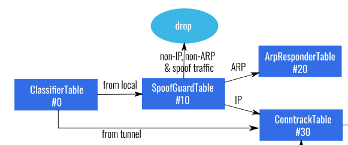

# PART D

This section explains how Address Resolution Protocol (ARP) flows are handled by OVS. It also clarifies how MAC address "aa:bb:cc:dd:ee:ff" is used in various tables by OVS in the previous sections.

The related part in the OVS pipeline diagram (below) shows the steps related to ARP flows. 

Any flow that comes ingress to OVS through a local port would be first subject to spoofguard check (Table 10) and if it is an ARP flow then it is handed over to Table 20. A quick review of Table 10 (below) on worker1 node verifies it.

<pre><code>
vmware@master:~$ kubectl exec -n kube-system -it antrea-agent-f76q2 -c antrea-ovs -- ovs-ofctl dump-flows br-int <b>table=10</b> --no-stats
 cookie=0x1000000000000, table=10, priority=200,ip,in_port="antrea-gw0" actions=resubmit(,30)
 cookie=0x1000000000000, table=10, priority=200,<b>arp</b>,in_port="antrea-gw0",arp_spa=10.222.1.1,arp_sha=4e:99:08:c1:53:be <b>actions=resubmit(,20)</b>
 cookie=0x1030000000000, table=10, priority=200,<b>arp</b>,in_port="coredns--3e3abf",arp_spa=10.222.1.2,arp_sha=f2:82:cc:96:da:bd <b>actions=resubmit(,20)</b>
 cookie=0x1030000000000, table=10, priority=200,<b>arp</b>,in_port="antrea-o-830766",arp_spa=10.222.1.3,arp_sha=6e:9e:5a:3e:3f:e8 <b>actions=resubmit(,20)</b>
 cookie=0x1030000000000, table=10, priority=200,<b>arp</b>,in_port="backend1-bab86f",arp_spa=10.222.1.47,arp_sha=f2:32:d8:07:e2:a6 <b>actions=resubmit(,20)</b>
 cookie=0x1030000000000, table=10, priority=200,<b>arp</b>,in_port="frontend-a3ba2f",arp_spa=10.222.1.48,arp_sha=be:2c:bf:e4:ec:c5 <b>actions=resubmit(,20)</b>
 cookie=0x1030000000000, table=10, priority=200,ip,in_port="coredns--3e3abf",dl_src=f2:82:cc:96:da:bd,nw_src=10.222.1.2 actions=resubmit(,30)
 cookie=0x1030000000000, table=10, priority=200,ip,in_port="antrea-o-830766",dl_src=6e:9e:5a:3e:3f:e8,nw_src=10.222.1.3 actions=resubmit(,30)
 cookie=0x1030000000000, table=10, priority=200,ip,in_port="backend1-bab86f",dl_src=f2:32:d8:07:e2:a6,nw_src=10.222.1.47 actions=resubmit(,30)
 cookie=0x1030000000000, table=10, priority=200,ip,in_port="frontend-a3ba2f",dl_src=be:2c:bf:e4:ec:c5,nw_src=10.222.1.48 actions=resubmit(,30)
 cookie=0x1000000000000, table=10, priority=0 actions=drop
vmware@master:~$ 
</code></pre>

Highlighted flow entries in the output above prove that if the flow is an ARP flow and also if the source IP/MAC in the ARP header matches the endpoint which is connected to that OVS port, then the flow gets handed over to Table 20, which is the ArpResponder table.

**Note :** SPA in "arp_spa" stands for source IP address and SHA in "arp_sha" stands for source hardware address (MAC). More detailed info about these acronyms can be found in the "ovs-fields" section on [this page](https://docs.openvswitch.org/en/latest/ref/?highlight=fields#man-pages).

# 12. ArpResponder Table #20

Table 20 on Worker 1 node is shown below.

<pre><code>
vmware@master:~$ kubectl exec -n kube-system -it antrea-agent-f76q2 -c antrea-ovs -- ovs-ofctl dump-flows br-int table=20 --no-stats
 cookie=0x1020000000000, table=20, priority=200,arp,arp_tpa=10.222.0.1,arp_op=1 actions=move:NXM_OF_ETH_SRC[]->NXM_OF_ETH_DST[],mod_dl_src:aa:bb:cc:dd:ee:ff,load:0x2->NXM_OF_ARP_OP[],move:NXM_NX_ARP_SHA[]->NXM_NX_ARP_THA[],load:0xaabbccddeeff->NXM_NX_ARP_SHA[],move:NXM_OF_ARP_SPA[]->NXM_OF_ARP_TPA[],load:0xade0001->NXM_OF_ARP_SPA[],IN_PORT
 cookie=0x1020000000000, table=20, priority=200,arp,arp_tpa=10.222.2.1,arp_op=1 actions=move:NXM_OF_ETH_SRC[]->NXM_OF_ETH_DST[],mod_dl_src:aa:bb:cc:dd:ee:ff,load:0x2->NXM_OF_ARP_OP[],move:NXM_NX_ARP_SHA[]->NXM_NX_ARP_THA[],load:0xaabbccddeeff->NXM_NX_ARP_SHA[],move:NXM_OF_ARP_SPA[]->NXM_OF_ARP_TPA[],load:0xade0201->NXM_OF_ARP_SPA[],IN_PORT
 cookie=0x1000000000000, table=20, priority=190,arp actions=NORMAL
 cookie=0x1000000000000, table=20, priority=0 actions=drop
vmware@master:~$ 
</code></pre>

- The first flow entry is to process the ARP request flows (arp_op=1) sent for the IP address 10.222.0.1 which is **master** node' s antrea-gw0 IP. Then the same flow entry takes certain actions on the flow.
- The second flow entry is to process the ARP request flows (arp_op=1) sent for the IP address 10.222.2.1 which is the **worker2** node' s antrea-gw0 IP. Then the same flow entry takes certain actions on the flow.
- The third flow entry is to process all the remaining ARP requests as a generic Layer 2 switch (actions=normal). (Reminder that an ARP request is a Layer 2 broadcast)
- The fourth flow entry simply drops all the other type of traffic.

**Why would OVS receive ARP requests for other Kubernetes nodes' gw0 interface IPs ?** Isnt each node' s gw0 interface in its unique subnet ? To remind again, the pod subnets assigned by node ipam controller to each individual Kubernetes node in this Kubernetes cluster are as following : 

- master - 10.222.0.0/24
- worker1 - 10.222.1.0/24
- worker2 - 10.222.2.0/24

The answer to the above question lies in the route table of the nodes. For instance worker1 node' s route table is shown below. (which was also shown back in [Part A Section 3.1.1](https://github.com/dumlutimuralp/antrea-packet-walks/tree/master/part_a#311-worker-1)). The highlighted lines below are the route entries for the pod subnets of the **other** Kubernetes nodes; to be precise worker2 and master. 

<pre><code>
vmware@<b>worker1</b>:~$ ip route
default via 10.79.1.1 dev ens160 proto static
10.79.1.0/24 dev ens160 proto kernel scope link src 10.79.1.201
<b>10.222.0.0/24 via 10.222.0.1 dev antrea-gw0 onlink </b>
10.222.1.0/24 dev antrea-gw0 proto kernel scope link src 10.222.1.1
<b>10.222.2.0/24 via 10.222.2.1 dev antrea-gw0 onlink </b>
172.17.0.0/16 dev docker0 proto kernel scope link src 172.17.0.1 linkdown
</code></pre>

The third route entry, "10.222.2.0/24 via 10.222.2.1 dev antrea-gw0 onlink", basically means that the subnet 10.222.2.0/24 is reachable through antrea-gw0 interface via next hop 10.222.2.1. But 10.222.2.1 is **not part of** any directly connected subnets on worker1 node ? So worker1 node would normally need to perform recursive lookup to figure how it can reach 10.222.2.1. Here, the "onlink" parameter used in the same route entry comes to rescue. This parameter makes the Linux Kernel IP stack to think as if 10.222.2.1 is a local next hop which is part of the network that antrea-gw0 interface is also directly connected to. Hence when worker1 node sends any traffic destined to subnet 10.222.2.0/24, it would first send an ARP request for 10.222.2.1 from its antrea-gw0 interface.

**Which traffic pattern would require worker1 node to send an ARP request ?** The easiest one that comes to mind is the flow which is explained in Section 9. In that section kube-proxy managed iptables applied DNAT to the flow from frontend pod to backendsvc service. The traffic pattern was from frontend pod on worker1 node to backend2 pod on worker2 node. 

When the flow from 10.222.1.48 (frontend pod) to 10.222.2.34 (backend2 pod) needs to be sent by worker1 node, that is exactly when worker1 node needs to figure out how to send the traffic. What worker1 node does is a route lookup; it identifies that IP 10.222.2.34 matches the third route entry, hence it then needs to access the next hop for that route entry, which is 10.222.2.1. Since the same route entry suggests that 10.222.2.1 is "onlink" on the antrea-gw0 interface, worker1 node sends an ARP request for 10.222.2.1 from its antrea-gw0 interface. 

The fifth route entry, "10.222.0.0/24 via 10.222.0.1 dev antrea-gw0 onlink", is for the pod subnet on the other Kubernetes node, which is the master node. All the things mentioned above would apply for this route entry as well.

Whenever a new node is added to the Kubernetes cluster, Antrea Node Controller would detect that by watching the Kubernetes API and then add a route entry, similar to the ones above, on worker1 node' s route table. (Explained [here](https://github.com/vmware-tanzu/antrea/blob/master/docs/architecture.md#antrea-agent))

Until now, the reason why a node would send an ARP request for another node' s gw0 interface IP is explained above. **What about OVS ? How does it handle these ARP requests ?** For that, focusing on the Table 20 again, the second flow entry is explained in more detail now, as below.

<pre><code>
cookie=0x1020000000000, table=20, priority=200,arp,arp_tpa=10.222.2.1,arp_op=1 actions=move:NXM_OF_ETH_SRC[]->NXM_OF_ETH_DST[],mod_dl_src:aa:bb:cc:dd:ee:ff,load:0x2->NXM_OF_ARP_OP[],move:NXM_NX_ARP_SHA[]->NXM_NX_ARP_THA[],load:0xaabbccddeeff->NXM_NX_ARP_SHA[],move:NXM_OF_ARP_SPA[]->NXM_OF_ARP_TPA[],load:0xade0201->NXM_OF_ARP_SPA[],IN_PORT
</code></pre>

This flow entry checks the following conditions :  

- if the current flow that comes ingress to OVS is an arp flow (arp)
- and if the ARP request is sent for IP address 10.222.2.1 (arp_tpa=10.222.2.1, tpa stands for target IP address)
- and if it is an arp request (arp_op=1 is for arp request). 

Once all of the above matches then the same flow entry takes the following actions on the flow : 

* <b>move:NXM_OF_ETH_SRC[]->NXM_OF_ETH_DST[] :</b> This action moves the MAC address, seen in the source address field of the ethernet header, to the destination address field in the ethernet header of the response
* <b>mod_dl_src:aa:bb:cc:dd:ee:ff :</b> This action puts the MAC address "aa:bb:cc:dd:ee:ff" into the source address field in the ethernet header of the response
* <b>load:0x2->NXM_OF_ARP_OP[] :</b> This action basically sets "0x2" which is "2" in decimal for "arp_op" and "arp_op=2" is used for ARP response
* <b>move:NXM_NX_ARP_SHA[]->NXM_NX_ARP_THA[] :</b> This action moves the MAC address, seen in the sender MAC address field in the ARP header of the ARP request, to the target MAC address field in the ARP header of the response 
* <b>load:0xaabbccddeeff->NXM_NX_ARP_SHA[] :</b> This action puts the MAC address "aa:bb:cc:dd:ee:ff" into the sender MAC address field in the ARP header of the response
* <b>move:NXM_OF_ARP_SPA[]->NXM_OF_ARP_TPA[] :</b> This action moves the IP address, seen in the sender IP address field of the ARP header, to the target IP address field in the ARP header of the response 
* <b>load:0xade0201->NXM_OF_ARP_SPA[] :</b> This action puts the IP address "10.222.2.1" (conversion from hex 0xade0201) into the the sender IP address field of the ARP header of the response 
* <b>IN_PORT :</b> This action means "forward the flow back to the port where it came" (which is the antrea-gw0 interface port on OVS on the worker1 node in this case)

Note : More detailed info about these fields can be found in the "ovs-fields" section on [this page](https://docs.openvswitch.org/en/latest/ref/?highlight=fields#man-pages).
