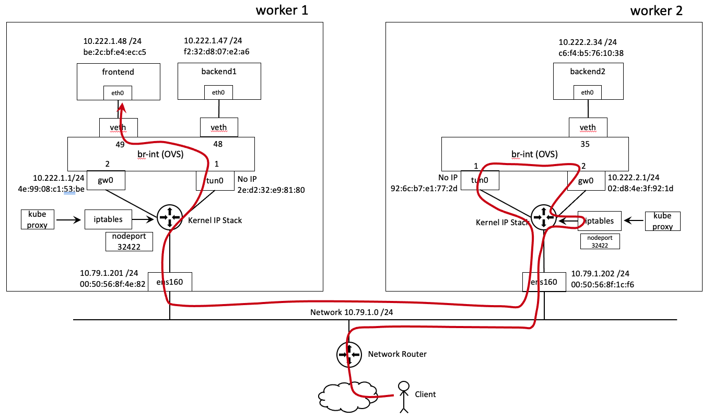
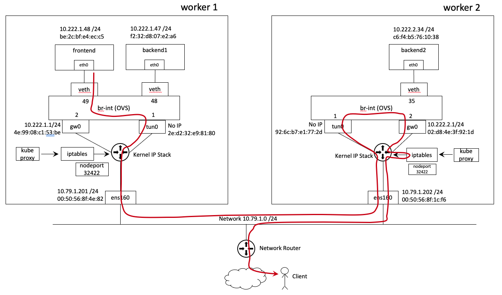

# PART F

This section explains the packet flow from an external client to Kubernetes service of type "nodeport". 

In this scenario frontend pod is exposed with Kubernetes service type of "NodePort". As shown below.

<pre><code>
vmware@<b>master:~$ kubectl get pods -o wide</b>
NAME       READY   STATUS    RESTARTS   AGE   IP            NODE      NOMINATED NODE   READINESS GATES
backend1   1/1     Running   0          44d   10.222.1.47   worker1   <none>           <none>
backend2   1/1     Running   0          44d   10.222.2.34   worker2   <none>           <none>
frontend   1/1     Running   0          44d   10.222.1.48   worker1   <none>           <none>
vmware@master:~$ 
vmware@<b>master:~$ kubectl expose pod frontend --type=NodePort --port=80</b>
<b>service/frontend exposed</b>
vmware@master:~$ 
</code></pre>

<pre><code>
vmware@<b>master:~$ kubectl get svc</b>
NAME         TYPE        CLUSTER-IP      EXTERNAL-IP   PORT(S)        AGE
backendsvc   ClusterIP   10.104.65.133   <none>              80/TCP         37d
<b>frontend     NodePort</b>    10.108.131.6    <none>              80:<b>32422</b>/TCP   4s
kubernetes   ClusterIP   10.96.0.1       <none>              443/TCP        42d
</code></pre>

<pre><code>
vmware@<b>master:~$ kubectl get endpoints</b>
NAME         ENDPOINTS                       AGE
backendsvc   10.222.1.47:80,10.222.2.34:80   44d
<b>frontend     10.222.1.48:80</b>                  6d5h
kubernetes   10.79.1.200:6443                49d
vmware@master:~$ 
</code></pre>

## 17. Client to Frontend
[Back to table of contents](https://github.com/dumlutimuralp/antrea-packet-walks/blob/master/part_f/README.md#part-f)

The following diagram shows the flow that will be explained in this section. 

For simplicity and to explain both overlay and nodeport mechanisms in the same example, the client sends a request to the **nodeport on the worker 2 node**. In a real production environment, there would be a load balancer between the client and the Kubernetes nodes. The load balancer would send the flow to the nodeport of one of the nodes in the Kubernetes cluster. 

**Note :** For the intrigued, Kubernetes supports eliminating the nodes, which do NOT have any pods backing that service, from the load balancer pool. Please refer to [this doc](https://kubernetes.io/docs/tasks/access-application-cluster/create-external-load-balancer/#preserving-the-client-source-ip) for more info. In this scenario "externaltraffic policy" is not used on purpose. Nodeport is exposed on both nodes and it is functional on both nodes.

A sample output from the client is shown below. Here the client sends an http request,using curl, to the nodeport (32422) on worker 2 node (10.79.1.202)

<pre><code>
client$ <b>curl 10.79.1.202:32422</b>
Praqma Network MultiTool (with NGINX) - frontend - 10.222.1.48/24
client$
</code></pre>

A quick tcpdump on the ens160 interface of the worker 2 node (while doing "curl 10.79.1.202:32422" on the client) would reveal the headers of this flow which comes from the client then ingress to the frontend service nodeport on the worker 2 node . Shown below.

<pre><code>
vmware@<b>worker2</b>:~$ <b>sudo tcpdump -en -i ens160 port 32422</b>
tcpdump: verbose output suppressed, use -v or -vv for full protocol decode
listening on ens160, link-type EN10MB (Ethernet), capture size 262144 bytes
14:44:42.675546 00:0c:29:fa:d8:a8 > 00:50:56:8f:1c:f6, ethertype IPv4 (0x0800), length 78: <b>172.16.100.2.63669 > 10.79.1.202.32422</b>: Flags [S], seq 4044212013, win 65535, options [mss 1380,nop,wscale 6,nop,nop,TS val 1570982397 ecr 0,sackOK,eol], length 0
14:44:42.677439 00:50:56:8f:1c:f6 > 00:0c:29:fa:d8:a8, ethertype IPv4 (0x0800), length 74: <b>10.79.1.202.32422 > 172.16.100.2.63669</b>: Flags [S.], seq 3660856873, ack 4044212014, win 64308, options [mss 1410,sackOK,TS val 2865667670 ecr 1570982397,nop,wscale 7], length 0
<b>OUTPUT OMITTED</b>
</code></pre>

First line in the above output is the packet coming from client to the worker 2 node and it has the following content : 

- Source IP = 172.16.100.2 (Client IP)
- Destination IP = 10.79.1.202 (Worker 2 node IP)
- Source MAC = 00:0c:29:fa:d8:a8 (Network router MAC)
- Destination MAC = 00:50:56:8f:1c:f6 (Worker 2 ens160 interface MAC)

### 17.1 Worker 2 Iptables

When worker 2 node Linux IP stack receives the flow, kube-proxy managed iptables rules process it. Worker 2 node iptables NAT rules are shown below. 

- "-t nat" pulls the NAT table 
- "-L" lists all the rules in the given table
- "-n" displays IP address and port numbers (rather than hostnames and service names)

<pre><code>
vmware@worker2:~$ sudo iptables -t nat -L -n
[sudo] password for vmware: 
Chain PREROUTING (policy ACCEPT)
target     prot opt source               destination         
KUBE-SERVICES  all  --  0.0.0.0/0            0.0.0.0/0            /* kubernetes service portals */
DOCKER     all  --  0.0.0.0/0            0.0.0.0/0            ADDRTYPE match dst-type LOCAL

Chain INPUT (policy ACCEPT)
target     prot opt source               destination         

Chain OUTPUT (policy ACCEPT)
target     prot opt source               destination         
KUBE-SERVICES  all  --  0.0.0.0/0            0.0.0.0/0            /* kubernetes service portals */
DOCKER     all  --  0.0.0.0/0           !127.0.0.0/8          ADDRTYPE match dst-type LOCAL

Chain POSTROUTING (policy ACCEPT)
target     prot opt source               destination         
KUBE-POSTROUTING  all  --  0.0.0.0/0            0.0.0.0/0            /* kubernetes postrouting rules */
MASQUERADE  all  --  172.17.0.0/16        0.0.0.0/0           
ANTREA-POSTROUTING  all  --  0.0.0.0/0            0.0.0.0/0            /* Antrea: jump to Antrea postrouting rules */

Chain ANTREA-POSTROUTING (1 references)
target     prot opt source               destination         
MASQUERADE  all  --  10.222.2.0/24        0.0.0.0/0            /* Antrea: masquerade pod to external packets */ ! match-set ANTREA-POD-IP dst

Chain DOCKER (2 references)
target     prot opt source               destination         
RETURN     all  --  0.0.0.0/0            0.0.0.0/0           

Chain KUBE-KUBELET-CANARY (0 references)
target     prot opt source               destination         

Chain KUBE-MARK-DROP (0 references)
target     prot opt source               destination         
MARK       all  --  0.0.0.0/0            0.0.0.0/0            MARK or 0x8000

Chain KUBE-MARK-MASQ (22 references)
target     prot opt source               destination         
MARK       all  --  0.0.0.0/0            0.0.0.0/0            MARK or 0x4000

Chain <b>KUBE-NODEPORTS</b> (1 references)
target     prot opt source               destination         
KUBE-MARK-MASQ  tcp  --  0.0.0.0/0            0.0.0.0/0            /* default/frontend: */ tcp dpt:32422
<b>KUBE-SVC-GYQQTB6TY565JPRW  tcp  --  0.0.0.0/0            0.0.0.0/0            /* default/frontend: */ tcp dpt:32422</b>
KUBE-MARK-MASQ  tcp  --  0.0.0.0/0            0.0.0.0/0            /* kube-system/antrea-octant: */ tcp dpt:31067
KUBE-SVC-A2RN3UXPG7GRS3AU  tcp  --  0.0.0.0/0            0.0.0.0/0            /* kube-system/antrea-octant: */ tcp dpt:31067

Chain KUBE-POSTROUTING (1 references)
target     prot opt source               destination         
RETURN     all  --  0.0.0.0/0            0.0.0.0/0            mark match ! 0x4000/0x4000
MARK       all  --  0.0.0.0/0            0.0.0.0/0            MARK xor 0x4000
MASQUERADE  all  --  0.0.0.0/0            0.0.0.0/0            /* kubernetes service traffic requiring SNAT */

Chain KUBE-PROXY-CANARY (0 references)
target     prot opt source               destination         

Chain KUBE-SEP-2MIG7YSQRKRPLGGX (1 references)
target     prot opt source               destination         
KUBE-MARK-MASQ  all  --  10.222.1.2           0.0.0.0/0            /* kube-system/kube-dns:dns */
DNAT       udp  --  0.0.0.0/0            0.0.0.0/0            /* kube-system/kube-dns:dns */ udp to:10.222.1.2:53

<b>Chain KUBE-SEP-3CFGSU2LP4O527CE (1 references)</b>
target     prot opt source               destination         
KUBE-MARK-MASQ  all  --  10.222.1.48          0.0.0.0/0            /* default/frontend: */
<b>DNAT       tcp  --  0.0.0.0/0            0.0.0.0/0            /* default/frontend: */ tcp to:10.222.1.48:80</b>

Chain KUBE-SEP-6PRWOLZVS5LKSHLK (1 references)
target     prot opt source               destination         
KUBE-MARK-MASQ  all  --  10.222.1.47          0.0.0.0/0            /* default/backendsvc: */
DNAT       tcp  --  0.0.0.0/0            0.0.0.0/0            /* default/backendsvc: */ tcp to:10.222.1.47:80

Chain KUBE-SEP-BCZG4RHMLPD3XZC5 (1 references)
target     prot opt source               destination         
KUBE-MARK-MASQ  all  --  10.222.2.2           0.0.0.0/0            /* kube-system/kube-dns:dns-tcp */
DNAT       tcp  --  0.0.0.0/0            0.0.0.0/0            /* kube-system/kube-dns:dns-tcp */ tcp to:10.222.2.2:53

Chain KUBE-SEP-EVFFBIHEP2PDYG44 (1 references)
target     prot opt source               destination         
KUBE-MARK-MASQ  all  --  10.79.1.200          0.0.0.0/0            /* default/kubernetes:https */
DNAT       tcp  --  0.0.0.0/0            0.0.0.0/0            /* default/kubernetes:https */ tcp to:10.79.1.200:6443

Chain KUBE-SEP-NRWLC3D3JGTRYOSQ (1 references)
target     prot opt source               destination         
KUBE-MARK-MASQ  all  --  10.79.1.202          0.0.0.0/0            /* kube-system/antrea: */
DNAT       tcp  --  0.0.0.0/0            0.0.0.0/0            /* kube-system/antrea: */ tcp to:10.79.1.202:10349

Chain KUBE-SEP-NS6VF4EO5FNJEZ3Z (1 references)
target     prot opt source               destination         
KUBE-MARK-MASQ  all  --  10.222.1.3           0.0.0.0/0            /* kube-system/antrea-octant: */
DNAT       tcp  --  0.0.0.0/0            0.0.0.0/0            /* kube-system/antrea-octant: */ tcp to:10.222.1.3:80

Chain KUBE-SEP-QQKVVTQCCVWQJVWT (1 references)
target     prot opt source               destination         
KUBE-MARK-MASQ  all  --  10.222.2.2           0.0.0.0/0            /* kube-system/kube-dns:dns */
DNAT       udp  --  0.0.0.0/0            0.0.0.0/0            /* kube-system/kube-dns:dns */ udp to:10.222.2.2:53

Chain KUBE-SEP-R5BOSGFC7D2XSIZA (1 references)
target     prot opt source               destination         
KUBE-MARK-MASQ  all  --  10.222.2.34          0.0.0.0/0            /* default/backendsvc: */
DNAT       tcp  --  0.0.0.0/0            0.0.0.0/0            /* default/backendsvc: */ tcp to:10.222.2.34:80

Chain KUBE-SEP-U2DUVZDMAC5YMHOK (1 references)
target     prot opt source               destination         
KUBE-MARK-MASQ  all  --  10.222.1.2           0.0.0.0/0            /* kube-system/kube-dns:dns-tcp */
DNAT       tcp  --  0.0.0.0/0            0.0.0.0/0            /* kube-system/kube-dns:dns-tcp */ tcp to:10.222.1.2:53

Chain KUBE-SEP-Z2WIYZ27U5AUKQEZ (1 references)
target     prot opt source               destination         
KUBE-MARK-MASQ  all  --  10.222.1.2           0.0.0.0/0            /* kube-system/kube-dns:metrics */
DNAT       tcp  --  0.0.0.0/0            0.0.0.0/0            /* kube-system/kube-dns:metrics */ tcp to:10.222.1.2:9153

Chain KUBE-SEP-ZP6MZIYCX7J4FSPR (1 references)
target     prot opt source               destination         
KUBE-MARK-MASQ  all  --  10.222.2.2           0.0.0.0/0            /* kube-system/kube-dns:metrics */
DNAT       tcp  --  0.0.0.0/0            0.0.0.0/0            /* kube-system/kube-dns:metrics */ tcp to:10.222.2.2:9153

Chain <b>KUBE-SERVICES</b> (2 references)
target     prot opt source               destination         
KUBE-MARK-MASQ  udp  -- !10.222.0.0/16        10.96.0.10           /* kube-system/kube-dns:dns cluster IP */ udp dpt:53
KUBE-SVC-TCOU7JCQXEZGVUNU  udp  --  0.0.0.0/0            10.96.0.10           /* kube-system/kube-dns:dns cluster IP */ udp dpt:53
KUBE-MARK-MASQ  tcp  -- !10.222.0.0/16        10.96.0.10           /* kube-system/kube-dns:dns-tcp cluster IP */ tcp dpt:53
KUBE-SVC-ERIFXISQEP7F7OF4  tcp  --  0.0.0.0/0            10.96.0.10           /* kube-system/kube-dns:dns-tcp cluster IP */ tcp dpt:53
KUBE-MARK-MASQ  tcp  -- !10.222.0.0/16        10.96.0.1            /* default/kubernetes:https cluster IP */ tcp dpt:443
KUBE-SVC-NPX46M4PTMTKRN6Y  tcp  --  0.0.0.0/0            10.96.0.1            /* default/kubernetes:https cluster IP */ tcp dpt:443
KUBE-MARK-MASQ  tcp  -- !10.222.0.0/16        10.110.254.249       /* kube-system/antrea: cluster IP */ tcp dpt:443
KUBE-SVC-ACVYUMUVQZGITN4Q  tcp  --  0.0.0.0/0            10.110.254.249       /* kube-system/antrea: cluster IP */ tcp dpt:443
KUBE-MARK-MASQ  tcp  -- !10.222.0.0/16        10.108.131.6         /* default/frontend: cluster IP */ tcp dpt:80
<b>KUBE-SVC-GYQQTB6TY565JPRW  tcp  --  0.0.0.0/0            10.108.131.6         /* default/frontend: cluster IP */ tcp dpt:80</b>
KUBE-MARK-MASQ  tcp  -- !10.222.0.0/16        10.96.0.10           /* kube-system/kube-dns:metrics cluster IP */ tcp dpt:9153
KUBE-SVC-JD5MR3NA4I4DYORP  tcp  --  0.0.0.0/0            10.96.0.10           /* kube-system/kube-dns:metrics cluster IP */ tcp dpt:9153
KUBE-MARK-MASQ  tcp  -- !10.222.0.0/16        10.109.110.219       /* kube-system/antrea-octant: cluster IP */ tcp dpt:80
KUBE-SVC-A2RN3UXPG7GRS3AU  tcp  --  0.0.0.0/0            10.109.110.219       /* kube-system/antrea-octant: cluster IP */ tcp dpt:80
KUBE-MARK-MASQ  tcp  -- !10.222.0.0/16        10.104.65.133        /* default/backendsvc: cluster IP */ tcp dpt:80
KUBE-SVC-EKL7ZEFK3VFJKKGJ  tcp  --  0.0.0.0/0            10.104.65.133        /* default/backendsvc: cluster IP */ tcp dpt:80
<b>KUBE-NODEPORTS  all  --  0.0.0.0/0            0.0.0.0/0            /* kubernetes service nodeports; NOTE: this must be the last rule in this chain */ ADDRTYPE match dst-type LOCAL</b>

Chain KUBE-SVC-A2RN3UXPG7GRS3AU (2 references)
target     prot opt source               destination         
KUBE-SEP-NS6VF4EO5FNJEZ3Z  all  --  0.0.0.0/0            0.0.0.0/0            /* kube-system/antrea-octant: */

Chain KUBE-SVC-ACVYUMUVQZGITN4Q (1 references)
target     prot opt source               destination         
KUBE-SEP-NRWLC3D3JGTRYOSQ  all  --  0.0.0.0/0            0.0.0.0/0            /* kube-system/antrea: */

Chain KUBE-SVC-EKL7ZEFK3VFJKKGJ (1 references)
target     prot opt source               destination         
KUBE-SEP-6PRWOLZVS5LKSHLK  all  --  0.0.0.0/0            0.0.0.0/0            /* default/backendsvc: */ statistic mode random probability 0.50000000000
KUBE-SEP-R5BOSGFC7D2XSIZA  all  --  0.0.0.0/0            0.0.0.0/0            /* default/backendsvc: */

Chain KUBE-SVC-ERIFXISQEP7F7OF4 (1 references)
target     prot opt source               destination         
KUBE-SEP-U2DUVZDMAC5YMHOK  all  --  0.0.0.0/0            0.0.0.0/0            /* kube-system/kube-dns:dns-tcp */ statistic mode random probability 0.50000000000
KUBE-SEP-BCZG4RHMLPD3XZC5  all  --  0.0.0.0/0            0.0.0.0/0            /* kube-system/kube-dns:dns-tcp */

<b>Chain KUBE-SVC-GYQQTB6TY565JPRW</b> (2 references)
target     prot opt source               destination         
<b>KUBE-SEP-3CFGSU2LP4O527CE</b>  all  --  0.0.0.0/0            0.0.0.0/0            /* default/frontend: */

Chain KUBE-SVC-JD5MR3NA4I4DYORP (1 references)
target     prot opt source               destination         
KUBE-SEP-Z2WIYZ27U5AUKQEZ  all  --  0.0.0.0/0            0.0.0.0/0            /* kube-system/kube-dns:metrics */ statistic mode random probability 0.50000000000
KUBE-SEP-ZP6MZIYCX7J4FSPR  all  --  0.0.0.0/0            0.0.0.0/0            /* kube-system/kube-dns:metrics */

Chain KUBE-SVC-NPX46M4PTMTKRN6Y (1 references)
target     prot opt source               destination         
KUBE-SEP-EVFFBIHEP2PDYG44  all  --  0.0.0.0/0            0.0.0.0/0            /* default/kubernetes:https */

Chain KUBE-SVC-TCOU7JCQXEZGVUNU (1 references)
target     prot opt source               destination         
KUBE-SEP-2MIG7YSQRKRPLGGX  all  --  0.0.0.0/0            0.0.0.0/0            /* kube-system/kube-dns:dns */ statistic mode random probability 0.50000000000
KUBE-SEP-QQKVVTQCCVWQJVWT  all  --  0.0.0.0/0            0.0.0.0/0            /* kube-system/kube-dns:dns */
vmware@worker2:~$ 
</code></pre>

The entries related to the frontend service are : 

- "KUBE-NODEPORTS" chain matches flows coming from external resources to the tcp port 32422 on the worker 2 node and it relays those flows to the "KUBE-SVC-GYQQTB6TY565JPRW" chain
- "KUBE-SERVICES" chain matches flows coming from pods to the service IP (10.108.31.6) on tcp port 80 and it also relays those flows to the "KUBE-SVC-GYQQTB6TY565JPRW" chain
- "KUBE-SVC-GYQQTB6TY565JPRW" chain basically calls out the "KUBE-SEP-3CFGSU2LP4O527CE" chain
- "KUBE-SEP-3CFGSU2LP4O527CE" chain applies DNAT and picks up one of the pods which backs the service (in this case the frontend pod, since it is the only pod backing frontend service)

**Note :** The reason "KUBE-SVC-GYQQTB6TY565JPRW" is used also in "KUBE-SERVICES" is that Kubernetes service type of "nodeport" automatically provisions a "clusterip" for the service (which is mentioned [here](https://kubernetes.io/docs/concepts/services-networking/service/#publishing-services-service-types)) This is for the internal access to that service (i.e. a pod in the Kubernetes cluster accessing the frontend service)

At this stage, after iptables processing, the flow will have a new destination IP, which should be frontend pod IP. A quick tcpdump on the **antrea-gw0 interface** of worker 2 node would reveal the IP/MAC headers of the flow.

<pre><code>
vmware@worker2:~$ sudo tcpdump -en -i antrea-gw0 port 80
tcpdump: verbose output suppressed, use -v or -vv for full protocol decode
listening on antrea-gw0, link-type EN10MB (Ethernet), capture size 262144 bytes
16:46:32.645219 <b>02:d8:4e:3f:92:1d > aa:bb:cc:dd:ee:ff</b>, ethertype IPv4 (0x0800), length 78: <b>10.222.2.1.33116 > 10.222.1.48.80</b>: Flags [S], seq 1220947672, win 65535, options [mss 1380,nop,wscale 6,nop,nop,TS val 1578219643 ecr 0,sackOK,eol], length 0
16:46:32.646935 <b>4e:99:08:c1:53:be > 02:d8:4e:3f:92:1d</b>, ethertype IPv4 (0x0800), length 74: <b>10.222.1.48.80 > 10.222.2.1.33116</b>: Flags [S.], seq 2448921740, ack 1220947673, win 64308, options [mss 1410,sackOK,TS val 2872977760 ecr 1578219643,nop,wscale 7], length 0
</code></pre>

As seen in the above output, the request from client to nodeport is redirected to frontend pod IP 10.222.1.48. **But the source IP (10.222.2.1) is different than the original client IP**, which is 172.16.100.2. Apparently the source IP has also been subject to Source NAT (SNAT). How come ? 

The reason for SNAT is for **the return traffic** to be routed back to the client **through worker 2 node**; since it is the node which the client originally sent the request to. Without source NAT, the node where the destination pod runs would try to send the response directly to the client in which the traffic would get dropped on that node in which the destination pod runs.

Although this article should not be treated as a replacement for a full fledge iptables lecture, at a high level, the iptables entries which applies SNAT to theis flow are shown below. 

<pre><code>
Chain KUBE-MARK-MASQ (22 references)
target     prot opt source               destination         
MARK       all  --  0.0.0.0/0            0.0.0.0/0            MARK or 0x4000
Chain KUBE-NODEPORTS (1 references)
target     prot opt source               destination         
KUBE-MARK-MASQ  tcp  --  0.0.0.0/0            0.0.0.0/0            /* default/frontend: */ tcp dpt:32422
<b>OUTPUT OMITTED</b>
Chain KUBE-POSTROUTING (1 references)
target     prot opt source               destination         
RETURN     all  --  0.0.0.0/0            0.0.0.0/0            mark match ! 0x4000/0x4000
MARK       all  --  0.0.0.0/0            0.0.0.0/0            MARK xor 0x4000
MASQUERADE  all  --  0.0.0.0/0            0.0.0.0/0
<b>OUTPUT OMITTED</b>
</code></pre>

Hence the original flow (172.16.100.2 -> 10.79.1.202), not only gets DNATed to frontend pod IP 10.222.1.48 but it also gets SNATed to the antrea-gw0 IP by iptables NAT rules. **After iptables processing, the flow becomes 10.222.2.1 -> 10.222.1.49.** Source IP of the flow becomes the antrea-gw0 interface on worker 2 node because the route table of worker 2 node sends all traffic destined to 10.222.1.0 /24 through antrea-gw0 interface. (As shown in [Part A Section 3.1.2](https://github.com/dumlutimuralp/antrea-packet-walks/tree/master/part_a#312-worker-2))

At this stage the flow has the following content : 

- Source IP = 10.222.2.1 (antrea-gw0 interface IP of worker 2 node)
- Destination IP = 10.222.1.48 (frontend pod IP)
- Source MAC = 02:d8:4e:3f:92:1d (antrea-gw0 interface MAC of worker 2 node)
- Destination MAC = aa:bb:cc:dd:ee:ff (When the destination pod is on a different node this global virtual MAC is used. It is explained in [PART D Section 12](https://github.com/dumlutimuralp/antrea-packet-walks/tree/master/part_d#12-arpresponder-table-20))

This flow comes ingress to OVS on worker 2 node through the antrea-gw0 interface. It will be matched against a flow entry in each OVS Table, processed top to bottom in each individual table, based on the priority value of the flow entry in the table.

### 17.2 Worker 2 Classifier Table #0

Table #0 on Worker 2 node is shown below.

<pre><code>
vmware@master:~$ kubectl exec -n kube-system -it antrea-agent-fv5x9 -c antrea-ovs -- ovs-ofctl dump-flows br-int table=0 --no-stats
 <b>cookie=0x1000000000000, priority=200,in_port="antrea-gw0" actions=load:0x1->NXM_NX_REG0[0..15],resubmit(,10)</b>
 cookie=0x1000000000000, priority=200,in_port="antrea-tun0" actions=move:NXM_NX_TUN_METADATA0[28..31]->NXM_NX_REG9[28..31],load:0->NXM_NX_REG0[0..15],load:0x1->NXM_NX_REG0[19],resubmit(,30)
 cookie=0x1030000000000, priority=190,in_port="coredns--d8f62c" actions=load:0x2->NXM_NX_REG0[0..15],resubmit(,10)
 cookie=0x1030000000000, priority=190,in_port="backend2-202ff6" actions=load:0x2->NXM_NX_REG0[0..15],resubmit(,10)
 cookie=0x1000000000000, priority=0 actions=drop
vmware@master:~$
</code></pre> 

This table is to classify the current flow by matching it on the ingress port and then setting the register NXM_NX_REG0[0..15] bits as following; "0" for tunnel, "1" for local gateway and "2" for local pod.  The current flow in this scenario, which comes to OVS from the antrea-gw0 interface, matches the <b>first</b> flow entry in the above output (which is highlighted). First action in this flow entry is to set the value of the register reg0[0..15] to "0x1", which means flow comes from the local gateway. Second action in the same flow entry is to hand the flow over to next table, Table 10. (resubmit(,10)) 

So next stop is Table 10.

**Note :** "0x" means that it is hexadecimal. For example,

- "0x1" is 1 × (16 to the power of 0) = 1 x 1 = 1 (in decimal)
- or "0x10" is 1 x (16 to the power of 1) + 0 x (16 to the power of 0) = 16 + 0 = 16 (in decimal)

### 17.3 Worker 2 Spoofguard Table #10

Table #10 on Worker 2 node is shown below. "nw_src" refers to the IP address and "dl_src" refers to the MAC address of the pod connected to the respective OF port.

<pre><code>
vmware@master:~$ kubectl exec -n kube-system -it antrea-agent-fv5x9 -c antrea-ovs -- ovs-ofctl dump-flows br-int table=10 --no-stats
 <b>cookie=0x1000000000000, table=10, priority=200,ip,in_port="antrea-gw0" actions=resubmit(,30)</b>
 <b>cookie=0x1000000000000, table=10, priority=200,arp,in_port="antrea-gw0",arp_spa=10.222.2.1,arp_sha=02:d8:4e:3f:92:1d actions=resubmit(,20)</b>
 cookie=0x1030000000000, table=10, priority=200,arp,in_port="coredns--d8f62c",arp_spa=10.222.2.2,arp_sha=52:9d:f4:63:06:bc actions=resubmit(,20)
 cookie=0x1030000000000, table=10, priority=200,arp,in_port="backend2-202ff6",arp_spa=10.222.2.34,arp_sha=c6:f4:b5:76:10:38 actions=resubmit(,20)
 cookie=0x1030000000000, table=10, priority=200,ip,in_port="coredns--d8f62c",dl_src=52:9d:f4:63:06:bc,nw_src=10.222.2.2 actions=resubmit(,30)
 cookie=0x1030000000000, table=10, priority=200,ip,in_port="backend2-202ff6",dl_src=c6:f4:b5:76:10:38,nw_src=10.222.2.34 actions=resubmit(,30)
 cookie=0x1000000000000, table=10, priority=0 actions=drop
vmware@master:~$ 
</code></pre>

The current flow comes from the antrea-gw0 interface so it matches the first flow entry in this table. Spoofguard does not implement any IP checks when the flow comes from antrea-gw0 cause the source IP for most majority of the flows would not be antrea-gw0 interface IP. (as explained in previous parts of this series) Hence the only action specified in the first flow entry is handing the flow over to Table 30 (actions=goto_table:30). 

So next stop is Table 30.

**Note :** Spoofguard does not do any checks for IP packets on the antrea-gw0 port. However it still checks the ARP flows on that port. Second entry in the table is used for that purpose. It basically checks the ARP requests/replies sent by the antrea-gw0 interface.

### 17.4 Worker 2 Conntrack Table #30

Table #30 on Worker 2 node is shown below.

<pre><code>
vmware@master:~$ kubectl exec -n kube-system -it antrea-agent-fv5x9 -c antrea-ovs -- ovs-ofctl dump-flows br-int table=30 --no-stats
 cookie=0x1000000000000, table=30, priority=200,ip <b>actions=ct(table=31</b>,zone=65520)
vmware@master:~$ 
</code></pre>

Conntrack table' s job is to start tracking all the traffic. ("ct" action means connection tracking). Any flow that goes through this table will be in "tracked" (trk) state. In generic networking security terms this functionality makes the OVS a stateful connection aware component. Flow then gets handed over to the next table which is Table 31; as seen in the "actions" section of the flow entry. (actions=ct(table=31,)) So next stop is Table 31.

**Note :** Zone ID is explained [here](https://github.com/vmware-tanzu/antrea/blob/master/docs/ovs-pipeline.md#conntracktable-30) as "A ct_zone is simply used to isolate connection tracking rules. It is similar in spirit to the more generic Linux network namespaces, but ct_zone is specific to conntrack and has less overhead." 

### 17.4 Worker 2 ConntrackState Table #31

Table #31 on Worker 2 node is shown below. 

<pre><code>
vmware@master:~$ kubectl exec -n kube-system -it antrea-agent-fv5x9 -c antrea-ovs -- ovs-ofctl dump-flows br-int table=31 --no-stats
 cookie=0x1000000000000, table=31, priority=210,ct_state=-new+trk,ct_mark=0x20,ip,reg0=0x1/0xffff actions=resubmit(,40)
 cookie=0x1000000000000, table=31, priority=200,ct_state=-new+trk,ct_mark=0x20,ip actions=load:0x2d84e3f921d->NXM_OF_ETH_DST[],resubmit(,40)
 cookie=0x1000000000000, table=31, priority=190,ct_state=+inv+trk,ip actions=drop
 <b>cookie=0x1000000000000, table=31, priority=0 actions=resubmit(,40)</b>
vmware@master:~$ 
vmware@master:~$ 
</code></pre>

ConntrackState table processes all the flows that are in tracked state (basically which were handed over by the Conntrack table 30). The first and second flow entries shown above process the flows where the flow is NOT new AND tracked. (ct_state=-new means not new, +trk means being tracked) The third flow entry processes the flows where the respective flow is INVALID and TRACKED, basically it drops all those flows.

The current flow is a completely NEW flow destined to frontend pod. Hence the flow matches the <b>last entry</b> in the flow table highlighted above. Notice the action in the same flow entry is handing the flow over to the next table which is table 40 (resubmit(,40)). So next stop is Table 40.

### 17.5 Worker 2 DNAT Table #40

Table #40 on Worker 2 node is shown below.

<pre><code>
vmware@master:~$ kubectl exec -n kube-system -it antrea-agent-fv5x9 -c antrea-ovs -- ovs-ofctl dump-flows br-int table=40 --no-stats
 cookie=0x1040000000000, table=40, priority=200,ip,nw_dst=10.96.0.0/12 actions=mod_dl_dst:02:d8:4e:3f:92:1d,load:0x2->NXM_NX_REG1[],load:0x1->NXM_NX_REG0[16],resubmit(,105)
 <b>cookie=0x1000000000000, table=40, priority=0 actions=resubmit(,50)</b>
vmware@master:~$ 
</code></pre>

This table in essence checks whether if the flow is destined to a Kubernetes service so that it can redirect the flow to the antrea-gw0. 

The table has only two flow entries. The first flow entry checks whether if the destination IP of the flow is part of the service CIDR range configured in the cluster (which is 10.96.0.0/12); if it does, then certain actions are taken on the flow to steer the flow to the antrea-gw0 interface on the node.  

The destination IP of the current flow is frontend pod IP (10.222.1.48) and it does not fall into the service CIDR range in the first flow entry in Table 40. Hence the current flow will match <b>the second/last entry</b>. The action specified in the last flow entry is to basically hand the flow over to Table 50 (actions=resubmit(,50)). So next stop is Table 50.

**Note :** In the OVS Pipeline diagram [here](https://github.com/dumlutimuralp/antrea-packet-walks/blob/master/part_a/README.md#2-ovs-pipeline), there are tables 45,49 before Table50. However those tables are in use only when Antrea Network Policy feature of Antrea is used. In this Antrea environment, it is not used. 

### 17.6 Worker 2 EgressRule Table #50

At this stage, the flow is in Table 50. 

Table 50 has flow entries that correspond to the egress rules in Kubernetes Network Policies. Worker 2 node has only backend2 pod running and backend2 pod has Kubernetes Network Policy "backendpolicy" applied to it. 

Table 50 on Worker 2 node is shown below. 

<pre><code>
vmware@master:~$ kubectl exec -n kube-system -it antrea-agent-fv5x9 -c antrea-ovs -- ovs-ofctl dump-flows br-int table=50 --no-stats
 cookie=0x1000000000000, table=50, priority=210,ct_state=-new+est,ip actions=resubmit(,70)
 cookie=0x1050000000000, table=50, priority=200,ip,nw_src=10.222.2.34 actions=conjunction(2,1/2)
 cookie=0x1050000000000, table=50, priority=190,conj_id=2,ip actions=load:0x2->NXM_NX_REG5[],resubmit(,70)
 <b>cookie=0x1000000000000, table=50, priority=0 actions=resubmit(,60)</b>
vmware@master:~$ 
</code></pre>

The current flow is destined to frontend pod IP and it is a NEW flow. It has got nothing to do with the rules that are configured in the Kubernetes Network Policy "backendpolicy"; hence the current flow matches the **last** entry in the table (highlighted above). The same flow entry has a single action which is handing the flow over to Table 60 (resubmit(,60)). **Hence next stop is Table 60, explained in next section, Section 17.7.**

For reference the first three flows in this table are explained below.

The first flow entry checks whether if the flow is an already established flow (-new,+est); if it is then there is no need to process the flow against the remaining flow entries, since Kubernetes Network Policy is STATEFUL by nature. However the current flow is a NEW flow hence it does NOT match this first flow entry.

The second flow entry matches on the source IP of 10.222.2.34 which is backend2 pod' s IP. The same flow entry has a conjunction action with a conjunction id of "2". 

**Note** : Conjunction 2 has a single condition which is second flow entry (shown with 1/2) , the other condition 2/2 is missing from the table. The reason is in the backendpolicy applied, there is no specific "to" (aka targets) defined in the egress section of the "backendpolicy".

The third flow entry defines two actions for conjunction 2. First action is to set the register NXM_NX_REG5 with the conjunction id of "2" (0x2). The second action in the same flow entry is to hand the flow over to the next table which is Table 70. (resubmit(,70))

Kubernetes Network Policy "backendpolicy" content is shown below.

<pre><code>
vmware@master:~$ kubectl get netpol backendpolicy
NAME            POD-SELECTOR   AGE
backendpolicy   role=backend   7d20h
vmware@master:~$ kubectl get netpol backendpolicy -o yaml
apiVersion: networking.Kubernetes.io/v1
kind: NetworkPolicy
metadata:
   name: <b>backendpolicy</b>
  namespace: default
spec:
  ingress:
  - from:
    - podSelector:
        matchLabels:
          role: frontend
    ports:
    - port: 80
      protocol: TCP
  podSelector:
    matchLabels:
      role: backend
  policyTypes:
  - Ingress
  <b>- Egress</b>
vmware@master:~$ kubectl describe netpol backendpolicy
Name:         backendpolicy
Namespace:    default
Created on:   2020-09-14 15:27:33 +0000 UTC
Labels:       <none>
Annotations:  Spec:
  PodSelector:     role=backend
  Allowing ingress traffic:
    To Port: 80/TCP
    From:
      PodSelector: role=frontend
  <b>Allowing egress traffic:
    <none> (Selected pods are isolated for egress connectivity)</b>
  Policy Types: Ingress, Egress
vmware@master:~$ 
</code></pre>

### 17.7 Worker 2 EgressDefaultRule Table #60

Table 60 is for isolation rules. Basically when a Kubernetes Network Policy is applied to a pod, the flows which do not match any of the entries in Table 50 will be dropped by Table 60.

Table 60 on Worker 2 node is shown below. As mentioned in the previous section, there will only be rules related to the Kubernetes Network Policy "backendpolicy" on this node, since backend2 pod is the only pod running on the worker 2 node. Hence this table only checks the source IP of the flows as the backend2 pod' s IP (10.222.2.34).  

<pre><code>
vmware@master:~$ kubectl exec -n kube-system -it antrea-agent-fv5x9 -c antrea-ovs -- ovs-ofctl dump-flows br-int table=60 --no-stats
 cookie=0x1000000000000, table=60, priority=200,ip,nw_src=10.222.2.34 actions=drop
 <b>cookie=0x1000000000000, table=60, priority=0 actions=resubmit(,70)</b>
vmware@master:~$ 
</code></pre>

**However the current flow is from worker 2 node' s antrea-gw0 interface IP** (10.222.2.1) to frontend pod IP (10.222.1.48). Hence it matches the **last** entry in this table. The last entry has a single action which is handing the flow over to Table 70 (resubmit(,70)). Hence next stop is Table 70.

### 17.8 Worker 2 L3Forwarding Table #70

The Table 70 on Worker 2 node is shown below.

<pre><code>
vmware@master:~$ kubectl exec -n kube-system -it antrea-agent-fv5x9 -c antrea-ovs -- ovs-ofctl dump-flows br-int table=70 --no-stats
 cookie=0x1000000000000, table=70, priority=200,ip,dl_dst=aa:bb:cc:dd:ee:ff,nw_dst=10.222.2.1 actions=mod_dl_dst:02:d8:4e:3f:92:1d,resubmit(,80)
 cookie=0x1030000000000, table=70, priority=200,ip,dl_dst=aa:bb:cc:dd:ee:ff,nw_dst=10.222.2.2 actions=mod_dl_src:02:d8:4e:3f:92:1d,mod_dl_dst:52:9d:f4:63:06:bc,dec_ttl,resubmit(,80)
 cookie=0x1030000000000, table=70, priority=200,ip,dl_dst=aa:bb:cc:dd:ee:ff,nw_dst=10.222.2.34 actions=mod_dl_src:02:d8:4e:3f:92:1d,mod_dl_dst:c6:f4:b5:76:10:38,dec_ttl,resubmit(,80)
 cookie=0x1020000000000, table=70, priority=200,ip,nw_dst=10.222.0.0/24 actions=dec_ttl,mod_dl_src:02:d8:4e:3f:92:1d,mod_dl_dst:aa:bb:cc:dd:ee:ff,load:0x1->NXM_NX_REG1[],load:0x1->NXM_NX_REG0[16],load:0xa4f01c8->NXM_NX_TUN_IPV4_DST[],resubmit(,105)
 <b>cookie=0x1020000000000, table=70, priority=200,ip,nw_dst=10.222.1.0/24 actions=dec_ttl,mod_dl_src:02:d8:4e:3f:92:1d,mod_dl_dst:aa:bb:cc:dd:ee:ff,load:0x1->NXM_NX_REG1[],load:0x1->NXM_NX_REG0[16],load:0xa4f01c9->NXM_NX_TUN_IPV4_DST[],resubmit(,105)</b>
 cookie=0x1000000000000, table=70, priority=0 actions=resubmit(,80)
vmware@master:~$ 
</code></pre>

Basically each flow entry in this flow table checks either the destination IP address or destination MAC address (in some entries both) to make a forwarding decision. 

The current flow' s source and destination MAC and IP address values are still as they are shown back in Section 17.1. Shown below again. 

- Source IP = 10.222.2.1 (antrea-gw0 interface IP of worker 2 node)
- Destination IP = 10.222.1.48 (frontend pod IP)
- Source MAC = 02:d8:4e:3f:92:1d (antrea-gw0 interface MAC of worker 2 node)
- Destination MAC = aa:bb:cc:dd:ee:ff (When the destination pod is on a different node this global virtual MAC is used. It is explained in [PART D Section 12](https://github.com/dumlutimuralp/antrea-packet-walks/tree/master/part_d#12-arpresponder-table-20))

Based on the current flow' s source and destination MAC/IP values the flow matches the <b>fifth</b> flow entry in Table 70, since the destination IP matches the subnet in "nw_dst" field in the fifth flow entry. The following actions are taken on the flow : 

- First action is to decrement the TTL ("dec_ttl") since the destination IP of the flow is on another subnet than the antrea-gw0 interface of worker 2 node, so this flow is actually a routed flow.

- Second action is to modify the source MAC address of the flow "mod_dl_src: 02:d8:4e:3f:92:1d" (which is the antrea-gw0 interface MAC of Worker 2 node)

- Third action is to modify the destination MAC address of the flow "mod_dl_dst: aa:bb:cc:dd:ee:ff" (This MAC address is related to ARP processing and is explained in [Part D Section 12](https://github.com/dumlutimuralp/antrea-packet-walks/tree/master/part_d#12-arpresponder-table-20)).

- Fourth action is to set the "NXM_NX_REG1" bit to "0x1" (by load:0x1 in hex, which is 1 in decimal). This register represents the OF Port ID which this flow will be sent through. "1" is the OF Port ID for the tunnel0 interface (genev_sys_6081 interface on Linux) used for overlay networking between Kubernetes worker nodes. The outputs and diagrams shown in Part A Section 3.4 can be reviewed again to see OF Port ID.

- Fifth action is to set the "NXM_NX_REG0[16]" to "1" (by load:0x1). This value in Reg0[16] means that the destination MAC address in the flow is known to OVS. In other words this MAC address exists in OVS MAC address table (Table 80), which is explained in a seperate section.

- Sixth action is to set the "NXM_NX_TUN_IPV4_DST" to "0xa4f01c9" which corresponds to 10.79.1.201 in decimal. Meaning that the destination node for this flow should be Worker 1 node since 10.79.1.201 is the ens160 interface IP of the Worker 1 node.

- Seventh action is "resubmit(,105)" which basically hands the flow over to Table 105. Hence next stop is Table 105.

**Note 1:** Notice that the original source and destination MAC address in the flow are already the values which are written by the second and third actions in seventh flow entry. Why are those still rewritten ? The reason is this same flow entry  is used also for the direct flows between pods on different nodes, in which the source MAC of the flow would be source pod' s MAC and destination MAC would be the antrea-gw0 interface of the node where source pod is running. So with one flow entry two different types of flows are addressed. One is service to pod (on another node) flows, the other is pod to pod (on another node) flows. In this case the current flow is service to pod, cause originally the client accesses the nodeport service on the worker2 node, hence the current flow is continuation of that client request. 

**Note 2:** The flow here skips Table 80 (L2 Forwarding) and 90 (Ingress Rules). The OF Port ID of the port which this flow will be sent through is already written to register Reg1 and the ingress rules will be processed at the other end (Worker 1 node) cause the receiving pod is on that node.

### 17.9 Worker 2 ConntrackCommit Table #105

Table 105 on Worker 2 node is shown below.

<pre><code>
vmware@master:~$ kubectl exec -n kube-system -it antrea-agent-fv5x9 -c antrea-ovs -- ovs-ofctl dump-flows br-int table=105 --no-stats
 cookie=0x1000000000000, table=105, priority=200,ct_state=+new+trk,ip,reg0=0x1/0xffff actions=ct(commit,table=110,zone=65520,exec(load:0x20->NXM_NX_CT_MARK[]))
 cookie=0x1000000000000, table=105, priority=190,ct_state=+new+trk,ip actions=ct(commit,table=110,zone=65520)
 <b>cookie=0x1000000000000, table=105, priority=0 actions=resubmit(,110)</b>
vmware@master:~$ 
</code></pre>

This table is for committing all the new flows for tracking them. This action, ct(commit,), is specifically explained as "Commit the connection to the connection tracking module which will be stored beyond the lifetime of packet in the pipeline." [in OVS docs](https://docs.openvswitch.org/en/latest/tutorials/ovs-conntrack/).

The first flow entry checks whether if the flow is a new flow (+new) and if it is a tracked flow (+trk). The same flow entry also checks if the flow is coming from the gateway interface. This is represented by reg0=0x1/0xffff. Explanation of this is as following. The second part "0xffff" instructs OVS to verify the first 16 bits in reg0, meaning reg0[0..15] and then the first part "0x1" means the result of that check should be "1". So it basically checks reg0[0..15]. The Reg0[0..15] is set by Classifier Table 10 and it is set to "1" if the flow comes from antrea-gw0 interface. 

The second flow entry checks whether if the flow is a new flow (+new) and if it is a tracked flow (+trk). 

The current flow is NOT new and it is TRACKED additionally it is coming from the gateway interface hence its reg0[0..15] was already set to "1" earlier in Table 10 (Section 17.1). So the current flow matches the first flow entry in Table 105. The actions in the first flow entry are as following :

- commit this tracked flow to conntrack table and hand it over to Table 110 (actions=ct(commit,table=110..))
- set the NXM_NX_CT_MARK[] register to 0x20 (load:0x20)

The next stop is Table 110.

**Note :** NSM_NX_CT_MARK register is used at a later stage for identifying the response from the frontend pod.

### 17.10 Worker 2 L2ForwardingOut Table #110

Table 110 on Worker 2 node is shown below.

<pre><code>
vmware@master:~$ kubectl exec -n kube-system -it antrea-agent-fv5x9 -c antrea-ovs -- ovs-ofctl dump-flows br-int table=110 --no-stats
 cookie=0x1000000000000, table=110, priority=200,ip,reg0=0x10000/0x10000 actions=output:NXM_NX_REG1[]
 cookie=0x1000000000000, table=110, priority=0 actions=drop
vmware@master:~$ 
</code></pre>

This table' s job is simple. First flow entry in this table first reads the value in register reg0[16]. If the value of this register is "1" in decimal, that means the destination MAC address is known to OVS and the flow should be able to get forwarded (otherwise it would get dropped). The same flow entry has an action defined as "actions=output:NXM_NX_REG1[]". What this action does is it reads the value in "NXM_NX_REG1" to determine the OF port this flow will be sent through and then sends the flow onwards to that port.

The current flow' s reg0[16] bit was set to "0x1" (1 in decimal) back in L3Forwarding Table 70 and the value of REG1 was set to "0x1" (1 in decimal) also back in Table 70.  "1" is the OF Port ID of tunnel0 interface. **Hence the current flow is sent onwards to the tunnel0 interface.**

**Note :** The second flow entry in this table obviously drops the flows which do not have their "reg0[16]" register set.

The logic of "reg0=-0x10000/0x10000" in the flow entry is that the first 0x10000 is the desired value of this register. The second 0x10000 is the exact instructions on which specific bit(s) should be verified to match the desired value. Since "0x" is hexadecimal, below is a detailed explanation of the position of the bit that is verified. 

<pre><code>
23              16  15               8   7               0
0 0 0 0 | 0 0 0 1   0 0 0 0 |  0 0 0 0   0 0 0 0 | 0 0 0 0
</code></pre>

So bit 16 must be "1", and that is being verified in "reg0". The first four bits on the left hand side is not worth to mention hence the desired value and actual value are both shown as "0x10000". 

### 17.11 Encapsulation from Worker 2 to Worker 1

When the current flow gets to tunnel0 (genev_sys_6081) interface on Worker 2 node, Linux IP Stack adds the GENEVE headers to the flow with the destination IP address of 10.79.1.201 (which was determined in Table 70) and source IP of 10.79.1.202 which is Worker 2 node IP. Next, the flow is sent through the ens160 interface of the Worker 2 node onwards to the physical network, destined to the Worker 1 node.

To verify how Worker 2 node encapsulates the flows, a quick tcpdump on the ens160 interface on UDP 6081, which is GENEVE port, would reveal the source and destination IP/MAC of this flow. 

While performing "curl 10.79.1.202:32422" on the client, perform tcpdump on worker 2 node' s ens160 interface; as shown below. 

<pre><code>
vmware@worker2:~$ sudo tcpdump -i ens160 -en udp port 6081
[sudo] password for vmware: 
tcpdump: verbose output suppressed, use -v or -vv for full protocol decode
listening on ens160, link-type EN10MB (Ethernet), capture size 262144 bytes
12:30:39.335331 <b>00:50:56:8f:1c:f6 > 00:50:56:8f:4e:82</b>, ethertype IPv4 (0x0800), length 128: <b>10.79.1.202.12482 > 10.79.1.201.6081</b>: Geneve, Flags [none], vni 0x0, proto TEB (0x6558): <b>02:d8:4e:3f:92:1d > aa:bb:cc:dd:ee:ff</b>, ethertype IPv4 (0x0800), length 78: <b>10.222.2.1.3355 > 10.222.1.48.80</b>: Flags [S], seq 418279221, win 65535, options [mss 1380,nop,wscale 6,nop,nop,TS val 1648881347 ecr 0,sackOK,eol], length 0
<b>OUTPUT OMITTED</b>
</code></pre>

The outer source and destination IP/MAC are the ens160 interfaces of the worker 2 and worker 1 nodes. The inner source and destination IP/MAC can also be seen in the same output. The inner source IP is antrea-gw0 interface IP of worker 2 node and the inner destination IP is frontend pod IP.

**Note:** Notice "vni 0x0" that is the actual network ID used in the GENEVE header for this traffic. Apparently no specific ID needs to be used cause OVS keeps track of each flow individually.

### 17.12 Decapsulation on Worker 1

When the worker 1 node receives the flow, the Linux IP stack reads the GENEVE header, strips it out and then sends the flow over to the tunnel0 (genev_sys_6081) interface.

At this stage the flow has the following IP/MAC. (they have not changed since Section 17.1)

- Source IP = 10.222.2.1 (antrea-gw0 interface IP of worker 2 node)
- Destination IP = 10.222.1.48 (frontend pod IP)
- Source MAC = 02:d8:4e:3f:92:1d (antrea-gw0 interface MAC of worker 2 node)
- Destination MAC = aa:bb:cc:dd:ee:ff (When the destination pod is on a different node this global virtual MAC is used. It is explained in [PART D Section 12](https://github.com/dumlutimuralp/antrea-packet-walks/tree/master/part_d#12-arpresponder-table-20))

This flow comes ingress to OVS on worker 1 node through the tunnel0 interface. It will be matched against a flow entry in each OVS Table, processed top to bottom in each individual table, based on the priority value of the flow entry in the table.

### 17.13 Worker 1 Classifier Table #0

Table #0 on Worker 1 node is shown below.

<pre><code>
vmware@master:~$ kubectl exec -n kube-system -it antrea-agent-f76q2 -c antrea-ovs -- ovs-ofctl dump-flows br-int table=0 --no-stats
 cookie=0x1000000000000, priority=200,in_port="antrea-gw0" actions=load:0x1->NXM_NX_REG0[0..15],resubmit(,10)
 <b>cookie=0x1000000000000, priority=200,in_port="antrea-tun0" actions=move:NXM_NX_TUN_METADATA0[28..31]->NXM_NX_REG9[28..31],load:0->NXM_NX_REG0[0..15],load:0x1->NXM_NX_REG0[19],resubmit(,30)</b>
 cookie=0x1030000000000, priority=190,in_port="coredns--3e3abf" actions=load:0x2->NXM_NX_REG0[0..15],resubmit(,10)
 cookie=0x1030000000000, priority=190,in_port="antrea-o-830766" actions=load:0x2->NXM_NX_REG0[0..15],resubmit(,10)
 cookie=0x1030000000000, priority=190,in_port="backend1-bab86f" actions=load:0x2->NXM_NX_REG0[0..15],resubmit(,10)
 cookie=0x1030000000000, priority=190,in_port="frontend-a3ba2f" actions=load:0x2->NXM_NX_REG0[0..15],resubmit(,10)
 cookie=0x1000000000000, priority=0 actions=drop
vmware@master:~$
</code></pre>

This table is to classify the current flow by matching it on the ingress port and then setting the register NXM_NX_REG0[0..15] bits as following; "0" for tunnel, "1" for local gateway and "2" for local pod.

The current flow came from tunnel0 interface hence it matches the second flow entry in the above output (which is highlighted). There are multiple actions in the second flow entry.

- First action is "move:NXM_NX_TUN_METADATA0[28..31]->NXM_NX_REG9[28..31]" which actually writes a tag which is used by another feature of Antrea called "traceflow". More info on it can be found here.

- Second action is to set the reg0[0..15] to "0", meaning that this traffic has come to OVS from the tunnel interface

- Third action is to set the NXM_NX_REG0[19] to "1" (0x1), meaning that the MAC addresses in this flow needs to be rewritten (since this is a routed flow that came from another node)

- Fourth action is to hand the flow over to the next table, which is Table 30 (resubmit(,30)).

**Notice that the flow bypasses Spoofguard Table 10.**

### 17.14 Worker 1 Conntrack Table #30

Table #30 on Worker 1 node is shown below.

<pre><code>
vmware@master:~$ kubectl exec -n kube-system -it antrea-agent-fv5x9 -c antrea-ovs -- ovs-ofctl dump-flows br-int table=30 --no-stats
 cookie=0x1000000000000, table=30, priority=200,ip actions=ct(table=31,zone=65520)
vmware@master:~$ 
</code></pre>

Conntrack table' s job is to start tracking all the traffic. ("ct" action means connection tracking). Any flow that goes through this table will be in "tracked" (trk) state. In generic networking security terms this functionality makes the OVS a stateful connection aware component. Flow then gets handed over to the next table which is Table 31; as seen in the "actions" section of the flow entry. (actions=ct(table=31,)) So next stop is Table 31.

**Note :** Zone ID is explained [here](https://github.com/vmware-tanzu/antrea/blob/master/docs/ovs-pipeline.md#conntracktable-30) as "A ct_zone is simply used to isolate connection tracking rules. It is similar in spirit to the more generic Linux network namespaces, but ct_zone is specific to conntrack and has less overhead." 

### 17.15 Worker 1 ConnTrackState Table #31

Table #31 on Worker 1 node is shown below.

<pre><code>
vmware@master:~$ kubectl exec -n kube-system -it antrea-agent-fv5x9 -c antrea-ovs -- ovs-ofctl dump-flows br-int table=31 --no-stats
 cookie=0x1000000000000, table=31, priority=210,ct_state=-new+trk,ct_mark=0x20,ip,reg0=0x1/0xffff actions=resubmit(,40)
 cookie=0x1000000000000, table=31, priority=200,ct_state=-new+trk,ct_mark=0x20,ip actions=load:0x2d84e3f921d->NXM_OF_ETH_DST[],resubmit(,40)
 cookie=0x1000000000000, table=31, priority=190,ct_state=+inv+trk,ip actions=drop
 <b>cookie=0x1000000000000, table=31, priority=0 actions=resubmit(,40)</b>
vmware@master:~$ 
</code></pre>

ConntrackState table processes all the flows that are in tracked state (basically which were handed over by the Conntrack table 30). The first and second flow entries shown above process the flows where the flow is NOT new AND tracked. (ct_state=-new means not new, +trk means being tracked) The third flow entry processes the flows where the respective flow is INVALID and TRACKED, basically it drops all those flows.

The current flow is a completely NEW flow destined to frontend pod. Hence the flow matches the <b>last entry</b> in the flow table highlighted above. Notice the action in the same flow entry is handing the flow over to the next table which is table 40 (resubmit(,40)). So next stop is Table 40.

### 17.16 Worker 1 DNAT Table #40

Table #40 on Worker 1 node is shown below.

<pre><code>
vmware@master:~$ kubectl exec -n kube-system -it antrea-agent-f76q2 -c antrea-ovs -- ovs-ofctl dump-flows br-int table=40 --no-stats
 cookie=0x1040000000000, table=40, priority=200,ip,w_dst=10.96.0.0/12 actions=mod_dl_dst:4e:99:08:c1:53:be,load:0x2->NXM_NX_REG1[],load:0x1->NXM_NX_REG0[16],resubmit(,105)
 <b>cookie=0x1000000000000, table=40, priority=0 actions=resubmit(,50)</b>
vmware@master:~$ 
</code></pre>

This table in essence checks whether if the flow is destined to a Kubernetes service so that it can redirect the flow to the antrea-gw0. 

The table has only two flow entries. The first flow entry checks whether if the destination IP of the flow is part of the service CIDR range configured in the cluster (which is 10.96.0.0/12); if it does, then certain actions are taken on the flow to steer the flow to the antrea-gw0 interface on the Worker 1 node.  

The destination IP of the current flow is frontend pod IP (10.222.1.48) and it does not fall into the service CIDR range in the first flow entry in Table 40. Hence the current flow will match the **second/last** entry. The action specified in the last flow entry is to basically hand the flow over to Table 50 (actions=resubmit(,50)). So next stop is Table 50.

**Note :** In the OVS Pipeline diagram [here](https://github.com/dumlutimuralp/antrea-packet-walks/blob/master/part_a/README.md#2-ovs-pipeline), there are tables 45,49 before Table50. However those tables are in use only when Antrea Network Policy feature of Antrea is used. In this Antrea environment, it is not used. 

### 17.17 Worker 1 EgressRule Table #50

At this stage, the flow is in Table 50. 

Table 50 has flow entries which correspond to the egress rules configured in Kubernetes Network Policies applied to all the pods on Worker 1 node. There is a frontend pod and a backend1 pod on the Worker 1 node. "frontendpolicy" is applied to frontend pod and "backendpolicy" is applied to backend1 pod and backend2 pod (on Worker2).

The Table 50 on Worker 1 node is shown below. 

<pre><code>
vmware@master:~$ kubectl exec -n kube-system -it antrea-agent-f76q2 -c antrea-ovs -- ovs-ofctl dump-flows br-int table=50 --no-stats
 cookie=0x1000000000000, table=50, priority=210,ct_state=-new+est,ip actions=resubmit(,70)
 cookie=0x1050000000000, table=50, priority=200,ip actions=conjunction(2,2/3)
 cookie=0x1050000000000, table=50, priority=200,udp,tp_dst=53 actions=conjunction(2,3/3)
 cookie=0x1050000000000, table=50, priority=200,tcp,tp_dst=80 actions=conjunction(1,3/3)
 cookie=0x1050000000000, table=50, priority=200,ip,nw_src=10.222.1.48 actions=conjunction(1,1/3),conjunction(2,1/3)
 cookie=0x1050000000000, table=50, priority=200,ip,nw_src=10.222.1.47 actions=conjunction(5,1/2)
 cookie=0x1050000000000, table=50, priority=200,ip,nw_dst=10.222.2.34 actions=conjunction(1,2/3)
 cookie=0x1050000000000, table=50, priority=200,ip,nw_dst=10.222.1.47 actions=conjunction(1,2/3)
 cookie=0x1050000000000, table=50, priority=190,conj_id=2,ip actions=load:0x2->NXM_NX_REG5[],resubmit(,70)
 cookie=0x1050000000000, table=50, priority=190,conj_id=1,ip actions=load:0x1->NXM_NX_REG5[],resubmit(,70)
 cookie=0x1050000000000, table=50, priority=190,conj_id=5,ip actions=load:0x5->NXM_NX_REG5[],resubmit(,70)
 <b>cookie=0x1000000000000, table=50, priority=0 actions=resubmit(,60)</b>
vmware@master:~$ 
</code></pre>

The flow entries in this table is explained in detail in the [Part B](https://github.com/dumlutimuralp/antrea-packet-walks/blob/master/part_b/README.md) and [Part C](https://github.com/dumlutimuralp/antrea-packet-walks/blob/master/part_c/README.md) based on the flows explained in those sections.

The current flow, which is from antrea-gw0 interface IP (of worker 2 node) 10.222.2.1 to the frontend pod IP 10.222.1.48, matches the **last** entry in this table. Last flow entry has a single action defined which hands the flow over to Table 60 (actions=resubmit(,60)) 

So next stop is Table 60.

**Note :** The current flow has already been processed by Table 50 on worker 2 node (Section 17.6). Hence one may ask "Why the need to process the flow once again by Table 50 on worker1 node ?" This may be considered as a future enhancement.

### 17.18 Worker 1 EgressDefault Table #60

Table 60 on Worker 1 node is shown below. Table 60 is for isolation rules for the pods. Basically when a Kubernetes Network Policy is applied to a pod, the flows (coming from pods) which do not match any of the entries in Table 50 will be dropped by Table 60.

<pre><code>
vmware@master:~$ kubectl exec -n kube-system -it antrea-agent-f76q2 -c antrea-ovs -- ovs-ofctl dump-flows br-int table=60 --no-stats
 cookie=0x1000000000000, table=60, priority=200,ip,nw_src=10.222.1.48 actions=drop
 cookie=0x1000000000000, table=60, priority=200,ip,nw_src=10.222.1.47 actions=drop
 <b>cookie=0x1000000000000, table=60, priority=0 actions=resubmit(,70)</b>
vmware@master:~$ 
</code></pre>

Reason there are two source IPs in two different flow entries here is, there is an egress rule used in two different Kubernetes Network Policies; one is "frontendpolicy" applied to frontend pod, the other is "backendpolicy" applied to backend pods. Each of the first two flow entries in this table used to deny the traffic from the respective pod running on Worker 1 node.

**However the current flow is from worker 2 node' s antrea-gw0 interface IP** (10.222.2.1) to frontend pod IP (10.222.1.48). Hence it will match the **last** entry in this table. The last entry has a single action which is handing the flow over to Table 70 (resubmit(,70)). Hence next stop is Table 70.

### 17.19 Worker 1 L3Forwarding Table #70

The Table 70 on Worker 1 node is shown below.

<pre><code>
vmware@master:~$ kubectl exec -n kube-system -it antrea-agent-f76q2 -c antrea-ovs -- ovs-ofctl dump-flows br-int table=70 --no-stats
 cookie=0x1000000000000, table=70, priority=200,ip,dl_dst=aa:bb:cc:dd:ee:ff,nw_dst=10.222.1.1 actions=mod_dl_dst:4e:99:08:c1:53:be,resubmit(,80)
 cookie=0x1030000000000, table=70, priority=200,ip,dl_dst=aa:bb:cc:dd:ee:ff,nw_dst=10.222.1.2 actions=mod_dl_src:4e:99:08:c1:53:be,mod_dl_dst:f2:82:cc:96:da:bd,dec_ttl,resubmit(,80)
 cookie=0x1030000000000, table=70, priority=200,ip,dl_dst=aa:bb:cc:dd:ee:ff,nw_dst=10.222.1.3 actions=mod_dl_src:4e:99:08:c1:53:be,mod_dl_dst:6e:9e:5a:3e:3f:e8,dec_ttl,resubmit(,80)
 cookie=0x1030000000000, table=70, priority=200,ip,dl_dst=aa:bb:cc:dd:ee:ff,nw_dst=10.222.1.47 actions=mod_dl_src:4e:99:08:c1:53:be,mod_dl_dst:f2:32:d8:07:e2:a6,dec_ttl,resubmit(,80)
 <b>cookie=0x1030000000000, table=70, priority=200,ip,dl_dst=aa:bb:cc:dd:ee:ff,nw_dst=10.222.1.48 actions=mod_dl_src:4e:99:08:c1:53:be,mod_dl_dst:be:2c:bf:e4:ec:c5,dec_ttl,resubmit(,80)</b>
 cookie=0x1020000000000, table=70, priority=200,ip,nw_dst=10.222.0.0/24 actions=dec_ttl,mod_dl_src:4e:99:08:c1:53:be,mod_dl_dst:aa:bb:cc:dd:ee:ff,load:0x1->NXM_NX_REG1[],load:0x1->NXM_NX_REG0[16],load:0xa4f01c8->NXM_NX_TUN_IPV4_DST[],resubmit(,105)
 cookie=0x1020000000000, table=70, priority=200,ip,nw_dst=10.222.2.0/24 actions=dec_ttl,mod_dl_src:4e:99:08:c1:53:be,mod_dl_dst:aa:bb:cc:dd:ee:ff,load:0x1->NXM_NX_REG1[],load:0x1->NXM_NX_REG0[16],load:0xa4f01ca->NXM_NX_TUN_IPV4_DST[],resubmit(,105)
 cookie=0x1000000000000, table=70, priority=0 actions=resubmit(,80)
vmware@master:~$ 
</code></pre>

Basically each flow entry in this flow table checks either the destination IP address or destination MAC address (in some entries both) to make a forwarding decision.

At this stage the flow has the following IP/MAC. (they have not changed since Section 17.1)

- Source IP = 10.222.2.1 (antrea-gw0 interface IP of worker 2 node)
- Destination IP = 10.222.1.48 (frontend pod IP)
- Source MAC = 02:d8:4e:3f:92:1d (antrea-gw0 interface MAC of worker 2 node)
- Destination MAC = aa:bb:cc:dd:ee:ff (When the destination pod is on a different node this global virtual MAC is used. It is explained in [PART D Section 12](https://github.com/dumlutimuralp/antrea-packet-walks/tree/master/part_d#12-arpresponder-table-20))

Based on the flow' s source and destination MAC/IP values the flow matches the **fifth** flow entry. There are several actions in this seventh flow entry which are explained below :

- First action is to modify the source MAC address of the flow "mod_dl_src: 4e:99:08:c1:53:be" (which is the antrea-gw0 interface MAC of Worker 1 node)

- Second action is to modify the destination MAC address of the flow "mod_dl_dst:be:2c:bf:e4:ec:c5" (frontend pod' s MAC address).

- Third action is to decrement the TTL ("dec_ttl") since this actually is a routed flow (flows through both node' s Linux IP stack)

- Fourth action is "resubmit(,80)" which basically hands the flow over to Table 80. 

Hence next stop is Table 80.

### 17.20 Worker 1 L2ForwardingCalc Table #80

Table 80 on Worker 1 node is shown below.

<pre><code>
vmware@master:~$ kubectl exec -n kube-system -it antrea-agent-f76q2 -c antrea-ovs -- ovs-ofctl dump-flows br-int table=80 --no-stats
 cookie=0x1000000000000, table=80, priority=200,dl_dst=4e:99:08:c1:53:be actions=load:0x2->NXM_NX_REG1[],load:0x1->NXM_NX_REG0[16],resubmit(,90)
 cookie=0x1030000000000, table=80, priority=200,dl_dst=f2:82:cc:96:da:bd actions=load:0x3->NXM_NX_REG1[],load:0x1->NXM_NX_REG0[16],resubmit(,90)
 cookie=0x1030000000000, table=80, priority=200,dl_dst=6e:9e:5a:3e:3f:e8 actions=load:0x4->NXM_NX_REG1[],load:0x1->NXM_NX_REG0[16],resubmit(,90)
 cookie=0x1030000000000, table=80, priority=200,dl_dst=f2:32:d8:07:e2:a6 actions=load:0x30->NXM_NX_REG1[],load:0x1->NXM_NX_REG0[16],resubmit(,90)
 <b>cookie=0x1030000000000, table=80, priority=200,dl_dst=be:2c:bf:e4:ec:c5 actions=load:0x31->NXM_NX_REG1[],load:0x1->NXM_NX_REG0[16],resubmit(,90)</b>
 cookie=0x1000000000000, table=80, priority=0 actions=resubmit(,90)
vmware@master:~$ 
</code></pre>

What this table does is not that different than a typical IEEE 802.1d transparent bridge. This is basically the MAC address table of the OVS. Based on the destination MAC address of the flow OVS decides on which egress port (OF Port) the flow should be sent to.

Each flow entry in this table sets two registers, both of which mentioned in earlier sections, will be explained here once again.

- Reg1 is used to store OF port ID of the the OVS port which the flow should be sent to. Based on the destination MAC address of the flow this register is set with the respective OF port ID. This register will be used later on in Table 110 (L2ForwardingOut Table).
- The way Reg0[16] is used is that if it is set to "1" then that indicates that the given flow has a matching destination address in this table, which is known to OVS, and it should be forwarded.

As seen in the highlighted flow entry above in the table, for the current flow, which has a destination MAC address of be:2c:bf:e4:ec:c5 (the MAC of frontend pod) matches this **fifth** flow entry. The actions in that flow entry are as following :

- set the reg1 register to "0x31". 0x31 in hexadecimal corresponds to [3 x (16 to the power of 1) + 1 x (16 to the power of 0)] = 49. And "49" is the OF port id of frontend pod on the OVS.
- set the reg0[16] register to "1" (Hex : 0x1)
- hand the flow over to Table 90 by "resubmit(,90)"

Hence next stop is Table 90.

Just to emphasize once more, as a result of the actions mentioned in above bullets, OVS now knows that the destination of fhis flow is OF port 49 and the destination MAC address is known. However there is still more processing that needs to be done, as Table 90 and onwards.

**Note :** In the OVS Pipeline diagram [here](https://github.com/dumlutimuralp/antrea-packet-walks/blob/master/part_a/README.md#2-ovs-pipeline), there are tables 85,89 before Table 90. However those tables are in use only when Antrea Network Policy feature of Antrea is used. In this Antrea environment, it is not used.

### 17.21 Worker 1 IngressRule Table #90

At this stage, the flow is in Table 90.

Table 90 has flow entries which correspond to the ingress rules configured in all the Kubernetes Network Policies applied to all the pods on Worker 1 node. There is a frontend pod and a backend1 pod on the Worker 1 node. "frontendpolicy" is applied to frontend pod and "backendpolicy" is applied to backend1 pod and backend2 pod (on Worker2). 

The focus in this section will be on Kubernetes Network Policy named as "frontendpolicy" since frontend pod is the receiver of the current flow.

<pre><code>
vmware@master:~$ kubectl get netpol frontendpolicy
NAME             POD-SELECTOR    AGE
frontendpolicy   role=frontend   6d5h
vmware@master:~$ kubectl get netpol frontendpolicy -o yaml
apiVersion: networking.Kubernetes.io/v1
kind: NetworkPolicy
metadata:
  name: <b>frontendpolicy</b>
  namespace: default
spec:
  egress:
  - ports:
    - port: 80
      protocol: TCP
    to:
    - podSelector:
        matchLabels:
          role: backend
  - ports:
    - port: 53
      protocol: UDP
  <b>ingress:
  - ports:
    - port: 80
      protocol: TCP</b>
  podSelector:
    matchLabels:
      role: frontend
  policyTypes:
  - Egress
  - Ingress
vmware@master:~$ 
vmware@master:~$ k describe netpol frontendpolicy
Name:         frontendpolicy
Namespace:    default
Created on:   2020-09-14 15:27:33 +0000 UTC
Labels:       <none>
Annotations:  Spec:
  PodSelector:     role=frontend
  <b>Allowing ingress traffic:
    To Port: 80/TCP
    From: <any> (traffic not restricted by source)</b>
  Allowing egress traffic:
    To Port: 80/TCP
    To:
      PodSelector: role=backend
    ----------
    To Port: 53/UDP
    To: <any> (traffic not restricted by source)
  Policy Types: Egress, Ingress
vmware@master:~$ 
vmware@master:~$ 
</code></pre>

Table 90 on Worker 1 node is shown below.
<pre><code>
vmware@master:~$ kubectl exec -n kube-system -it antrea-agent-f76q2 -c antrea-ovs -- ovs-ofctl dump-flows br-int table=90 --no-stats
 cookie=0x1000000000000, table=90, priority=210,ct_state=-new+est,ip actions=resubmit(,105)
 cookie=0x1000000000000, table=90, priority=210,ip,nw_src=10.222.1.1 actions=resubmit(,105)
 cookie=0x1050000000000, table=90, priority=200,ip,nw_src=10.222.1.48 actions=conjunction(3,1/3)
 cookie=0x1050000000000, table=90, priority=200,tcp,tp_dst=80 actions=conjunction(4,3/3),conjunction(3,3/3)
 cookie=0x1050000000000, table=90, priority=200,ip,reg1=0x30 actions=conjunction(3,2/3)
 cookie=0x1050000000000, table=90, priority=200,ip,reg1=0x31 actions=conjunction(4,2/3)
 cookie=0x1050000000000, table=90, priority=200,ip actions=conjunction(4,1/3)
 cookie=0x1050000000000, table=90, priority=190,conj_id=3,ip actions=load:0x3->NXM_NX_REG6[],resubmit(,105)
 cookie=0x1050000000000, table=90, priority=190,conj_id=4,ip actions=load:0x4->NXM_NX_REG6[],resubmit(,105)
 cookie=0x1000000000000, table=90, priority=0 actions=resubmit(,100)
vmware@master:~$ 
</code></pre>

The first flow entry checks whether if the flow is an already established flow (-new,+est); if it is then there is no need to process the flow against the remaining flow entries, since Kubernetes Network Policy is STATEFUL by nature. However the current flow is a NEW flow hence it does NOT match this first flow entry. 

The second flow entry matches on the source IP of 10.222.1.1 (antrea-gw0 IP). The same flow entry has an action of handing the flow over to Table 105. This flow entry is used by the kubelet process on the Worker 1 node to probe local pods. More info can be found [here](https://kubernetes.io/docs/tasks/configure-pod-container/configure-liveness-readiness-startup-probes/). 

The third flow entry matches on source IP of 10.222.1.48 (frontend pod IP). The same flow entry has a conjunction action with a conjunction id of "3".

The fourth flow entry matches on destination protocol and port which is TCP 80. The same flow entry has a conjunction action with a conjunction id of "3" and "4". 

The fifth flow entry matches on the OF port id where the flow will be delivered to (reg1=0x30). 0x30 corresponds to 48 in decimal, which is the OF port that the backend pod is connected to. This is an additional check (verifying the OF port ID of the receiver) that the ingress table implements in addition to source IP check. The same flow entry has a conjunction action with a conjunction id of "3".

<b>Conjunction 3 is fully implemented by third, fourth and fifth flow entries.</b> Conjunction 3 checks if the source IP is 10.222.1.48 and then if the destination is TCP 80 and then if the destination OF port id is "48". This actually corresponds to TCP 80 specific rule in the ingress section of the Kubernetes Network Policy named as "backendpolicy".

The sixth flow entry matches on the OF port id where the flow will be delivered to (reg1=0x31). 0x31 corresponds to 49 in decimal, which is the OF port that the frontend pod is connected to. This is an additional check (verifying the OF port ID of the receiver) that the ingress table implements in addition to source IP check. The same flow entry has a conjunction action with a conjunction id of "4".

The seventh flow entry matches on the IP protocol only, no specific source IP is checked. The same flow entry has a conjunction action with a conjunction id of "4".

<b>Conjunction 4 is fully implemented by fourth, sixth and seventh flow entries.</b> Conjunction 4 checks if the flow is IP, then if the destination is TCP 80 and then if the destination OF port id is "49". This actually corresponds to TCP 80 specific rule in the ingress section of the Kubernetes Network Policy named as "frontendpolicy".

The eighth flow entry defines two actions for conjunction 3 as soon as all fields of conjunction 3 (which is explained above with third, fourth and fifth flow entries) is matched. First action is to set the register NXM_NX_REG6 with the conjunction id of "3" (0x3). The second action in the same flow entry is to hand the flow over to the next table which is Table 105. (resubmit(,105))

The ninth flow entry defines two actions for conjunction 4 as soon as all fields of conjunction 4 (which is explained above with fourth,sixth and seventh flow entries) is matched. First action is to set the register NXM_NX_REG6 with the conjunction id of "4" (0x4). The second action in the same flow entry is to hand the flow over to the next table which is Table 105. (resubmit(,105))

**Note :** NXM_NX_REG6 register is used to cache the conjunction id which is mapped to the ingress Network Policy Rule in Antrea agent and also then written back to the Antrea custom resource definition in Kubernetes API for another feature of Antrea called "traceflow". More info on it can be found [here](https://github.com/vmware-tanzu/antrea/blob/master/docs/traceflow-guide.md).

**The current flow, which is from antrea-gw0 interface IP of worker 2 node to frontend pod IP on protocol TCP 80, matches conjunction 4 (defined in ninth flow entry) and it will be handed over to Table 105. So next stop is Table 105. (explained in Section 17.22 below)**

For reference, remaining flow entries are explained below.

Last flow entry in Table 90 defines that if the flow does not match any of the above entries then the flow will be handed over to Table 100 which is IngressDefaultTable (resubmit(,100)). Table 100 is for isolation rules for pods. Basically when a network policy is applied to a pod, the flows which do not match any of the flows in Table 90 will be dropped by Table 100.

For reference, IngressDefault table on Worker 1 node is shown below. As the current flow matched conjunction 4 in Table 90, it bypasses Table 100.

The Table 100 on Worker 1 is shown below. 

<pre><code>
vmware@master:~$ kubectl exec -n kube-system -it antrea-agent-f76q2 -c antrea-ovs -- ovs-ofctl dump-flows br-int table=100 --no-stats
 cookie=0x1000000000000, table=100, priority=200,ip,reg1=0x30 actions=drop
 cookie=0x1000000000000, table=100, priority=200,ip,reg1=0x31 actions=drop
 cookie=0x1000000000000, table=100, priority=0 actions=resubmit(,105)
vmware@master:~$ 
</code></pre>

Reason there are two different OF port IDs in the first two flow entries here is, there is an ingress rule used in two different Kubernetes Network Policies; one is "frontendpolicy" applied to frontend pod, the other is "backendpolicy" applied to backend pods. Each of the first two flow entries in this table applies to the respective pod' s OVS interface, running on Worker 1 node. 

The last flow entry in Table 100 basically hands all the flows, which do not match any of the conjunctions in Table 90 or the first flow entries in Table 100, over to the next table - Table 105. 

### 17.22 Worker 1 ConntrackCommit Table #105

Table 105 on Worker 1 node is shown below.

<pre><code>
vmware@master:~$ kubectl exec -n kube-system -it antrea-agent-f76q2 -c antrea-ovs -- ovs-ofctl dump-flows br-int table=105 --no-stats
 cookie=0x1000000000000, table=105, priority=200,ct_state=+new+trk,ip,reg0=0x1/0xffff actions=ct(commit,table=110,zone=65520,exec(load:0x20->NXM_NX_CT_MARK[]))
 <b>cookie=0x1000000000000, table=105, priority=190,ct_state=+new+trk,ip actions=ct(commit,table=110,zone=65520)</b>
 cookie=0x1000000000000, table=105, priority=0 actions=resubmit(,110)
vmware@master:~$ 
</code></pre>

This table is for committing all the new flows for tracking them. This action, ct(commit,), is specifically explained as "Commit the connection to the connection tracking module which will be stored beyond the lifetime of packet in the pipeline." [in OVS docs](https://docs.openvswitch.org/en/latest/tutorials/ovs-conntrack/).

The first flow entry checks whether if the flow is a new flow (+new) and if it is a tracked flow (+trk). The same flow entry also checks if the flow is coming from the gateway interface. This is represented by reg0=0x1/0xffff. Explanation of this is as following. The second part "0xffff" instructs OVS to verify the first 16 bits in reg0, meaning reg0[0..15] and then the first part "0x1" means the result of that check should be "1". So it basically checks reg0[0..15]. The Reg0[0..15] is set by Classifier Table 10 and it is set to "1" if the flow comes from antrea-gw0 interface. 

The second flow entry checks whether if the flow is a new flow (+new) and if it is a tracked flow (+trk). 

In this case the current flow matches this **second** flow entry. It is not coming from the gateway interface; it is coming from the tunnel interface. It is a new flow and it is tracked (previously from Conntrack Table 30 and 31). The actions in this flow entry are to commit it to conntrack table (actions=ct(commit,..)) and then hand the flow over to the Table 110 (,table=110). 

So next stop is Table 110.

### 17.23 Worker 1 L2ForwardingOut Table #110

Table 110 on Worker 1 node is shown below.

<pre><code>
vmware@master:~$ kubectl exec -n kube-system -it antrea-agent-f76q2 -c antrea-ovs -- ovs-ofctl dump-flows br-int table=110 --no-stats
 cookie=0x1000000000000, table=110, priority=200,ip,reg0=0x10000/0x10000 actions=output:NXM_NX_REG1[]
 cookie=0x1000000000000, table=110, priority=0 actions=drop
vmware@master:~$
</code></pre>

This table' s job is simple. First flow entry in this table first reads the value in register reg0[16]. If the value of this register is "1" in decimal, that means the destination MAC address is known to OVS and the flow should be able to get forwarded (otherwise it would get dropped). The same flow entry has an action defined as "actions=output:NXM_NX_REG1[]". What this action does is it reads the value in "NXM_NX_REG1" to determine the OF port this flow will be sent through and then sends the flow onwards to that port.

The value of REG0[16] was set to "0x1" back in L2ForwardingCalc Table #80. The value of REG1 was set to "0x31" (which is "49" in decimal) also back in L2ForwardingCalc Table #80. "49" is the OF Port ID of frontend pod interface. Hence the OVS sends this flow onwards to the frontend pod. **At this stage frontend pod receives the request originally sent by the client.**

**Note :** The second flow entry in this table obviously drops all the other flows which do not have their "reg0[16]" register set.

The logic of "reg0=-0x10000/0x10000" in the flow entry is that the first 0x10000 is the desired value of this register. The second 0x10000 is the exact instructions on which specific bit(s) should be verified to match the desired value. Since "0x" is hexadecimal, below is a detailed explanation of the position of the bit that is verified. 

<pre><code>
23              16  15               8   7               0
0 0 0 0 | 0 0 0 1   0 0 0 0 |  0 0 0 0   0 0 0 0 | 0 0 0 0
</code></pre>

So bit 16 must be "1", and that is being verified in "reg0". The first four bits on the left hand side is not worth to mention hence the desired value and actual value are both shown as "0x10000".

## 18. Frontend to Client
[Back to table of contents](https://github.com/dumlutimuralp/antrea-packet-walks/blob/master/part_f/README.md#part-f)

A quick tcpdump on frontend pod (while doing "curl 10.79.1.202:32422" on the client) would reveal the headers of both the client request which is just received (explained in the Section 17) and also the response of frontend pod to that request.

<pre><code>
vmware@master:~$ k exec frontend -it -- sh
/ # 
/ # <b>tcpdump -en</b>
tcpdump: verbose output suppressed, use -v or -vv for full protocol decode
listening on eth0, link-type EN10MB (Ethernet), capture size 262144 bytes
17:22:25.834900 <b>4e:99:08:c1:53:be > be:2c:bf:e4:ec:c5</b>, ethertype IPv4 (0x0800), length 78: <b>10.222.2.1.42395 > 10.222.1.48.80</b>: Flags [S], seq 2298349782, win 65535, options [mss 1380,nop,wscale 6,nop,nop,TS val 1666263257 ecr 0,sackOK,eol], length 0
17:22:25.834963 <b>be:2c:bf:e4:ec:c5 > 4e:99:08:c1:53:be</b>, ethertype IPv4 (0x0800), length 74: <b>10.222.1.48.80 > 10.222.2.1.42395</b>: Flags [S.], seq 149251571, ack 2298349783, win 64308, options [mss 1410,sackOK,TS val 2961532448 ecr 1666263257,nop,wscale 7], length 0
<b>OUTPUT OMITTED</b>
</code></pre>

First line in the above output is the client request coming ingress to frontend pod. That flow is explained in the previous section. **The second line in the output is the frontend pod 's response.** This response flow is explained in this section. The following diagram shows the response flow from frontend pod all the way back to the client.

The frontend pod' s response flow has the following content : 

- Source IP = 10.222.1.48 (frontend pod IP)
- Destination IP = 10.222.2.1 (antrea-gw0 interface IP of Worker 2)
- Source MAC = be:2c:bf:e4:ec:c5 (frontend pod MAC)
- Destination MAC = 4e:99:08:c1:53:be (antrea-gw0 interface MAC of Worker 1)

This flow comes ingress to OVS on worker 1 node through the frontend pod interface. It will be matched against a flow entry in each OVS Table, processed top to bottom in each individual table, based on the priority value of the flow entry in the table.

### 18.1 Worker 1 Classifier Table #0

Table #0 on Worker 1 node is shown below.

<pre><code>
vmware@master:~$ kubectl exec -n kube-system -it antrea-agent-f76q2 -c antrea-ovs -- ovs-ofctl dump-flows br-int table=0 --no-stats
 cookie=0x1000000000000, priority=200,in_port="antrea-gw0" actions=load:0x1->NXM_NX_REG0[0..15],resubmit(,10)
 cookie=0x1000000000000, priority=200,in_port="antrea-tun0" actions=move:NXM_NX_TUN_METADATA0[28..31]->NXM_NX_REG9[28..31],load:0->NXM_NX_REG0[0..15],load:0x1->NXM_NX_REG0[19],resubmit(,30)
 cookie=0x1030000000000, priority=190,in_port="coredns--3e3abf" actions=load:0x2->NXM_NX_REG0[0..15],resubmit(,10)
 cookie=0x1030000000000, priority=190,in_port="antrea-o-830766" actions=load:0x2->NXM_NX_REG0[0..15],resubmit(,10)
 cookie=0x1030000000000, priority=190,in_port="backend1-bab86f" actions=load:0x2->NXM_NX_REG0[0..15],resubmit(,10)
 <b>cookie=0x1030000000000, priority=190,in_port="frontend-a3ba2f" actions=load:0x2->NXM_NX_REG0[0..15],resubmit(,10)</b>
 cookie=0x1000000000000, priority=0 actions=drop
vmware@master:~$
</code></pre>

This table is to classify the current flow by matching it on the ingress port and then setting the register NXM_NX_REG0[0..15] bits as following; "0" for tunnel, "1" for local gateway and "2" for local pod. The current flow comes from the frontend pod hence it matches the sixth flow entry in the above output (which is highlighted). First action in this flow entry is to set the value of the register reg0[0..15] to "0x2", which means flow comes from a local pod. Second action in the same flow entry is to hand the flow over to next table which is Table 10. (resubmit(,10))

So next stop is Table 10.

**Note :** "0x" means that it is hexadecimal. For example,

- "0x2" is 2 × (16 to the power of 0) = 2 x 1 = 2 (in decimal)
- or "0x20" is 2 x (16 to the power of 1) + 0 x (16 to the power of 0) = 32 + 0 = 32 (in decimal)

### 18.2 Worker 1 Spoofguard Table #10

Table #10 on Worker 1 node is shown below. "nw_src" refers to the IP address and "dl_src" refers to the MAC address of the pod connected to the respective OF port.

<pre><code>
vmware@master:~$ kubectl exec -n kube-system -it antrea-agent-f76q2 -c antrea-ovs -- ovs-ofctl dump-flows br-int table=10 --no-stats
 cookie=0x1000000000000, table=10, priority=200,ip,in_port="antrea-gw0" actions=resubmit(,30)
 cookie=0x1000000000000, table=10, priority=200,arp,in_port="antrea-gw0",arp_spa=10.222.1.1,arp_sha=4e:99:08:c1:53:be actions=resubmit(,20)
 cookie=0x1030000000000, table=10, priority=200,arp,in_port="coredns--3e3abf",arp_spa=10.222.1.2,arp_sha=f2:82:cc:96:da:bd actions=resubmit(,20)
 cookie=0x1030000000000, table=10, priority=200,arp,in_port="antrea-o-830766",arp_spa=10.222.1.3,arp_sha=6e:9e:5a:3e:3f:e8 actions=resubmit(,20)
 cookie=0x1030000000000, table=10, priority=200,arp,in_port="backend1-bab86f",arp_spa=10.222.1.47,arp_sha=f2:32:d8:07:e2:a6 actions=resubmit(,20)
 <b>cookie=0x1030000000000, table=10, priority=200,arp,in_port="frontend-a3ba2f",arp_spa=10.222.1.48,arp_sha=be:2c:bf:e4:ec:c5 actions=resubmit(,20)</b>
 cookie=0x1030000000000, table=10, priority=200,ip,in_port="coredns--3e3abf",dl_src=f2:82:cc:96:da:bd,nw_src=10.222.1.2 actions=resubmit(,30)
 cookie=0x1030000000000, table=10, priority=200,ip,in_port="antrea-o-830766",dl_src=6e:9e:5a:3e:3f:e8,nw_src=10.222.1.3 actions=resubmit(,30)
 cookie=0x1030000000000, table=10, priority=200,ip,in_port="backend1-bab86f",dl_src=f2:32:d8:07:e2:a6,nw_src=10.222.1.47 actions=resubmit(,30)
 <b>cookie=0x1030000000000, table=10, priority=200,ip,in_port="frontend-a3ba2f",dl_src=be:2c:bf:e4:ec:c5,nw_src=10.222.1.48 actions=resubmit(,30)</b>
 cookie=0x1000000000000, table=10, priority=0 actions=drop
vmware@master:~$ 
</code></pre>

What this table does is verifying if the source IP and MAC of the current flow matches the IP and MAC assigned to the Pod by Antrea CNI plugin during initial Pod connectivity. It implements this check both for IP and ARP traffic.

Highlighted lines in the above output are the respective ARP and IP check entries for the OF port which the frontend pod is connected to. The current flow successfully passes the IP and MAC check in the **tenth flow entry**, second line from the bottom. Notice, in the same flow entry, the action is to hand the flow over to Table 30 (actions=resubmit(,30)). Table 30 is the next stop.

### 18.3 Worker 1 Conntrack Table #30

Table #30 on Worker 1 node is shown below.

Conntrack table' s job is to start tracking all the traffic. ("ct" action means connection tracking) Any flow that goes through this table will be in "tracked" (trk) state. In generic networking security terms this functionality makes the OVS a stateful connection aware component. Flow then gets handed over to the next table which is Table 31; as seen in the "actions" section of the flow entry (actions=ct(table=31,)). Next stop is Table 31.

<pre><code>
vmware@master:~$ kubectl exec -n kube-system -it antrea-agent-f76q2 -c antrea-ovs -- ovs-ofctl dump-flows br-int table=30 --no-stats
 cookie=0x1000000000000, table=30, priority=200,ip <b>actions=ct(table=31,zone=65520)</b>
vmware@master:~$ 
</code></pre>

**Note :** "Zone" is explained [here](https://github.com/vmware-tanzu/antrea/blob/master/docs/ovs-pipeline.md#conntracktable-30) as following : "A ct_zone is simply used to isolate connection tracking rules. It is similar in spirit to the more generic Linux network namespaces, but ct_zone is specific to conntrack and has less overhead." 

### 18.4 Worker 1 ConntrackState Table #31

Table #31 on Worker 1 node is shown below.

<pre><code>
vmware@master:~$ kubectl exec -n kube-system -it antrea-agent-f76q2 -c antrea-ovs -- ovs-ofctl dump-flows br-int table=31 --no-stats
 cookie=0x1000000000000, table=31, priority=210,ct_state=-new+trk,ct_mark=0x20,ip,reg0=0x1/0xffff actions=resubmit(,40)
 cookie=0x1000000000000, table=31, priority=200,ct_state=-new+trk,ct_mark=0x20,ip actions=load:0x4e9908c153be->NXM_OF_ETH_DST[],resubmit(,40)
 cookie=0x1000000000000, table=31, priority=190,ct_state=+inv+trk,ip actions=drop
 <b>cookie=0x1000000000000, table=31, priority=0 actions=resubmit(,40)</b>
vmware@master:~$ 
</code></pre>

The first flow entry implements three checks. First check is if the flow is not new and tracked ("ct_state=-new means not new, +trk means being tracked) . Second check is if the flow's "ct_mark" field is set to "0x20". Third check is if the flow comes from antrea-gw0 interface. (by checking the reg0[0..15] register of the flow to see if it is set to "0x1" which is "1" in decimal, representing local gateway, as explained back in Table 0)

The second flow entry checks whether if the flow is not new and tracked ("ct_state=-new means not new, +trk means being tracked). It also checks if the flow's "ct_mark" field is set to "0x20".

The third flow entry checks if the flow is INVALID but TRACKED, basically it drops all these types of flows.

The current flow is the response of the frontend pod to the request which is explained in Section 17. It is not a new flow hence one may think that it must match the first or second flow entry (-new+trk); but it does not have its "ct_mark" set nor it is coming from local gateway. It is not an invalid flow either (+inv+trk). Hence the current flow will match the <b>last entry</b> in the flow table highlighted above. Notice the action in that last flow entry is handing the flow over to the next table which is table 40. (resubmit(,40)) Next stop is Table 40.

### 18.5 Worker 1 DNAT Table #40

Table #40 on Worker 1 is shown below.

<pre><code>
vmware@master:~$ kubectl exec -n kube-system -it antrea-agent-f76q2 -c antrea-ovs -- ovs-ofctl dump-flows br-int table=40 --no-stats
 cookie=0x1040000000000, table=40, priority=200,ip,nw_dst=10.96.0.0/12 actions=mod_dl_dst:4e:99:08:c1:53:be,load:0x2->NXM_NX_REG1[],load:0x1->NXM_NX_REG0[16],resubmit(,105)
 <b>cookie=0x1000000000000, table=40, priority=0 actions=resubmit(,50)</b>
vmware@master:~$ 
</code></pre>

This table in essence checks whether if the flow is destined to a Kubernetes service so that it can redirect the traffic to the antrea-gw0 on the Worker 1 node. 

The table has only two flow entries. The first flow entry checks whether if the destination IP of the flow is part of the service CIDR range configured in the cluster (which is 10.96.0.0/12); if it does, then certain actions are taken on the flow to steer the flow to the antrea-gw0 interface on the node.  

The destination IP of the current flow is antrea-gw0 interface IP of worker 2 node (10.222.2.1) and that destination IP does not fall into the service CIDR range in the first flow entry in Table 40. Hence the current flow will match the **second/last** entry which basically hands the flow over to Table 50 (actions=resubmit(,50)). So next stop is Table 50.

**Note :** In the OVS Pipeline diagram [here](https://github.com/dumlutimuralp/antrea-packet-walks/blob/master/part_a/README.md#2-ovs-pipeline), there are tables 45,49 before Table50. However those tables are in use only when Antrea Network Policy feature of Antrea is used. In this Antrea environment, it is not used. 

### 18.6 Worker 1 EgressRule Table #50

Table 50 on Worker 1 node is shown below. 

<pre><code>
vmware@master:~$ kubectl exec -n kube-system -it antrea-agent-f76q2 -c antrea-ovs -- ovs-ofctl dump-flows br-int table=50 --no-stats
 <b>cookie=0x1000000000000, table=50, priority=210,ct_state=-new+est,ip actions=resubmit(,70)</b>
 cookie=0x1050000000000, table=50, priority=200,ip actions=conjunction(2,2/3)
 cookie=0x1050000000000, table=50, priority=200,udp,tp_dst=53 actions=conjunction(2,3/3)
 cookie=0x1050000000000, table=50, priority=200,tcp,tp_dst=80 actions=conjunction(1,3/3)
 cookie=0x1050000000000, table=50, priority=200,ip,nw_src=10.222.1.48 actions=conjunction(1,1/3),conjunction(2,1/3)
 cookie=0x1050000000000, table=50, priority=200,ip,nw_src=10.222.1.47 actions=conjunction(5,1/2)
 cookie=0x1050000000000, table=50, priority=200,ip,nw_dst=10.222.2.34 actions=conjunction(1,2/3)
 cookie=0x1050000000000, table=50, priority=200,ip,nw_dst=10.222.1.47 actions=conjunction(1,2/3)
 cookie=0x1050000000000, table=50, priority=190,conj_id=2,ip actions=load:0x2->NXM_NX_REG5[],resubmit(,70)
 cookie=0x1050000000000, table=50, priority=190,conj_id=1,ip actions=load:0x1->NXM_NX_REG5[],resubmit(,70)
 cookie=0x1050000000000, table=50, priority=190,conj_id=5,ip actions=load:0x5->NXM_NX_REG5[],resubmit(,70)
 cookie=0x1000000000000, table=50, priority=0 actions=resubmit(,60)
vmware@master:~$ 
</code></pre>

The first flow entry in Table 50 above checks whether if the flow is an already established flow (-new,+trk); if it is then there is no need to process the flow against network policy, since Kubernetes Network Policy is STATEFUL by nature. 

The current flow is actually the response of frontend pod to the request that is explained in Section 17; because of this reason the current flow is not NEW and it is part of an already ESTABLISHED flow.

Hence the current flow will match the first flow entry in this table ("ct_state=-new+est"). The action specified in this first flow entry is handing the flow over to Table 70 (actions=resubmit(,70)). So next stop is Table 70. 

### 18.7 Worker 1 L3Forwarding Table #70

The Table 70 on Worker 1 node is shown below.

<pre><code>
vmware@master:~$ kubectl exec -n kube-system -it antrea-agent-f76q2 -c antrea-ovs -- ovs-ofctl dump-flows br-int table=70 --no-stats
 cookie=0x1000000000000, table=70, priority=200,ip,dl_dst=aa:bb:cc:dd:ee:ff,nw_dst=10.222.1.1 actions=mod_dl_dst:4e:99:08:c1:53:be,resubmit(,80)
 cookie=0x1030000000000, table=70, priority=200,ip,dl_dst=aa:bb:cc:dd:ee:ff,nw_dst=10.222.1.2 actions=mod_dl_src:4e:99:08:c1:53:be,mod_dl_dst:f2:82:cc:96:da:bd,dec_ttl,resubmit(,80)
 cookie=0x1030000000000, table=70, priority=200,ip,dl_dst=aa:bb:cc:dd:ee:ff,nw_dst=10.222.1.3 actions=mod_dl_src:4e:99:08:c1:53:be,mod_dl_dst:6e:9e:5a:3e:3f:e8,dec_ttl,resubmit(,80)
 cookie=0x1030000000000, table=70, priority=200,ip,dl_dst=aa:bb:cc:dd:ee:ff,nw_dst=10.222.1.47 actions=mod_dl_src:4e:99:08:c1:53:be,mod_dl_dst:f2:32:d8:07:e2:a6,dec_ttl,resubmit(,80)
 cookie=0x1030000000000, table=70, priority=200,ip,dl_dst=aa:bb:cc:dd:ee:ff,nw_dst=10.222.1.48 actions=mod_dl_src:4e:99:08:c1:53:be,mod_dl_dst:be:2c:bf:e4:ec:c5,dec_ttl,resubmit(,80)
 cookie=0x1020000000000, table=70, priority=200,ip,nw_dst=10.222.0.0/24 actions=dec_ttl,mod_dl_src:4e:99:08:c1:53:be,mod_dl_dst:aa:bb:cc:dd:ee:ff,load:0x1->NXM_NX_REG1[],load:0x1->NXM_NX_REG0[16],load:0xa4f01c8->NXM_NX_TUN_IPV4_DST[],resubmit(,105)
 <b>cookie=0x1020000000000, table=70, priority=200,ip,nw_dst=10.222.2.0/24 actions=dec_ttl,mod_dl_src:4e:99:08:c1:53:be,mod_dl_dst:aa:bb:cc:dd:ee:ff,load:0x1->NXM_NX_REG1[],load:0x1->NXM_NX_REG0[16],load:0xa4f01ca->NXM_NX_TUN_IPV4_DST[],resubmit(,105)</b>
 cookie=0x1000000000000, table=70, priority=0 actions=resubmit(,80)
vmware@master:~$ 
</code></pre>

Basically each flow entry in this flow table checks either the destination IP address or destination MAC address (in some entries both) to make a forwarding decision. 

The current flow' s source and destination MAC and IP address values are still as they are shown back at the beginning of this section. 

- Source IP = 10.222.1.48 (frontend pod IP)
- Destination IP = 10.222.2.1 (antrea-gw0 interface IP of Worker 2)
- Source MAC = be:2c:bf:e4:ec:c5 (frontend pod MAC)
- Destination MAC = 4e:99:08:c1:53:be (antrea-gw0 interface MAC of Worker 1)

Based on the current flow' s destination IP value (10.222.2.1), it matches the **seventh** flow entry in Table 70. There are several actions in that flow entry which are explained below :

- First action is to decrement the TTL ("dec_ttl") since the destination IP of the flow is on another subnet than the frontend pod itself, so this flow is actually a routed flow.

- Second action is to modify the source MAC address of the flow "mod_dl_src:4e:99:08:c1:53:be" to the antrea-gw0 interface MAC of Worker 1 node

- Third action is to modify the destination MAC address of the flow "mod_dl_dst:aa:bb:cc:dd:ee:ff" (When the destination is on a different node this global virtual MAC is used. It is explained in [PART D Section 12](https://github.com/dumlutimuralp/antrea-packet-walks/tree/master/part_d#12-arpresponder-table-20))

- Fourth action is to set the "NXM_NX_REG1" bit to "0x1" (by load:0x1 in hex, which is 1 in decimal). This register represents the OF Port ID which this flow will be sent through. "1" is the OF Port ID for the tunnel0 interface on Worker 1 node (genev_sys_6081 interface on Linux) used for overlay networking between Kubernetes worker nodes. The outputs and diagrams shown in Part A Section 3.4 can be reviewed again to see OF Port ID.

- Fifth action is to set the "NXM_NX_REG0[16]" to "1" (by load:0x1). This value in Reg0[16] means that the destination MAC address in the flow is known to OVS. In other words this MAC address exists in OVS MAC address table (Table 80), which is explained in a seperate section.

- Sixth action is to set the "NXM_NX_TUN_IPV4_DST" to "0xa4f01ca" which corresponds to 10.79.1.202 in decimal. Meaning that the destination node for this flow should be Worker 2 node since 10.79.1.202 is the ens160 interface IP of the Worker 2 node.

- Seventh action is "resubmit(,105)" which basically hands the flow over to Table 105. Hence next stop is Table 105. 

**Note :** The flow here skips Table 80 (L2 Forwarding) and 90 (Ingress Rules). The OF Port ID of the port which this flow will be sent through is already written to register Reg1 and the ingress rules will be processed at the other end (Worker 2 node) cause the destination is not on this node (worker 1).

### 18.8 Worker 1 ConntrackCommit Table #105

Table 105 on Worker 1 node is shown below.

<pre><code>
vmware@master:~$ kubectl exec -n kube-system -it antrea-agent-f76q2 -c antrea-ovs -- ovs-ofctl dump-flows br-int table=105 --no-stats
 cookie=0x1000000000000, table=105, priority=200,ct_state=+new+trk,ip,reg0=0x1/0xffff actions=ct(commit,table=110,zone=65520,exec(load:0x20->NXM_NX_CT_MARK[]))
 cookie=0x1000000000000, table=105, priority=190,ct_state=+new+trk,ip actions=ct(commit,table=110,zone=65520)
 <b>cookie=0x1000000000000, table=105, priority=0 actions=resubmit(,110)</b>
vmware@master:~$ 
</code></pre>

This table is for committing all the new flows for tracking them. This action, ct(commit,), is specifically explained as "Commit the connection to the connection tracking module which will be stored beyond the lifetime of packet in the pipeline." [in OVS docs](https://docs.openvswitch.org/en/latest/tutorials/ovs-conntrack/).

The first flow entry checks whether if the flow is a new flow (+new) and if it is a tracked flow (+trk). The same flow entry also checks if the flow is coming from the gateway interface. This is represented by reg0=0x1/0xffff. Explanation of this is as following. The second part "0xffff" instructs OVS to verify the first 16 bits in reg0, meaning reg0[0..15] and then the first part "0x1" means the result of that check should be "1". So it basically checks reg0[0..15]. The Reg0[0..15] is set by Classifier Table 10 and it is set to "1" if the flow comes from antrea-gw0 interface. 

The second flow entry checks whether if the flow is a new flow (+new) and if it is a tracked flow (+trk). 

The current flow matches the **last/third** flow entry in this table; because it is NOT a new flow; it is part of an already established flow and it matches the third entry in this table. The action in that flow entry is specified as "resubmit(,110)" which basically is handing the flow over to the Table 110. 

So next stop is Table 110.

### 18.9 Worker 1 L2ForwardingOut Table #110

Table 110 on Worker 1 node is shown below.

This table' s job is simple. First flow entry in this table first reads the value of register reg0[16] in the flow. If the value of this register is "1" in decimal, that means the destination MAC address is known to OVS and the flow should be able to get forwarded (otherwise it would get dropped). The same flow entry has an action defined as "actions=output:NXM_NX_REG1[]". What this action does is it reads the value in "NXM_NX_REG1" to determine the OF port this flow will be sent through and then sends the flow onwards to that port.

<pre><code>
vmware@master:~$ kubectl exec -n kube-system -it antrea-agent-f76q2 -c antrea-ovs -- ovs-ofctl dump-flows br-int table=110 --no-stats
 cookie=0x1000000000000, table=110, priority=200,ip,reg0=0x10000/0x10000 actions=output:NXM_NX_REG1[]
 cookie=0x1000000000000, table=110, priority=0 actions=drop
vmware@master:~$
</code></pre>

The value of reg0[16] in the current flow was set to "1" back in L3Forwarding Table #70 (Section 18.7). The value of REG1 in the current flow was set to "0x1" (which is "1" in decimal) also back in L3Forwarding Table #70. "1" is the OF Port ID of tunnel0 interface (genev_sys_6081 interface on Linux). **Hence the OVS sends the current flow onwards to the tunnel0 interface.**

**Note :** The second flow entry in this table obviously drops the flows which do not have their "reg0[16]" register set.

The logic of "reg0=-0x10000/0x10000" in the flow entry is that the first 0x10000 is the desired value of this register. The second 0x10000 is the exact instructions on which specific bit(s) should be verified to match the desired value. Since "0x" is hexadecimal, below is a detailed explanation of the position of the bit that is verified.

<pre><code>
23              16  15               8   7               0
0 0 0 0 | 0 0 0 1   0 0 0 0 |  0 0 0 0   0 0 0 0 | 0 0 0 0
</code></pre>

So bit 16 must be "1", and that is being verified in "reg0". The first four bits on the left hand side is not worth to mention hence the desired value and actual value are both shown as "0x10000".

### 18.10 Encapsulation from Worker 1 to Worker 2

When the current flow gets to tunnel0 (genev_sys_6081) interface on Worker 1 node, Linux IP stack adds the GENEVE headers to the flow with the destination IP address of 10.79.1.202 (which was determined in Table 70 back in Section 18.7 earlier) and source IP of 10.79.1.201 which is Worker 1 node IP. **Next, the flow is sent through the ens160 interface of the Worker 1 node onwards to the physical network, destined to the Worker 2 node.**

To verify how Worker 1 node encapsulates the flows, a quick tcpdump on the Worker 1 node ens160 interface on UDP 6081, which is GENEVE port, would reveal the source and destination IP/MAC of this flow. 

While performing curl on the client, in another ssh session to the Kubernetes Worker 1 node use tcpdump.

<pre><code>
client$ <b>curl 10.79.1.202:32422</b>
Praqma Network MultiTool (with NGINX) - frontend - 10.222.1.48/24
client$
</code></pre>

<pre><code>
vmware@<b>worker1:~$ sudo tcpdump -i ens160 -en udp port 6081</b>
tcpdump: verbose output suppressed, use -v or -vv for full protocol decode
listening on ens160, link-type EN10MB (Ethernet), capture size 262144 bytes
10:54:40.310521 00:50:56:8f:1c:f6 > 00:50:56:8f:4e:82, ethertype IPv4 (0x0800), length 128: 10.79.1.202.41044 > 10.79.1.201.6081: Geneve, Flags [none], vni 0x0, proto TEB (0x6558): 02:d8:4e:3f:92:1d > aa:bb:cc:dd:ee:ff, ethertype IPv4 (0x0800), length 78: 10.222.2.1.37001 > 10.222.1.48.80: Flags [S], seq 482838594, win 65535, options [mss 1380,nop,wscale 6,nop,nop,TS val 1895437112 ecr 0,sackOK,eol], length 0
10:54:40.311383 <b>00:50:56:8f:4e:82 > 00:50:56:8f:1c:f6</b>, ethertype IPv4 (0x0800), length 124: <b>10.79.1.201.51204 > 10.79.1.202.6081</b>: Geneve, Flags [none], vni 0x0, proto TEB (0x6558): <b>4e:99:08:c1:53:be > aa:bb:cc:dd:ee:ff</b>, ethertype IPv4 (0x0800), length 74: <b>10.222.1.48.80 > 10.222.2.1.37001</b>: Flags [S.], seq 3061876729, ack 482838595, win 64308, options [mss 1410,sackOK,TS val 3197470931 ecr 1895437112,nop,wscale 7], length 0
<b>OUTPUT OMITTED</b>
</code></pre>

The source and destination IP/MAC are the ens160 interfaces of the Worker 1 and Worker 2 nodes. Highlighted above. The inner IP/MAC can also be seen in the same output.

**Note:** Notice "vni 0x0" that is the actual network ID used in the GENEVE header for this traffic. Apparently no specific ID needs to be used cause OVS keeps track of each flow individually.

### 18.11 Decapsulation on Worker 2

When the worker  node receives the flow, the Linux IP stack reads the GENEVE header, strips it out and then sends the flow over to the tunnel0 (genev_sys_6081) interface.

At this stage the flow has the following IP/MAC. 

- Source IP = 10.222.1.48 (frontend pod IP)
- Destination IP = 10.222.2.1 (antrea-gw0 interface IP of Worker 2)
- Source MAC = 4e:99:08:c1:53:be (antrea-gw0 interface MAC of Worker 1)
- Destination MAC = aa:bb:cc:dd:ee:ff (When the destination pod is on a different node this global virtual MAC is used. It is explained in [PART D Section 12](https://github.com/dumlutimuralp/antrea-packet-walks/tree/master/part_d#12-arpresponder-table-20))

This flow comes ingress to OVS on worker 2 node through the tunnel0 interface. It will be matched against a flow entry in each OVS Table, processed top to bottom in each individual table, based on the priority value of the flow entry in the table.

### 18.12 Worker 2 Classifier Table #0

Table #0 on Worker 2 node is shown below.

<pre><code>
vmware@master:~$ kubectl exec -n kube-system -it antrea-agent-fv5x9 -c antrea-ovs -- ovs-ofctl dump-flows br-int table=0 --no-stats
 cookie=0x1000000000000, priority=200,in_port="antrea-gw0" actions=load:0x1->NXM_NX_REG0[0..15],resubmit(,10)
 <b>cookie=0x1000000000000, priority=200,in_port="antrea-tun0" actions=move:NXM_NX_TUN_METADATA0[28..31]->NXM_NX_REG9[28..31],load:0->NXM_NX_REG0[0..15],load:0x1->NXM_NX_REG0[19],resubmit(,30)</b>
 cookie=0x1030000000000, priority=190,in_port="coredns--d8f62c" actions=load:0x2->NXM_NX_REG0[0..15],resubmit(,10)
 cookie=0x1030000000000, priority=190,in_port="backend2-202ff6" actions=load:0x2->NXM_NX_REG0[0..15],resubmit(,10)
 cookie=0x1000000000000, priority=0 actions=drop
vmware@master:~$
</code></pre> 

This table is to classify the current flow by matching it on the ingress port and then setting the register NXM_NX_REG0[0..15] bits as following; "0" for tunnel, "1" for local gateway and "2" for local pod.

The current flow came from tunnel0 interface hence it matches the **second** flow entry in the above output (which is highlighted). There are multiple actions in the second flow entry.

- First action is "move:NXM_NX_TUN_METADATA0[28..31]->NXM_NX_REG9[28..31]" which actually writes a tag which is used by another feature of Antrea called "traceflow". More info on it can be found here.

- Second action is to set the reg0[0..15] to "0", meaning that this traffic has come to OVS from the tunnel interface

- Third action is to set the NXM_NX_REG0[19] to "1" (0x1), meaning that the MAC addresses in this flow needs to be rewritten (since this is a routed flow that came from another node)

- Fourth action is to hand the flow over to the next table, which is Table 30 (resubmit(,30)).

**Notice that the flow bypasses Spoofguard Table 10.**

### 18.13 Worker 2 Conntrack Table #30

Table #30 on Worker 2 node is shown below.

<pre><code>
vmware@master:~$ kubectl exec -n kube-system -it antrea-agent-fv5x9 -c antrea-ovs -- ovs-ofctl dump-flows br-int table=30 --no-stats
 cookie=0x1000000000000, table=30, priority=200,ip <b>actions=ct(table=31</b>,zone=65520)
vmware@master:~$ 
</code></pre>

Conntrack table' s job is to start tracking all the traffic. ("ct" action means connection tracking). Any flow that goes through this table will be in "tracked" (trk) state. In generic networking security terms this functionality makes the OVS a stateful connection aware component. Flow then gets handed over to the next table which is Table 31; as seen in the "actions" section of the flow entry. (actions=ct(table=31,)) So next stop is Table 31.

**Note :** Zone ID is explained [here](https://github.com/vmware-tanzu/antrea/blob/master/docs/ovs-pipeline.md#conntracktable-30) as "A ct_zone is simply used to isolate connection tracking rules. It is similar in spirit to the more generic Linux network namespaces, but ct_zone is specific to conntrack and has less overhead." 

### 18.14 Worker 2 ConntracState Table #31

Table #31 on Worker 2 node is shown below. 

<pre><code>
vmware@master:~$ kubectl exec -n kube-system -it antrea-agent-fv5x9 -c antrea-ovs -- ovs-ofctl dump-flows br-int table=31 --no-stats
 cookie=0x1000000000000, table=31, priority=210,ct_state=-new+trk,ct_mark=0x20,ip,reg0=0x1/0xffff actions=resubmit(,40)
 <b>cookie=0x1000000000000, table=31, priority=200,ct_state=-new+trk,ct_mark=0x20,ip actions=load:0x2d84e3f921d->NXM_OF_ETH_DST[],resubmit(,40)</b>
 cookie=0x1000000000000, table=31, priority=190,ct_state=+inv+trk,ip actions=drop
 cookie=0x1000000000000, table=31, priority=0 actions=resubmit(,40)
vmware@master:~$ 
vmware@master:~$ 
</code></pre>

ConntrackState table processes all the flows that are in tracked state (basically which were handed over by the Conntrack table 30). The first and second flow entries shown above process the flows where the flow is NOT new AND tracked. (ct_state=-new means not new, +trk means being tracked) The third flow entry processes the flows where the respective flow is INVALID and TRACKED, basically it drops all those flows.

The current flow is NOT new (-new) and it is a tracked flow (+trk). It also has its "ct_mark" set to "0x20" all the way back in Section 17.9. Hence the current flow matches the <b>second</b> entry in the flow table highlighted above. There are two actions specified in that flow entry. First action is to change the destination MAC address of the flow to "2d84e3f921d" (by load:0x2d84e3f921d->NXM_OF_ETH_DST[]) which is antrea-gw0 interface MAC of worker 2 node. Second action is to hand the flow over to the next table which is table 40 (resubmit(,40)). So next stop is Table 40.

**Note :** For the intrigued, the destination IP of the current flow is already set as antrea-gw0 interface IP of worker 2 node (from Section 17), so why the MAC address rewrite ? Remember from PART B and PART C of this article series that the "ct_mark" field is mainly used for service to backend pod traffic but more generally it is used to make sure that any flow that is originally sent by the antrea-gw0 interface on the node to be sent back to the requestor through the same antrea-gw0 interface. In this case, although this flow would certainly go back to the requestor through the antrea-gw0 interface anyway, as part of the "ct_mark" field usage the flow' s destination MAC address gets rewritten by this table. 

### 18.15 Worker 2 DNAT Table #40

Table #40 on Worker 2 node is shown below.

<pre><code>
vmware@master:~$ kubectl exec -n kube-system -it antrea-agent-fv5x9 -c antrea-ovs -- ovs-ofctl dump-flows br-int table=40 --no-stats
 cookie=0x1040000000000, table=40, priority=200,ip,nw_dst=10.96.0.0/12 actions=mod_dl_dst:02:d8:4e:3f:92:1d,load:0x2->NXM_NX_REG1[],load:0x1->NXM_NX_REG0[16],resubmit(,105)
 <b>cookie=0x1000000000000, table=40, priority=0 actions=resubmit(,50)</b>
vmware@master:~$ 
</code></pre>

This table in essence checks whether if the flow is destined to a Kubernetes service so that it can redirect the flow to the antrea-gw0. 

The table has only two flow entries. The first flow entry checks whether if the destination IP of the flow is part of the service CIDR range configured in the cluster (which is 10.96.0.0/12); if it does, then certain actions are taken on the flow to steer the flow to the antrea-gw0 interface on the node.  

The destination IP of the current flow is antrea-gw0 interface IP 10.222.2.1 (of worker 2 node) and it does not fall into the service CIDR range in the first flow entry in Table 40. Hence the current flow will match <b>the second/last entry</b>. The action specified in the last flow entry is to basically hand the flow over to Table 50 (actions=resubmit(,50)). So next stop is Table 50.

**Note :** In the OVS Pipeline diagram [here](https://github.com/dumlutimuralp/antrea-packet-walks/blob/master/part_a/README.md#2-ovs-pipeline), there are tables 45,49 before Table50. However those tables are in use only when Antrea Network Policy feature of Antrea is used. In this Antrea environment, it is not used. 

### 18.16 Worker 2 EgressRule Table #50

At this stage, the flow is in Table 50. 

Table 50 has flow entries that correspond to the egress rules in Kubernetes Network Policies. Worker 2 node has only backend2 pod running and backend2 pod has Kubernetes Network Policy "backendpolicy" applied to it. 

Table 50 on Worker 2 node is shown below. 

<pre><code>
vmware@master:~$ kubectl exec -n kube-system -it antrea-agent-fv5x9 -c antrea-ovs -- ovs-ofctl dump-flows br-int table=50 --no-stats
 <b>cookie=0x1000000000000, table=50, priority=210,ct_state=-new+est,ip actions=resubmit(,70)</b>
 cookie=0x1050000000000, table=50, priority=200,ip,nw_src=10.222.2.34 actions=conjunction(2,1/2)
 cookie=0x1050000000000, table=50, priority=190,conj_id=2,ip actions=load:0x2->NXM_NX_REG5[],resubmit(,70)
 cookie=0x1000000000000, table=50, priority=0 actions=resubmit(,60)
vmware@master:~$ 
</code></pre>

The current flow is actually the response of frontend pod to the request that is explained in Section 17; because of this reason the current flow is not NEW and it is part of an already ESTABLISHED flow.

Hence the current flow will match the first flow entry in this table ("ct_state=-new+est"). The action specified in this first flow entry is handing the flow over to Table 70 (actions=resubmit(,70)). So next stop is Table 70. 

**Note :** The current flow has already been processed by Table 50 on worker 1 node (Section 17.6). Hence one may ask "Why the need to process the flow once again by Table 50 on worker1 node ?" This may be considered as a future enhancement.

### 18.17 Worker 2 L3Forwarding Table #70

The Table 70 on Worker 2 node is shown below.

<pre><code>
vmware@master:~$ kubectl exec -n kube-system -it antrea-agent-fv5x9 -c antrea-ovs -- ovs-ofctl dump-flows br-int table=70 --no-stats
 cookie=0x1000000000000, table=70, priority=200,ip,dl_dst=aa:bb:cc:dd:ee:ff,nw_dst=10.222.2.1 actions=mod_dl_dst:02:d8:4e:3f:92:1d,resubmit(,80)
 cookie=0x1030000000000, table=70, priority=200,ip,dl_dst=aa:bb:cc:dd:ee:ff,nw_dst=10.222.2.2 actions=mod_dl_src:02:d8:4e:3f:92:1d,mod_dl_dst:52:9d:f4:63:06:bc,dec_ttl,resubmit(,80)
 cookie=0x1030000000000, table=70, priority=200,ip,dl_dst=aa:bb:cc:dd:ee:ff,nw_dst=10.222.2.34 actions=mod_dl_src:02:d8:4e:3f:92:1d,mod_dl_dst:c6:f4:b5:76:10:38,dec_ttl,resubmit(,80)
 cookie=0x1020000000000, table=70, priority=200,ip,nw_dst=10.222.0.0/24 actions=dec_ttl,mod_dl_src:02:d8:4e:3f:92:1d,mod_dl_dst:aa:bb:cc:dd:ee:ff,load:0x1->NXM_NX_REG1[],load:0x1->NXM_NX_REG0[16],load:0xa4f01c8->NXM_NX_TUN_IPV4_DST[],resubmit(,105)
 cookie=0x1020000000000, table=70, priority=200,ip,nw_dst=10.222.1.0/24 actions=dec_ttl,mod_dl_src:02:d8:4e:3f:92:1d,mod_dl_dst:aa:bb:cc:dd:ee:ff,load:0x1->NXM_NX_REG1[],load:0x1->NXM_NX_REG0[16],load:0xa4f01c9->NXM_NX_TUN_IPV4_DST[],resubmit(,105)
 cookie=0x1000000000000, table=70, priority=0 actions=resubmit(,80)
vmware@master:~$ 
</code></pre>

Basically each flow entry in this flow table checks either the destination IP address or destination MAC address (in some entries both) to make a forwarding decision. 

The current flow' s source and destination MAC and IP address values are as below. The only difference between the beginning of this Section 18 and now is the destination MAC rewrite which has been performed back in Section 18.14. 

- Source IP = 10.222.1.48 (frontend pod IP)
- Destination IP = 10.222.2.1 (antrea-gw0 interface IP of worker 2 node)
- Source MAC = 4e:99:08:c1:53:be (antrea-gw0 interface MAC of worker 1 node)
- Destination MAC = 02:d8:4e:3f:92:1d (antrea-gw0 interface MAC of worker 2 node)

Based on the current flow' s source and destination MAC/IP values the flow matches the <b>last</b> flow entry in Table 70, since the destination IP/MAC does not match any of the other flow entries. The only action in that last flow entry is to hand the flow over to Table 80 (resubmit(,80)). So next stop is Table 80.

### 18.18 Worker 2 L2ForwardingCalc Table #80

Table 80 on Worker 2 node is shown below.

<pre><code>
vmware@master:~$ kubectl exec -n kube-system -it antrea-agent-fv5x9 -c antrea-ovs -- ovs-ofctl dump-flows br-int table=80 --no-stats
 <b>cookie=0x1000000000000, table=80, priority=200,dl_dst=02:d8:4e:3f:92:1d actions=load:0x2->NXM_NX_REG1[],load:0x1->NXM_NX_REG0[16],resubmit(,90)</b>
 cookie=0x1030000000000, table=80, priority=200,dl_dst=52:9d:f4:63:06:bc actions=load:0x3->NXM_NX_REG1[],load:0x1->NXM_NX_REG0[16],resubmit(,90)
 cookie=0x1030000000000, table=80, priority=200,dl_dst=c6:f4:b5:76:10:38 actions=load:0x23->NXM_NX_REG1[],load:0x1->NXM_NX_REG0[16],resubmit(,90)
 cookie=0x1000000000000, table=80, priority=0 actions=resubmit(,90)
vmware@master:~$ 
</code></pre>

What this table does is not that different than a typical IEEE 802.1d transparent bridge. This is basically the MAC address table of the OVS. Based on the destination MAC address of the flow OVS decides on which egress port (OF Port) the flow should be sent to. 

Each flow entry in this table sets two registers, both of which mentioned in earlier sections, will be explained here once again. 

- Reg1 is used to store OF port ID of the the OVS port which the flow should be sent to. Based on the destination MAC address of the flow this register is set with the respective OF port ID.  This register will be used later on in Table 110 (L2ForwardingOut Table).
- The way Reg0[16] is used is that if it is set to "1" then that indicates that the given flow has a matching destination address in this table, which is known to OVS, and it should be forwarded. 

The current flow, which has a destination MAC address of 02:d8:4e:3f:92:1d (the antrea-gw0 interface MAC of worker 2 node) matches the **first** flow entry. The actions in the first flow entry are as following : 

- set the reg1 register to "0x2".  0x2 in hexadecimal corresponds to [2 x (16 to the power of 0) = 2. And "2" is the OF port id of antrea-gw0 port on the OVS.  
- set the reg0[16] register to "1" (Hex : 0x1)  
- hand over the flow to Table 90 by "resubmit(,90)"

Hence next stop is Table 90.

Just to emphasize once more, as a result of the actions mentioned in above bullets, OVS now knows that the destination of fhis flow is OF port 2 and the destination MAC address is known. However there is still more processing that needs to be done, as Table 90 and onwards.

**Note :** In the OVS Pipeline diagram [here](https://github.com/dumlutimuralp/antrea-packet-walks/blob/master/part_a/README.md#2-ovs-pipeline), there are tables 85,89 before Table 90. However those tables are in use only when Antrea Network Policy feature of Antrea is used. In this Antrea environment, it is not used. 

### 18.19 Worker 2 IngressRule Table #90

At this stage, the flow is in Table 90.

The Table 90 on Worker 2 node is shown below.

vmware@master:~$ kubectl exec -n kube-system -it antrea-agent-fv5x9 -c antrea-ovs -- ovs-ofctl dump-flows br-int table=90 --no-stats
 cookie=0x1000000000000, table=90, priority=210,ct_state=-new+est,ip actions=resubmit(,105)
 cookie=0x1000000000000, table=90, priority=210,ip,nw_src=10.222.2.1 actions=resubmit(,105)
 cookie=0x1050000000000, table=90, priority=200,ip,nw_src=10.222.1.48 actions=conjunction(1,1/3)
 cookie=0x1050000000000, table=90, priority=200,tcp,tp_dst=80 actions=conjunction(1,3/3)
 cookie=0x1050000000000, table=90, priority=200,ip,reg1=0x23 actions=conjunction(1,2/3)
 cookie=0x1050000000000, table=90, priority=190,conj_id=1,ip actions=load:0x1->NXM_NX_REG6[],resubmit(,105)
 cookie=0x1000000000000, table=90, priority=0 actions=resubmit(,100)
vmware@master:~$ 

Table 90 flow entries correspond to the ingress rules configured in Kubernetes Network Policy "backendpolicy". Cause there is only backend2 pod on the Worker 2 node.

The current flow is actually the response of frontend pod to the request that is explained in Section 17; because of this reason the current flow is not NEW and it is part of an already ESTABLISHED flow.

Hence the current flow will match the first flow entry in this table ("ct_state=-new+est"). The action specified in this first flow entry is handing the flow over to Table 100 (actions=resubmit(,100)). So next stop is Table 100. 

### 18.20 Worker 2 IngressRule Table #100

The Table 100 on Worker 2 node is shown below.

<pre><code>
vmware@master:~$ kubectl exec -n kube-system -it antrea-agent-fv5x9 -c antrea-ovs -- ovs-ofctl dump-flows br-int table=100 --no-stats
 cookie=0x1000000000000, table=100, priority=200,ip,reg1=0x23 actions=drop
 <b>cookie=0x1000000000000, table=100, priority=0 actions=resubmit(,105)</b>
vmware@master:~$ 
</code></pre>

First flow entry drops all the other flows destined to the OF port 0x23 which the backend2 pod is connected to.

The second/last flow entry in Table 100 basically hands all the other flows to the next table, Table 105.

The current flow' s destination is antrea-gw0 port on OVS (OF port id of "2", "0x2" in hex) hence it does not match the first flow entry. It matches the second flow entry in Table 100. The acton in that flow entry is "resubmit(,105)" which hands the flow over to Table 105. 

So next stop is Table 105.

### 18.21 Worker 2 ConntrackCommit Table #105

Table 105 on Worker 2 node is shown below.

<pre><code>
vmware@master:~$ kubectl exec -n kube-system -it antrea-agent-fv5x9 -c antrea-ovs -- ovs-ofctl dump-flows br-int table=105 --no-stats
 cookie=0x1000000000000, table=105, priority=200,ct_state=+new+trk,ip,reg0=0x1/0xffff actions=ct(commit,table=110,zone=65520,exec(load:0x20->NXM_NX_CT_MARK[]))
 cookie=0x1000000000000, table=105, priority=190,ct_state=+new+trk,ip actions=ct(commit,table=110,zone=65520)
 <b>cookie=0x1000000000000, table=105, priority=0 actions=resubmit(,110)</b>
vmware@master:~$ 
</code></pre>

This table is for committing all the new flows for tracking them. This action, ct(commit,), is specifically explained as "Commit the connection to the connection tracking module which will be stored beyond the lifetime of packet in the pipeline." in OVS docs.

The first flow entry checks whether if the flow is a new flow (+new) and if it is a tracked flow (+trk). The same flow entry also checks if the flow is coming from the gateway interface. This is represented by reg0=0x1/0xffff. Explanation of this is as following. The second part "0xffff" instructs OVS to verify the first 16 bits in reg0, meaning reg0[0..15] and then the first part "0x1" means the result of that check should be "1". So it basically checks reg0[0..15]. The Reg0[0..15] is set by Classifier Table 10 and it is set to "1" if the flow comes from antrea-gw0 interface.

The second flow entry checks whether if the flow is a new flow (+new) and if it is a tracked flow (+trk).

In this case the current flow is NOT a new flow. It is the response of frontend pod to the previous request that is explained in Section 17; it is part of an already established flow which is being tracked (previously from Conntrack Table 30 and 31). Hence it matches the **last** flow entry in this table. The only action in that flow entry is to hand the flow over to Table 110 (resubmit(,110)). So next stop is Table 110.

### 18.22 Worker 2 L2ForwardingOut Table #110

Table 110 on Worker 2 node is shown below.

<pre><code>
vmware@master:~$ kubectl exec -n kube-system -it antrea-agent-fv5x9 -c antrea-ovs -- ovs-ofctl dump-flows br-int table=110 --no-stats
 cookie=0x1000000000000, table=110, priority=200,ip,reg0=0x10000/0x10000 actions=output:NXM_NX_REG1[]
 cookie=0x1000000000000, table=110, priority=0 actions=drop
vmware@master:~$
</code></pre>

This table' s job is simple. First flow entry in this table first reads the value in register reg0[16]. If the value of this register is "1" in decimal, that means the destination MAC address is known to OVS and the flow should be able to get forwarded (otherwise it would get dropped). The same flow entry has an action defined as "actions=output:NXM_NX_REG1[]". What this action does is it reads the value in "NXM_NX_REG1" to determine the OF port this flow will be sent through and then sends the flow onwards to that port.

The current flow' s reg0[16] bit was set to "0x1" (1 in decimal) back in Table 80 and the value of REG1 was set to "0x2" (2 in decimal) also back in Table 80 in Section 9.11.7. "2" is the OF Port ID of antrea-gw0 interface. **Hence the current flow is sent onwards to the antrea-gw0 interface on worker 2 node.**

**Note :** The second flow entry in this table obviously drops the flows which do not have their "reg0[16]" register set.

The logic of "reg0=-0x10000/0x10000" in the flow entry is that the first 0x10000 is the desired value of this register. The second 0x10000 is the exact instructions on which specific bit(s) should be verified to match the desired value. Since "0x" is hexadecimal, below is a detailed explanation of the position of the bit that is verified.

<pre><code>
23              16  15               8   7               0
0 0 0 0 | 0 0 0 1   0 0 0 0 |  0 0 0 0   0 0 0 0 | 0 0 0 0
</code></pre>

So bit 16 must be "1", and that is being verified in "reg0". The first four bits on the left hand side is not worth to mention hence the desired value and actual value are both shown as "0x10000".

### 18.23 Worker 2 Iptables

Once the worker 2 node' s antrea-gw0 interface receives this flow that means Linux IP stack will process it.

The current flow has the following content in its IP/MAC values.

- Source IP = 10.222.1.48 (frontend pod IP)
- Destination IP = 10.222.2.1 (antrea-gw0 interface IP of worker 2 node)
- Source MAC = 4e:99:08:c1:53:be (antrea-gw0 interface MAC of worker 1 node)
- Destination MAC = 02:d8:4e:3f:92:1d (antrea-gw0 interface MAC of worker 2 node)

The Linux iptables NAT rules on worker 2 node were shown back in Section 17.1. So iptables already has the the state information about this flow and identifies that it is actually the response flow to the original request explained in Section 17. Hence this time iptables applies both DNAT and SNAT to the flow and the flow becomes : 

- Source IP = 10.79.1.202 (Worker 2 node IP)
- Destination IP = 172.16.100.2 (Client IP)
- Source MAC = 00:50:56:8f:1c:f6 (Worker 2 ens160 interface MAC)
- Destination MAC = 00:0c:29:fa:d8:a8 (Network router MAC)

At this stage worker 2 node sends this flow onwards to the physical network destined to the client.

**Client receives the response and the packet walk is completed.**

A quick tcpdump from antrea-gw0 interface on worker 2 node, ens160 interface on worker 2 node and client itself would reveal how the IP headers of the response flow changes as mentioned above.

- Client output : 

<pre><code>
client$ curl 10.79.1.202:32422                   
Praqma Network MultiTool (with NGINX) - frontend - 10.222.1.48/24
client$ 
</code></pre>

- antrea-gw0 output : 

<pre><code>
vmware@worker2:~$ sudo tcpdump -i antrea-gw0 -en port 80
[sudo] password for vmware: 
tcpdump: verbose output suppressed, use -v or -vv for full protocol decode
listening on antrea-gw0, link-type EN10MB (Ethernet), capture size 262144 bytes
13:55:27.708180 02:d8:4e:3f:92:1d > aa:bb:cc:dd:ee:ff, ethertype IPv4 (0x0800), length 78: 10.222.2.1.31608 > 10.222.1.48.80: Flags [S], seq 298495675, win 65535, options [mss 1380,nop,wscale 6,nop,nop,TS val 1906204372 ecr 0,sackOK,eol], length 0
13:55:27.710095 <b>4e:99:08:c1:53:be > 02:d8:4e:3f:92:1d</b>, ethertype IPv4 (0x0800), length 74: <b>10.222.1.48.80 > 10.222.2.1.31608</b>: Flags [S.], seq 1491448517, ack 298495676, win 64308, options [mss 1410,sackOK,TS val 3208318514 ecr 1906204372,nop,wscale 7], length 0
<b>OUTPUT OMITTED</b>
</code></pre>

- ens160 output : 

<pre><code>
vmware@worker2:~$ sudo tcpdump -i ens160 -en tcp port 32422
[sudo] password for vmware: 
tcpdump: verbose output suppressed, use -v or -vv for full protocol decode
listening on ens160, link-type EN10MB (Ethernet), capture size 262144 bytes
13:55:27.708107 00:0c:29:fa:d8:a8 > 00:50:56:8f:1c:f6, ethertype IPv4 (0x0800), length 78: 172.16.100.2.59668 > 10.79.1.202.32422: Flags [S], seq 298495675, win 65535, options [mss 1380,nop,wscale 6,nop,nop,TS val 1906204372 ecr 0,sackOK,eol], length 0
13:55:27.710120 <b>00:50:56:8f:1c:f6 > 00:0c:29:fa:d8:a8</b>, ethertype IPv4 (0x0800), length 74: <b>10.79.1.202.32422 > 172.16.100.2.59668</b>: Flags [S.], seq 1491448517, ack 298495676, win 64308, options [mss 1410,sackOK,TS val 3208318514 ecr 1906204372,nop,wscale 7], length 0
<b>OUTPUT OMITTED</b>
</code></pre>

